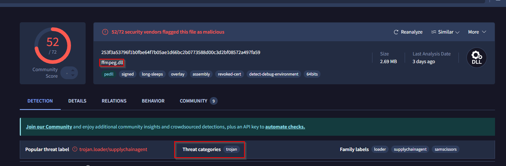

## MACHINE INFO

> **[3CX Supply Chain](https://cyberdefenders.org/blueteam-ctf-challenges/3cx-supply-chain/)** is a an easy lab from CyberDefenders that focuses on Threat Intelligence on the 3CX Supply Chain Attack utilizing tools such as VirusTotal to analyze malicious software and the attack chain and threat actors involved with this attack. 

## SCENARIO
A large multinational corporation heavily relies on the 3CX software for phone communication, making it a critical component of their business operations. After a recent update to the 3CX Desktop App, antivirus alerts flag sporadic instances of the software being wiped from some workstations while others remain unaffected. Dismissing this as a false positive, the IT team overlooks the alerts, only to notice degraded performance and strange network traffic to unknown servers. Employees report issues with the 3CX app, and the IT security team identifies unusual communication patterns linked to recent software updates.

As the threat intelligence analyst, it's your responsibility to examine this possible supply chain attack. Your objectives are to uncover how the attackers compromised the 3CX app, identify the potential threat actor involved, and assess the overall extent of the incident.


## QUESTIONS
From the lab, we are provided with a Windows installer of the 3CX desktop app. We will begin by unzipping the file and getting it's hash for further analysis on VirusTotal

```sh
Get-FileHash -Path "3CXDesktopApp-18.12.416.msi" -Algorithm MD5
```
HASH: `0EEB1C0133EB4D571178B2D9D14CE3E9`

###### Q1
Understanding the scope of the attack and identifying which versions exhibit malicious behavior is crucial for making informed decisions if these compromised versions are present in the organization. How many versions of 3CX ***running on Windows*** have been flagged as malware?

Under the `Community` tab on Virus Total, there are numerous resources provided containing information about the 3CX supply chain attack being analyzed in this scenario. A blog by [Zscaler](https://www.zscaler.com/blogs/security-research/3cx-supply-chain-attack-campaign) gives us information on the 3CX versions of Windows and MacOS that are affected by this attack.


###### Q2
Determining the age of the malware can help assess the extent of the compromise and track the evolution of malware families and variants. What's the UTC creation time of the `.msi` malware?

Under the `Details` tab on Virus Total, we are given key information on the History of the malicious software such as when it was created.


###### Q3
Executable files (`.exe`) are frequently used as primary or secondary malware payloads, while dynamic link libraries (`.dll`) often load malicious code or enhance malware functionality. Analyzing files deposited by the Microsoft Software Installer (`.msi`) is crucial for identifying malicious files and investigating their full potential. Which malicious DLLs were dropped by the `.msi` file?

When we go back to the [ZScaler](https://www.zscaler.com/blogs/security-research/3cx-supply-chain-attack-campaign) resource we got earlier, the blog provides a list of IOCs (*Indicators of Compromise*) which include 2 DLL files that are dropped by the malicious software upon execution


###### Q4
Recognizing the persistence techniques used in this incident is essential for current mitigation strategies and future defense improvements. What is the MITRE Technique ID employed by the `.msi` files to load the malicious DLL?

Under the `Behaviour` tab on Virus Total, we get information on the MITRE TTPs associated by the malicious software and based on the question we focus on the Technique associated with DLL Side-Loading `T1574`


###### Q5
Recognizing the malware type (`threat category`) is essential to your investigation, as it can offer valuable insight into the possible malicious actions you'll be examining. What is the threat category of the two malicious DLLs?

In Q3, we identified the malicious DLL files and their hashes, so we utilize Virus Total to analyze the threat category associated with them. 



Based on the output, we can conclude that both DLL files belong to the `Trojan` threat category

###### Q6
As a threat intelligence analyst conducting dynamic analysis, it's vital to understand how malware can evade detection in virtualized environments or analysis systems. This knowledge will help you effectively mitigate or address these evasive tactics. What is the MITRE ID for the virtualization/sandbox evasion techniques used by the two malicious DLLs?

Back to the `Behaviour` Tab only this time focusing on the MITRE Defense Evasion Technique associates with virtualization/sandbox evasion.


###### Q7
When conducting malware analysis and reverse engineering, understanding anti-analysis techniques is vital to avoid wasting time. Which hypervisor is targeted by the anti-analysis techniques in the `ffmpeg.dll` file?

Earlier, we had gotten the hash for both malicious DLL files. Under the `Behaviour` tab of our analysis of `ffmpeg.dll` on Virus Total we can see the `VMWare` hypervisor is targeted by the software's anti-analysis techniques.


###### Q8
Identifying the cryptographic method used in malware is crucial for understanding the techniques employed to bypass defense mechanisms and execute its functions fully. What encryption algorithm is used by the `ffmpeg.dll` file?

Still under the `Behaviour` tab, we are able to determine that `RC4` algorithm is used for data encryption.


###### Q9
As an analyst, you've recognized some TTPs involved in the incident, but identifying the APT group responsible will help you search for their usual TTPs and uncover other potential malicious activities. Which group is responsible for this attack?

From the `Community` tab, there's an entry that shows a report published by Qualys identifying the `Lazarus` group as the threat actors behind this incident


### READ MORE ABOUT THE 3CX AUPPLY CHAIN ATTACK HERE
- [ZScaler](https://www.virustotal.com/gui/file/59e1edf4d82fae4978e97512b0331b7eb21dd4b838b850ba46794d9c7a2c0983/detection)
- [Mandiant](https://cloud.google.com/blog/topics/threat-intelligence/3cx-software-supply-chain-compromise/)
- [3CX-Software](https://www.3cx.com/)
