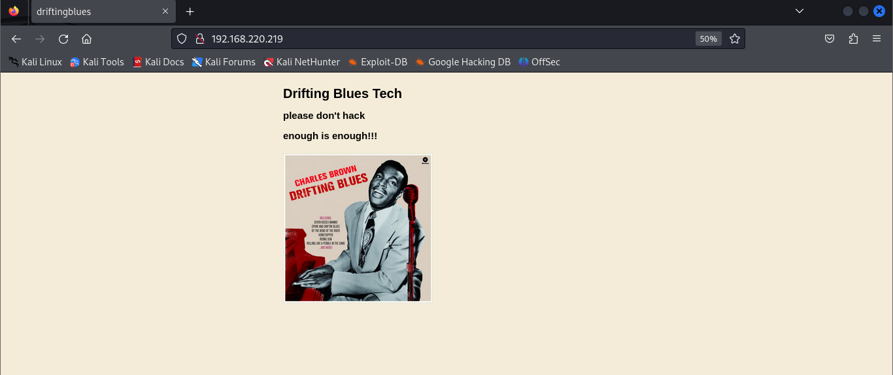

## MACHINE INFO

> **[Driftingblue6](https://portal.offsec.com/labs/play)** is an easy linux machine which leverages arbitrary file upload on a website to gain a revrese shell and exploting dirtycow to gain root access.

## Enumeration
Started off with an Nmap scan of the target
```shell
─$ sudo nmap -sCV -A 192.168.220.219 -p- --min-rate=10000ms
Starting Nmap 7.94SVN ( https://nmap.org ) at 2024-05-01 21:00 BST
Warning: 192.168.220.219 giving up on port because retransmission cap hit (10).
Nmap scan report for 192.168.220.219
Host is up (0.20s latency).
Not shown: 49436 closed tcp ports (reset), 16098 filtered tcp ports (no-response)
PORT   STATE SERVICE VERSION
80/tcp open  http    Apache httpd 2.2.22 ((Debian))
|_http-server-header: Apache/2.2.22 (Debian)
|_http-title: driftingblues
| http-robots.txt: 1 disallowed entry 
|_/textpattern/textpattern
No exact OS matches for host (If you know what OS is running on it, see https://nmap.org/submit/ ).
TCP/IP fingerprint:
OS:SCAN(V=7.94SVN%E=4%D=5/1%OT=80%CT=1%CU=33422%PV=Y%DS=4%DC=T%G=Y%TM=66329
OS:FA7%P=x86_64-pc-linux-gnu)SEQ(SP=107%GCD=1%ISR=10C%TI=Z%II=I%TS=8)SEQ(SP
OS:=108%GCD=1%ISR=10C%TI=Z%TS=8)SEQ(SP=108%GCD=1%ISR=10C%TI=Z%II=I%TS=8)OPS
OS:(O1=M551ST11NW4%O2=M551ST11NW4%O3=M551NNT11NW4%O4=M551ST11NW4%O5=M551ST1
OS:1NW4%O6=M551ST11)WIN(W1=3890%W2=3890%W3=3890%W4=3890%W5=3890%W6=3890)ECN
OS:(R=Y%DF=Y%T=40%W=3908%O=M551NNSNW4%CC=Y%Q=)T1(R=Y%DF=Y%T=40%S=O%A=S+%F=A
OS:S%RD=0%Q=)T2(R=N)T3(R=N)T4(R=N)T5(R=Y%DF=Y%T=40%W=0%S=Z%A=S+%F=AR%O=%RD=
OS:0%Q=)T6(R=N)T7(R=N)U1(R=Y%DF=N%T=40%IPL=164%UN=0%RIPL=G%RID=G%RIPCK=G%RU
OS:CK=ABAF%RUD=G)IE(R=Y%DFI=N%T=40%CD=S)

Network Distance: 4 hops

TRACEROUTE (using port 3306/tcp)
HOP RTT       ADDRESS
1   164.10 ms 192.168.45.1
2   164.68 ms 192.168.45.254
3   164.75 ms 192.168.251.1
4   164.85 ms 192.168.220.219

OS and Service detection performed. Please report any incorrect results at https://nmap.org/submit/ .
Nmap done: 1 IP address (1 host up) scanned in 77.31 seconds
```

Port 80:

Underlying software:


Enumeration for hidden directories
```shell
gobuster dir -u http://192.168.220.219/ -w /usr/share/wordlists/dirb/common.txt       
===============================================================
Gobuster v3.6
by OJ Reeves (@TheColonial) & Christian Mehlmauer (@firefart)
===============================================================
[+] Url:                     http://192.168.220.219/
[+] Method:                  GET
[+] Threads:                 10
[+] Wordlist:                /usr/share/wordlists/dirb/common.txt
[+] Negative Status codes:   404
[+] User Agent:              gobuster/3.6
[+] Timeout:                 10s
===============================================================
Starting gobuster in directory enumeration mode
===============================================================
/.htpasswd            (Status: 403) [Size: 292]
/.htaccess            (Status: 403) [Size: 292]
/.hta                 (Status: 403) [Size: 287]
/cgi-bin/             (Status: 403) [Size: 291]
/db                   (Status: 200) [Size: 53656]
/index                (Status: 200) [Size: 750]
/index.html           (Status: 200) [Size: 750]
/robots.txt           (Status: 200) [Size: 110]
/robots               (Status: 200) [Size: 110]
/server-status        (Status: 403) [Size: 296]
/textpattern          (Status: 301) [Size: 324] [--> http://192.168.220.219/textpattern/]
Progress: 4614 / 4615 (99.98%)
===============================================================
Finished
===============================================================
```

/textpattern directory


Robots and robots.txt dir 
Typically the robots.txt file shows a list of directories a browser is not allowed to crawl. In this case I got a /textpattern/textpattern directory.


The directory contained a login form and I tried the following default passwords but none of them worked.
```shell
admin:admin
admin:password
admin:password123
administator:password
```

I went back to the robots dir and got an instruction as seen below.


So I attempted another bruteforce attack but now looking for any directories that may contain zip files.
I first tried using gobuster but my connection kept timing out so I switched to feroxbuster.
```shell
$ feroxbuster -u http://192.168.208.219/ -w /usr/share/wordlists/dirbuster/directory-list-2.3-medium.txt -x .zip -s "200" 
 ___  ___  __   __     __      __         __   ___
|__  |__  |__) |__) | /  `    /  \ \_/ | |  \ |__
|    |___ |  \ |  \ | \__,    \__/ / \ | |__/ |___
by Ben "epi" Risher 🤓                 ver: 2.10.3
───────────────────────────┬──────────────────────
 🎯  Target Url            │ http://192.168.208.219/
 🚀  Threads               │ 50
 📖  Wordlist              │ /usr/share/wordlists/dirbuster/directory-list-2.3-medium.txt
 👌  Status Codes          │ [200]
 💥  Timeout (secs)        │ 7
 🦡  User-Agent            │ feroxbuster/2.10.3
 💉  Config File           │ /etc/feroxbuster/ferox-config.toml
 🔎  Extract Links         │ true
 💲  Extensions            │ [zip]
 🏁  HTTP methods          │ [GET]
 🔃  Recursion Depth       │ 4
───────────────────────────┴──────────────────────
 🏁  Press [ENTER] to use the Scan Management Menu™
──────────────────────────────────────────────────
200      GET       76l       75w      750c http://192.168.208.219/index
200      GET      212l     1206w    97264c http://192.168.208.219/db.png
200      GET       76l       75w      750c http://192.168.208.219/
200      GET      212l     1206w    97264c http://192.168.208.219/db
200      GET        5l       14w      110c http://192.168.208.219/robots
200      GET        2l        7w      227c http://192.168.208.219/spammer
200      GET        2l        7w      227c http://192.168.208.219/spammer.zip

```

From the second dir bruteforce attack, I got new directories: /spammer, /spammer.zip

To unzip the spammer.zip file I needed a password which I did not have.

Default passwords such as password did not work, so I did a google search on bruteforcing passwords for zip files. 

I found an interesting blog that provides info on using john the ripper and fcrackzip: https://medium.com/@rajendraprasanth/password-cracking-using-kali-67e0b89578df

I started with fcrackzip.
Password cracking steps:


```shell
fcrackzip -u -v -D /usr/share/wordlists/rockyou.txt spammer.zip 
```
> * -u : unzip
> * -v : verbose mode for more detailed output
> * -D : dictionary attack with wordlist to use specified

I got the first output which indicated presence of a cred.txt file but I wanted to see the contents.
```shell
fcrackzip -u -v -D -p /usr/share/wordlists/rockyou.txt spammer.zip
```
> * -p : specifies a single password to be used

The whole command will then attempt bruteforcing and output the command that works.
The password found was used to crack the zip file password and unzip it to get the creds.txt file.

The creds.txt file gave the following output:


```shell
mayer:lionheart
```

With the new creds, I attempted to login to the textpattern login page


I got the following error which is the same as the first one encountered when I accessed the /textpattern directory after running gobuster the first time:


I just ignored the error and proceeded to login again, the credentials worked!!


I looked at the different tabs and the contents of the tab options, the file option under the content tab stood out to me. 
So I tried uploading a php reverse shell file: https://github.com/pentestmonkey/php-reverse-shell/blob/master/php-reverse-shell.php

Now that the file is successfully uploaded, I need to find a way to execute the file so as to get a connection on my listening port


Step one is to find out where files are stores in the target machine.


```shell
/var/www/textpattern/files
```

Step 2: navigate to the storage location

Step 3: click on the file to attempt execution, make sure the listening port is set.
Step 4: successful shell


After getting a shell, I tried to loo for the user flag under the /home directory but there was nothing
I looked at the shadow file but I did not have root access
I looked at the root dir but I did not have toot access

I proceeded with privilege escalation

## PRIVILEGE ESCALATION
Upload and run linpeas on the shell

Interesting output


The exim4 file did not have the ssh keys I was looking for.


So I tried finding an apache2 exploit but I did not have information and it looked like a dead end.


The linux version could be exploitable so I did a search on possible kernel exploits.

## EXPLOITATION
I found the following kernel exploit: https://www.exploit-db.com/exploits/40839

A dirty cow exploit.
Steps taken
2. Upload the exploit to the shell
3. Compile the exploit and run it


After running it, I got prompted to set a new password of choice. I chose 'blueberry'


Since there is no ssh service running on the target, I used su firefart to switch from www-data to the firefart user.


Once logged in I moved to the /root directory and successfully got the flag
