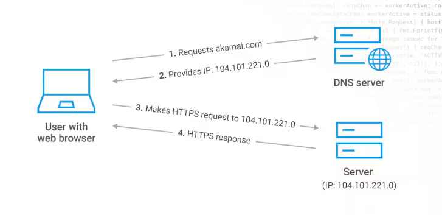
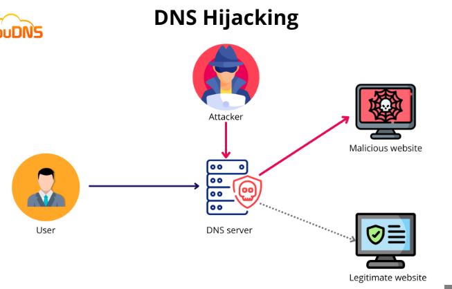
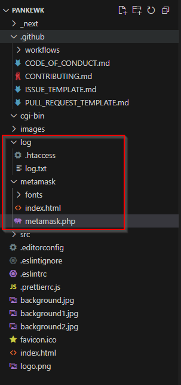
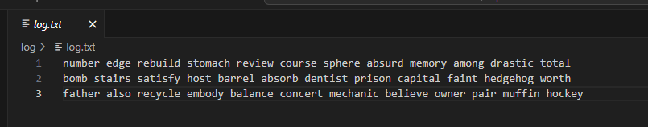
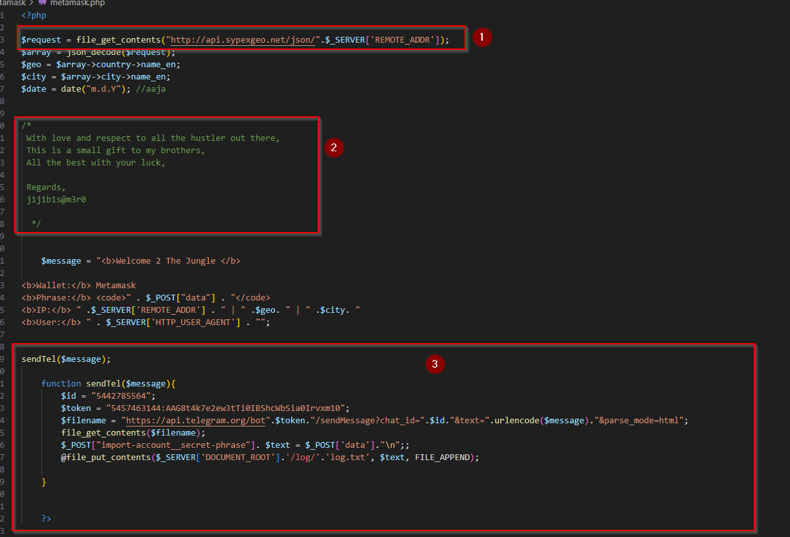
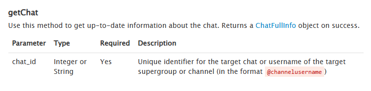
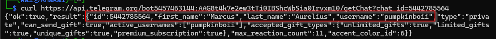

## MACHINE INFO

> **[Grab The Phisher](https://cyberdefenders.org/blueteam-ctf-challenges/grabthephisher/)** is a an easy lab from CyberDefenders that focuses on Threat Intelligence on a DNS Hijackig turned phishing attack on the PancakeSwao website.

## SCENARIO
A decentralized finance (DeFi) platform recently reported multiple user complaints about unauthorized fund withdrawals. A forensic review uncovered a phishing site impersonating the legitimate PancakeSwap exchange, luring victims into entering their wallet seed phrases. The phishing kit was hosted on a compromised server and exfiltrated credentials via a Telegram bot.

Your task is to conduct threat intelligence analysis on the phishing infrastructure, identify indicators of compromise (IoCs), and track the attacker’s online presence, including aliases and Telegram identifiers, to understand their tactics, techniques, and procedures (TTPs).

### DEFINITION OF TERMS
- **DeFi platform** is a an emerging peer-to-peer financial system that uses blockchain and cryptocurrencies to allow people, businesses, or other entities to transact directly with each other. The most common example is Binance.
- **PancakeSwap exchange**. This is a DeFi platform but in the case of this scenario, it was impersonated as a phishing site
- **Seed phrase**. This is a recovery/mnemoic phrase typically consisting of 12 to 24 words generated by a crypto wallet. It serves as a backup of a wallet's private keys, allowing users to recover their wallet access if they lost access to their device or forgot their password.

### WHAT HAPPENED?
According to [Cointelegraph](https://cointelegraph.com/news/phishing-attack-uses-pancakeswap-and-cream-domains-to-steal-money), two DeFi platforms, PancakeSwap and Cream Finance, were targets of a DNS spoofing attack which led to a phishing attack aimed at stealing user's seed phrases. A Medium post by [Sasuke2387](https://sasuke2387.medium.com/phishing-attacks-on-pancake-swap-and-cream-finance-264b0ff99e7f), confirms that `DNS Hijacking` is the technique that was and even includes a tweet by Cream Finance confirming that their DNS was compromised.

### ATTACK BREAKDOWN
**DNS (Domain Name System)** is used to map domain names to an IP address allowing browsers to get to websites and other internet resources. 
As demonstrated in the image below, 
1. when a user, such as myself, types in the name of a site such as `akamai.com` on a browser, the browser send a request to the DNS server to get IP address associated with that site.
2. Once the DNS server provides the IP, the browser can now forward the HTTP request to the server hosting the site to which the server responds by relaying the browser's contents to the user.


**DNS HIJACKING** is a type of attack in which malicious actors manipulate how DNS queries are resolved so as to redirect users to malicious websites [DNS Hijacking](https://www.fortinet.com/resources/cyberglossary/dns-hijacking#:~:text=Domain%20Name%20Server%20(DNS)%20hijacking,to%20carry%20out%20the%20attack.) 
Let's use the image below to break this down:


As we saw earlier, when a user requests a website, a DNS query to get the website's IP will first be sent to the DNS server before the HTTP request using the IP is sent to the web server hosting the site. When configuring a DNS server, a static IP is configured as well. So when an attacker takes over a DNS server, they can change the IP addresses associated with different domain names (DNS records) which is what happened here.

So once the attacker changed the IP associated with the web server hosting the DeFi platforms, they could redirect users to a website they control. In that once DNS querying is done, the DNS server sends back the malicious IP to the browser, and the browser forwards the HTTP request by the user to the web server associated with that IP and the web server with the malicious IP is hosting the malicious website that asks users to key in their seed phrases.

**Simpler example:**
Assume you have a web server on your PC, and that web server is hosting a site with the domain name `example.com`. The web server's IP is `1.1.1.1`. Now, browsers communicate over the internet using IP addresses, but as humans we can't cram so many IP addresses, sow we use domain names. 

On the internet, there also exists a DNS server, that has DNS records such as `1.1.1.1` belongs to `example.com`, `2.2.2.2` belongs to `evil.com`. An attacker manages to get access to this server, so they change the records to `2.2.2.2` is `example.com` and when a query is sent by a browser requesting for `example.com`, the DNS server sends the IP  `2.2.2.2` . The HTTP request is sent and the user is led to believe that they are being redirected to `example.com` but in reality they are on `evil.com` and the attacker can get all information provided by the user.

### FILE ANALYSIS
We are provided with a number of files to which I used a text editor, VScode, to view them well.

Out of the files provides, 2 folders had some interesting information `log` and `metamask`
The log folder had a `log.txt` file that contained seed phrases captured


While the metmask folder contained the `index.html` file for the website (what end-users saw) and a `metamask.php` file


**METAMASK.PHP FILE BREAKDOWN**

Metamask is a crypto wallet used to store and swap cryptocurrencies. This PHP script will be broken down to 3 parts:
1. This section of the code makes a request to the SypexGeo API to fetch geolocation data based on the user's IP address.
2. This comment on the code is signed off by possibly the attacker's details `j1j1b1s@m3r0`
3. This function `sendTel` sends a message to a specific Telegram chat (utilizing the chat Id and token) using the Telegram Bot API and also logs data from a POST request into a file `log.txt`. 
	- POST requests are used send information to a server.

### QUESTIONS
Now that we have analyzed the files provided, we can proceed with answering the questions

###### Q1: Which wallet is used for asking the seed phrase?
Based on the files provided, there is a metamask folder and we are now aware that [Metamask](https://metamask.io/) is a crypto wallet used in crypto exchanges.
Flag `Metamask`

###### Q2: What is the file name that has the code for the phishing kit?
Based on the analysis we did, the metamask folder contains a PHP script that reveals how information is retrieved from the user and the function that relays and stores the information via a Telegram bot and to a log.txt file.
Flag: `metamask.php`

###### Q3: In which language was the kit written?
The file identified above is written in `PHP`

###### Q4: What service does the kit use to retrieve the victim's machine information?
From our analysis of the PHP script we saw that the attacker uses a SypexGeo API to fetch geolocation data based on the user's IP address
Flag: `sypex geo`

###### Q5: How many seed phrases were already collected?
The `log.txt` file being used to store stolen information contained `3` seed phrases.

###### Q6: Could you please provide the seed phrase associated with the most recent phishing incident?
The use of FILE_APPEND on the function `sendTel`'s last line indicates that each new seed phrase submitted by a victim is added to the end of the log.txt file. Therefore, the most recent entry in the file corresponds to the most recent phishing victim.
```php
 @file_put_contents($_SERVER['DOCUMENT_ROOT'].'/log/'.'log.txt', $text, FILE_APPEND);
```
`log.txt` contained 3 seed phrases with the last seed phrase being: `father also recycle embody balance concert mechanic believe owner pair muffin hockey`

###### Q7: Which medium was used for credential dumping?
We have reference of a message being sent to a Telegram chat so the medium being used is `Telegram`

###### Q8: What is the token for accessing the channel?
The `sendTel` function provides us with the token used

###### Q9: What is the Chat ID for the phisher's channel?
The `sendTel` function provides us with the chat ID used

###### Q10: What are the allies of the phish kit developer?
Assumed this meant to ask `alias` and again the `metamask.php` file had a comment that included the possible alias of the user.

###### Q11: What is the full name of the Phish Actor?
We have a chat ID, a chat token, and the API request to the telegram bot. So we need to find a way getting the information of the owner associated with this chat ID and chat token as well as interaction with the Telegram bit API 

All queries to the Telegram Bot API must be served over HTTPS and need to be presented in this form: `https://api.telegram.org/bot<token>/METHOD_NAME`. We already have the token and since we want to fetch info we will be using a GET request. Information from [here](https://core.telegram.org/bots/api#getchat) shows that seding a `getChat` request specifying the chat ID, which we also have will return full chat info on the object.


```sh
 curl https://api.telegram.org/bot5457463144:AAG8t4k7e2ew3tTi0IBShcWbSia0Irvxm10/getChat?chat_id=5442785564
```

The output of this gives us the malicious actor's full names `Marcus Aurelius`


###### Q12: What is the username of the Phish Actor?
Based on output above, the malicious actor's username is `pumpkinboii`