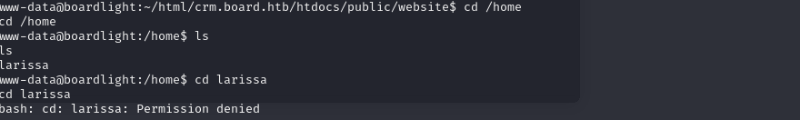

## MACHINE INFO

> **[Boardlight](https://app.hackthebox.com/machines/603)** is an easy Linux machine on the Offsec Proving Grounds. The challenge involves leveraging a Local File Inclusion (LFI) vulnerability in a web application to obtain user credentials. These credentials are then used to gain access to the target system. Privilege escalation is achieved by exploiting the nice command to gain root access.

## ENUMERATION
Nmap scan of target

```shell
p0s3id0n@kali:~/Machines/htb/labs$ sudo nmap -sCV -T4 -vv 10.10.11.11
[sudo] password for p0s3id0n: 
Starting Nmap 7.94SVN ( https://nmap.org ) at 2024-06-11 12:40 EDT
<---snip--->
Completed Ping Scan at 12:40, 0.19s elapsed (1 total hosts)
Initiating Parallel DNS resolution of 1 host. at 12:40
Completed Parallel DNS resolution of 1 host. at 12:40, 0.02s elapsed
Initiating SYN Stealth Scan at 12:40
Scanning 10.10.11.11 [1000 ports]
Discovered open port 80/tcp on 10.10.11.11
Discovered open port 22/tcp on 10.10.11.11
Discovered open port 3333/tcp on 10.10.11.11
Completed SYN Stealth Scan at 12:40, 3.08s elapsed (1000 total ports)
Initiating Service scan at 12:40
Scanning 3 services on 10.10.11.11
Completed Service scan at 12:40, 7.22s elapsed (3 services on 1 host)
<---snip--->
Nmap scan report for 10.10.11.11
Host is up, received echo-reply ttl 63 (0.37s latency).
Scanned at 2024-06-11 12:40:44 EDT for 23s
Not shown: 997 closed tcp ports (reset)
PORT     STATE SERVICE    REASON         VERSION
22/tcp   open  ssh        syn-ack ttl 63 OpenSSH 8.2p1 Ubuntu 4ubuntu0.11 (Ubuntu Linux; protocol 2.0)
| ssh-hostkey: 
|   3072 06:2d:3b:85:10:59:ff:73:66:27:7f:0e:ae:03:ea:f4 (RSA)
| ssh-rsa AAAAB3NzaC1yc2EAAAADAQABAAABgQDH0dV4gtJNo8ixEEBDxhUId6Pc/8iNLX16+zpUCIgmxxl5TivDMLg2JvXorp4F2r8ci44CESUlnMHRSYNtlLttiIZHpTML7ktFHbNexvOAJqE1lIlQlGjWBU1hWq6Y6n1tuUANOd5U+Yc0/h53gKu5nXTQTy1c9CLbQfaYvFjnzrR3NQ6Hw7ih5u3mEjJngP+Sq+dpzUcnFe1BekvBPrxdAJwN6w+MSpGFyQSAkUthrOE4JRnpa6jSsTjXODDjioNkp2NLkKa73Yc2DHk3evNUXfa+P8oWFBk8ZXSHFyeOoNkcqkPCrkevB71NdFtn3Fd/Ar07co0ygw90Vb2q34cu1Jo/1oPV1UFsvcwaKJuxBKozH+VA0F9hyriPKjsvTRCbkFjweLxCib5phagHu6K5KEYC+VmWbCUnWyvYZauJ1/t5xQqqi9UWssRjbE1mI0Krq2Zb97qnONhzcclAPVpvEVdCCcl0rYZjQt6VI1PzHha56JepZCFCNvX3FVxYzEk=
|   256 59:03:dc:52:87:3a:35:99:34:44:74:33:78:31:35:fb (ECDSA)
| ecdsa-sha2-nistp256 AAAAE2VjZHNhLXNoYTItbmlzdHAyNTYAAAAIbmlzdHAyNTYAAABBBK7G5PgPkbp1awVqM5uOpMJ/xVrNirmwIT21bMG/+jihUY8rOXxSbidRfC9KgvSDC4flMsPZUrWziSuBDJAra5g=
|   256 ab:13:38:e4:3e:e0:24:b4:69:38:a9:63:82:38:dd:f4 (ED25519)
|_ssh-ed25519 AAAAC3NzaC1lZDI1NTE5AAAAILHj/lr3X40pR3k9+uYJk4oSjdULCK0DlOxbiL66ZRWg
80/tcp   open  http       syn-ack ttl 63 Apache httpd 2.4.41 ((Ubuntu))
|_http-title: Site doesn't have a title (text/html; charset=UTF-8).
| http-methods: 
|_  Supported Methods: GET HEAD POST OPTIONS
|_http-server-header: Apache/2.4.41 (Ubuntu)
3333/tcp open  tcpwrapped syn-ack ttl 63
Service Info: OS: Linux; CPE: cpe:/o:linux:linux_kernel

<---snip--->
Read data files from: /usr/bin/../share/nmap
Service detection performed. Please report any incorrect results at https://nmap.org/submit/ .
Nmap done: 1 IP address (1 host up) scanned in 23.28 seconds
           Raw packets sent: 1120 (49.256KB) | Rcvd: 1120 (44.800KB)

```
Open ports from namp scan: 22, 80, 3333

### PORT 80 ENUMERATION


I tried to post content on the submit a comment section of the website but that led to nowhere. So I proceeded to bruteforce for hidden directories using gobuster.

```shell
p0s3id0n@kali:~/Machines/htb/labs$ gobuster dir -u http://10.10.11.11/ -w /usr/share/wordlists/dirb/common.txt             
===============================================================
Gobuster v3.6
by OJ Reeves (@TheColonial) & Christian Mehlmauer (@firefart)
===============================================================
[+] Url:                     http://10.10.11.11/
[+] Method:                  GET
[+] Threads:                 10
[+] Wordlist:                /usr/share/wordlists/dirb/common.txt
[+] Negative Status codes:   404
[+] User Agent:              gobuster/3.6
[+] Timeout:                 10s
===============================================================
Starting gobuster in directory enumeration mode
===============================================================
/.hta                 (Status: 403) [Size: 276]
/.htaccess            (Status: 403) [Size: 276]
/.htpasswd            (Status: 403) [Size: 276]
/css                  (Status: 301) [Size: 308] [--> http://10.10.11.11/css/]
/images               (Status: 301) [Size: 311] [--> http://10.10.11.11/images/]
/index.php            (Status: 200) [Size: 15949]
/js                   (Status: 301) [Size: 307] [--> http://10.10.11.11/js/]
/server-status        (Status: 403) [Size: 276]
Progress: 4614 / 4615 (99.98%)
===============================================================
Finished
===============================================================
```

Several directory bruteforcing attempts with different parameters still gave me the same output, so I had to result to other sources on how to proceed from here.

From the official HTB forums page on the machine, there were several comments about a comment on the page source with interesting information. I totally forgot to check the page source. 


I found the following and when I tried to access the suppossed file directory, I got the error below.


Once more I was stuck, further research gave me an idea on fuzzing for subdomains.

```shell
p0s3id0n@kali:~/Downloads$ ffuf -w /usr/share/wordlists/seclists/Discovery/DNS/subdomains-top1million-5000.txt -u http://board.htb/ -H "Host: FUZZ.board.htb" -fs 15949

        /'___\  /'___\           /'___\       
       /\ \__/ /\ \__/  __  __  /\ \__/       
       \ \ ,__\\ \ ,__\/\ \/\ \ \ \ ,__\      
        \ \ \_/ \ \ \_/\ \ \_\ \ \ \ \_/      
         \ \_\   \ \_\  \ \____/  \ \_\       
          \/_/    \/_/   \/___/    \/_/       

       v2.1.0-dev
________________________________________________

 :: Method           : GET
 :: URL              : http://board.htb/
 :: Wordlist         : FUZZ: /usr/share/wordlists/seclists/Discovery/DNS/subdomains-top1million-5000.txt
 :: Header           : Host: FUZZ.board.htb
 :: Follow redirects : false
 :: Calibration      : false
 :: Timeout          : 10
 :: Threads          : 40
 :: Matcher          : Response status: 200-299,301,302,307,401,403,405,500
 :: Filter           : Response size: 15949
________________________________________________

crm                     [Status: 200, Size: 6360, Words: 397, Lines: 150, Duration: 238ms]
:: Progress: [4989/4989] :: Job [1/1] :: 174 req/sec :: Duration: [0:00:39] :: Errors: 0 ::
```

## EXPLOITATION

- Used default creds `admin:admin`

Post-login:


From the login page, I noted the dollibar version and did a google search on possible exploits.
I found the following exploit: https://github.com/nikn0laty/Exploit-for-Dolibarr-17.0.0-CVE-2023-30253.git

I got a successful shell!!


As is the norm, the user.txt flag is typically stored in the home directory but I couldn't access the directory of the user larissa.


After doing some research online, I got the idea of cheking the Dolibar configuration file for possible passwords stored. 


` dolibarrowner: serverfun2$2023!!`
Since I had only seen one user `larissa`, I tried using ssh to login as larissa using the password provided.

It worked!!User flag pwned!!


## PRIVILEGE ESCALATION
Now onto privilege escalation.
I uploaded linpeas to the ssh session 

I found some interesting output:


> SUID (Set User ID) binaries are executable files in Unix-like operating systems that run with the permissions of the file owner, rather than the user who executes them.

> Enlightenment is a Window Manager, Compositor and Minimal Desktop  
for Linux (the primary platform), BSD and any other compatible UNIX system.

I used the following exploit: https://github.com/MaherAzzouzi/CVE-2022-37706-LPE-exploit/blob/main/exploit.sh
And successfully got root!!


