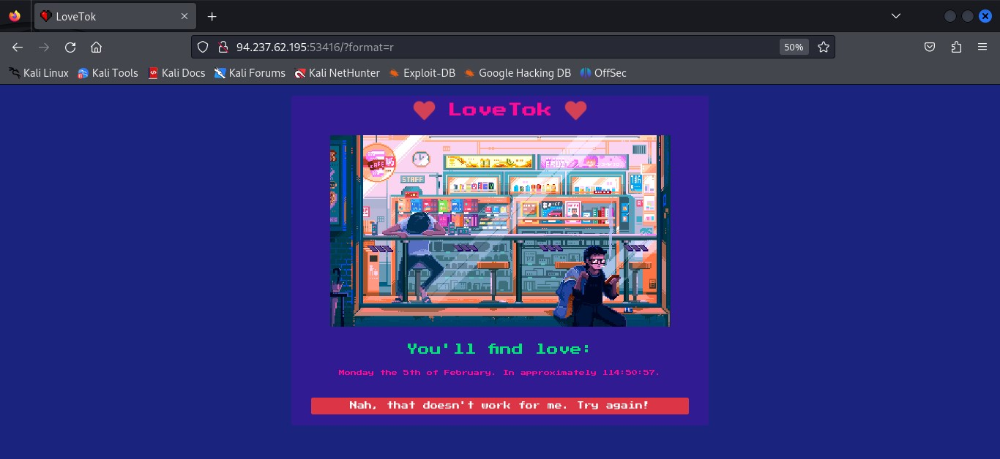
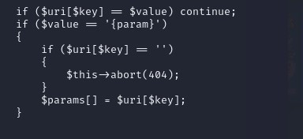
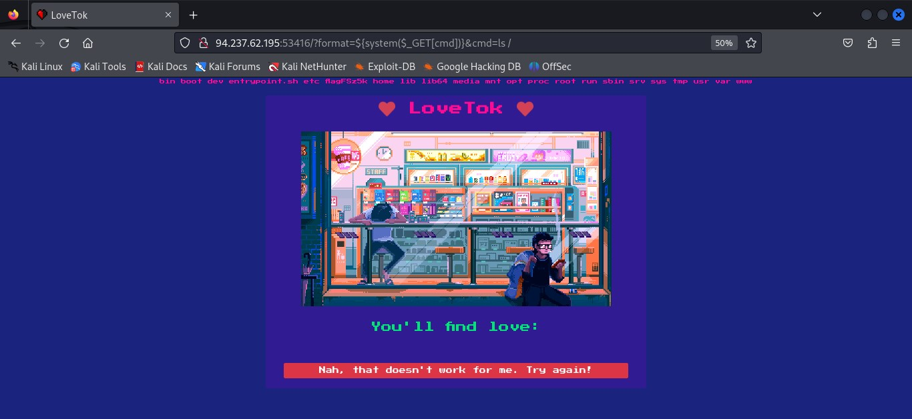
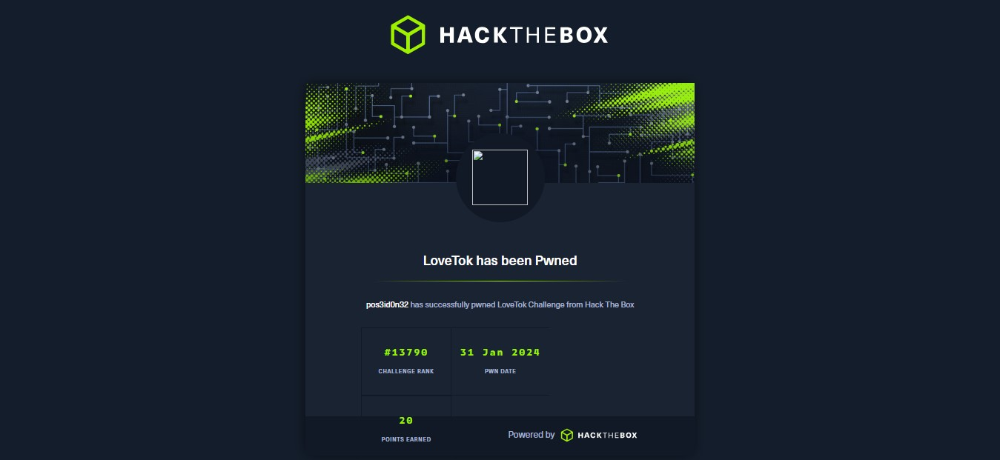

## MACHINE INFO

> **[LoveTok](https://app.hackthebox.com/challenges/lovetok)** is an easy web exploitation challenge which leverages use of web shells to gain remote access to the target's web server which will ultimately lead to obtaining the flag.  

## Walkthrough
We are given the ip address and port number of the target host, which we load on our browser. We are directed to the LoveTok wesite which seems to contain nothing much besides a button at the bottom of the page. 


When we first click on the button, nothing seems to have changed but on taking a closer look, the URL or the website has a slight change. (http://94.237.62.195:53416/?format=r)


I tried to mess around with the r value of the URL by changing it to different system commands and the output on the website kept on changing. 


I then proceeded to look at the downloaded files of the machine and found some interesting code in the Router.php file. The code explain a a basic routing mechanism for a PHP application, allowing developers to define routes and corresponding controller functions or methods to handle incoming requests.

A specific section of the code stood out to me.


It handles a scenario where a segment in the route pattern is a placeholder {param}, indicating that a parameter value is expected in that segment of the URL. If the current segment is an empty string, then it means the parameter value of the corresponding screen is missing and the script aborts with a error 404 status code. 

This means that we can get a webshell payload that can bypass this conditional check, exploit the command injection vulnerability to execute arbitrary commands on the server and ultimately allow us to extract sensitive data, which in this case will be the flag.

I used Google to search for webshell payloads and the following payload worked for me. It uses the system() function to execute commands that are being passed through ‘cmd’ HTTP request GET parameter.

```shell
<?php system($_GET['cmd']);?>
```

I adjusted the payload to reveal contents of the root directory

```shell
${system($_GET[cmd])}&cmd=ls /
```


Upon adding the payload to the url and loading the page, I got a list of files and directories. One file stood out to be. I assumed the contents of this file may be the flag so I adjusted the payload tp reveal the contents of the file.

```shell
http://94.237.62.195:53416/?format=${system($_GET[cmd])}&cmd=cat%20/flagFSz5k
```
And Voila! I got the flag!


