## MACHINE INFO

> **[Potato](https://portal.offsec.com/labs/play)** is an easy Linux machine on the Offsec Proving Grounds. The challenge involves leveraging a Local File Inclusion (LFI) vulnerability in a web application to obtain user credentials. These credentials are then used to gain access to the target system. Privilege escalation is achieved by exploiting the nice command to gain root access.


Nmap Scan of the target:
```shell
p0s3id0n@kali:~/Machines/offsec/potato$ sudo nmap -sCV -T4 -vv -p- 192.168.217.101
[sudo] password for p0s3id0n: 
Starting Nmap 7.94SVN ( https://nmap.org ) at 2024-07-02 07:51 EDT
<---snip--->
Nmap scan report for 192.168.217.101
Host is up, received echo-reply ttl 61 (0.19s latency).
Scanned at 2024-07-02 07:51:16 EDT for 1229s
Not shown: 65532 closed tcp ports (reset)
PORT     STATE SERVICE REASON         VERSION
22/tcp   open  ssh     syn-ack ttl 61 OpenSSH 8.2p1 Ubuntu 4ubuntu0.1 (Ubuntu Linux; protocol 2.0)
| ssh-hostkey: 
|   3072 ef:24:0e:ab:d2:b3:16:b4:4b:2e:27:c0:5f:48:79:8b (RSA)
| ssh-rsa AAAAB3NzaC1yc2EAAAADAQABAAABgQDamdAqH2ZyWoYj0tstPK0vbVKI+9OCgtkGDoynffxqV2kE4ceZn77FBuMGFKLU50Uv5RMUTFTX4hm1ijh77KMGG1CmAk2YWvEDhxbCBPCohp+xXMBXHBYoMbEVl/loKL2UW6USnKorOgwxUdoMAwDxIrohGHQ5WNUADRaqt1eHuHxuJ8Bgi8yzqP/26ePQTLCfwAZMq+SYPJedZBmfJJ3Brhb/CGgzgRU8BpJGI8IfBL5791JTn2niEgoMAZ1vdfnSx0m49uk8npd0h5hPQ+ucyMh+Q35lJ1zDq94E24mkgawDhEgmLtb23JDNdY4rv/7mAAHYA5AsRSDDFgmbXEVcC7N1c3cyrwVH/w+zF5SKOqQ8hOF7LRCqv0YQZ05wyiBu2OzbeAvhhiKJteICMuitQAuF6zU/dwjX7oEAxbZ2GsQ66kU3/JnL4clTDATbT01REKJzH9nHpO5sZdebfLJdVfx38qDrlS+risx1QngpnRvWTmJ7XBXt8UrfXGenR3U=
|   256 f2:d8:35:3f:49:59:85:85:07:e6:a2:0e:65:7a:8c:4b (ECDSA)
| ecdsa-sha2-nistp256 AAAAE2VjZHNhLXNoYTItbmlzdHAyNTYAAAAIbmlzdHAyNTYAAABBBNoh1z4mRbfROqXjtv9CG7ZYGiwN29OQQCVXMLce4ejLzy+0Bvo7tYSb5PKVqgO5jd1JaB3LLGWreXo6ZY3Z8T8=
|   256 0b:23:89:c3:c0:26:d5:64:5e:93:b7:ba:f5:14:7f:3e (ED25519)
|_ssh-ed25519 AAAAC3NzaC1lZDI1NTE5AAAAIDXv++bn0YEgaoSEmMm3RzCzm6pyUJJSsSW9FMBqvZQ3
80/tcp   open  http    syn-ack ttl 61 Apache httpd 2.4.41 ((Ubuntu))
| http-methods: 
|_  Supported Methods: HEAD POST OPTIONS
|_http-title: Potato company
|_http-server-header: Apache/2.4.41 (Ubuntu)
2112/tcp open  ftp     syn-ack ttl 61 ProFTPD
| ftp-anon: Anonymous FTP login allowed (FTP code 230)
| -rw-r--r--   1 ftp      ftp           901 Aug  2  2020 index.php.bak
|_-rw-r--r--   1 ftp      ftp            54 Aug  2  2020 welcome.msg
Service Info: OS: Linux; CPE: cpe:/o:linux:linux_kernel

NSE: Script Post-scanning.
NSE: Starting runlevel 1 (of 3) scan.
Initiating NSE at 08:11
Completed NSE at 08:11, 0.00s elapsed
NSE: Starting runlevel 2 (of 3) scan.
Initiating NSE at 08:11
Completed NSE at 08:11, 0.00s elapsed
NSE: Starting runlevel 3 (of 3) scan.
Initiating NSE at 08:11
Completed NSE at 08:11, 0.00s elapsed
Read data files from: /usr/bin/../share/nmap
Service detection performed. Please report any incorrect results at https://nmap.org/submit/ .
Nmap done: 1 IP address (1 host up) scanned in 1231.15 seconds
           Raw packets sent: 68877 (3.031MB) | Rcvd: 72834 (3.911MB)

```


### PORT 2112 ENUMERATION
FTP Anonymous login creds `anonymous:anonymous`
Used `ls` to list all files and folders present and found the following:
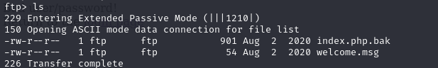

I transferred the files to my machine in order to access them using `get <filename>`
**welcome.msg**
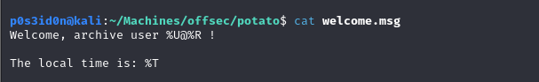

**index.php.bak**
Now here I found some interesting html code that had a section of php code
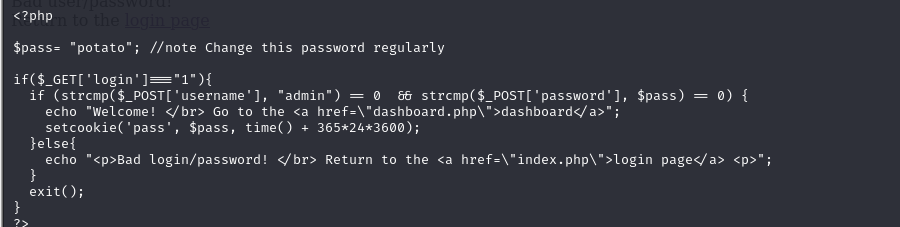

The first thing I noted there was a default password `potato` which may come in handy later and the username `admin`.
The rest of the code simply checks if login === 1 indicating a login attempt, then proceed to compare of the username `admin` is true and the password set is true (0), if both conditions are true then the user gets a message containing a link to the dashboard and a cookie is set otherwise the user is sent back to the login page.

### PORT 80 ENUMERATION
Website at a glance
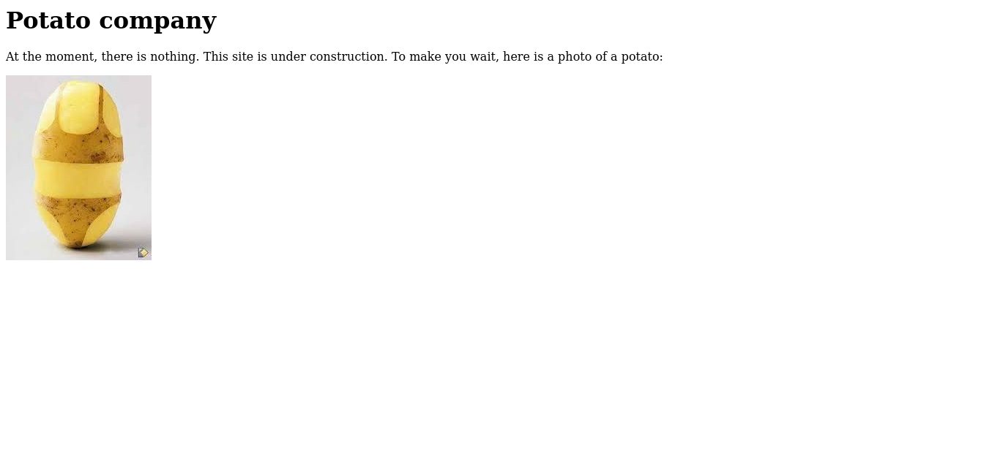

Page Source:
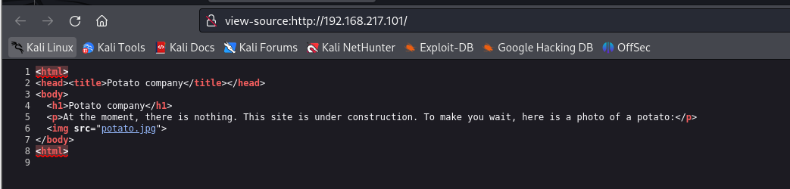
Nothing useful. 
Enumerate for hidden directories using gobuster
```shell
p0s3id0n@kali:~/Machines/offsec/potato$ gobuster dir -u http://192.168.217.101/ -w /usr/share/wordlists/dirb/common.txt      
===============================================================
Gobuster v3.6
by OJ Reeves (@TheColonial) & Christian Mehlmauer (@firefart)
===============================================================
[+] Url:                     http://192.168.217.101/
[+] Method:                  GET
[+] Threads:                 10
[+] Wordlist:                /usr/share/wordlists/dirb/common.txt
[+] Negative Status codes:   404
[+] User Agent:              gobuster/3.6
[+] Timeout:                 10s
===============================================================
Starting gobuster in directory enumeration mode
===============================================================
/.htpasswd            (Status: 403) [Size: 280]
/.htaccess            (Status: 403) [Size: 280]
/.hta                 (Status: 403) [Size: 280]
/admin                (Status: 301) [Size: 318] [--> http://192.168.217.101/admin/]
Progress: 309 / 4615 (6.70%)[ERROR] Get "http://192.168.217.101/addtocart": context deadline exceeded (Client.Timeout exceeded while awaiting headers)
Progress: 376 / 4615 (8.15%)[ERROR] Get "http://192.168.217.101/admin_login": context deadline exceeded (Client.Timeout exceeded while awaiting headers)
/index.php            (Status: 200) [Size: 245]
/server-status        (Status: 403) [Size: 280]
Progress: 4614 / 4615 (99.98%)
===============================================================
Finished
===============================================================
```


/admin directory
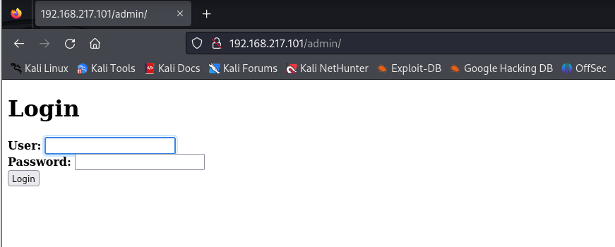

Tried default creds `admin:potato` `admin:admin`, `admin:password` , `admin:password123`
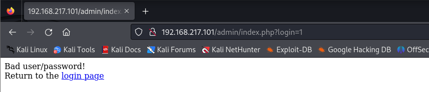
Got this error message. 

## LOGIN PAGE BYPASSING
I used BurpSuite to intercept requests.

First I tried SQL payloads
1. '-'
2. admin' --

None of the payloads seemed to work! 

I went back to the code I had found earlier and decided to analyse the code further. 
`strcmp` which stands for `string compare` is used to compare the submitted username and password with the hardcoded values such as `admin` for the username.

I found some interesting information in the following blog that had a similar strcmp vulnerability: (https://www.doyler.net/security-not-included/bypassing-php-strcmp-abctf2016)

So basically strcmp simply checks if the 2 values `admin` and `password` are equal to 0 the compares the 2, if both are 0 then a user id logged in. This is where the interesting bit comes in, if password is set to NULL or an empty string then by default the string will be equal to 0. 

So I decided to set the username to `admin` and to leave password as an empty value enclosed in 
([ ]=) as is shown in the blog I pasted above.

I first tried it directly on the login page but that did not seem to work so I tried it via Burpsuite.

For my first attempt I typed in `password=[]` but this did not work. Further research on it and I discovered that the syntax is not valid for HTTP query strings and PHP will not interpret this as an array or a string properly.

In order for the above conditions to be met, I had to type `password[]=`. Here PHP interprets the string as an array and when `strcmp` is called with an array and a string, it attempts to convert the array to a string. PHP then converts an empty array to an empty string `""`.
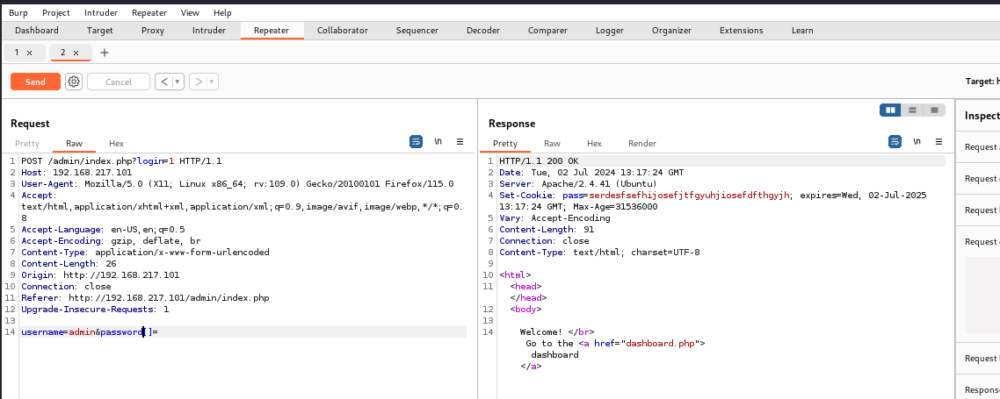
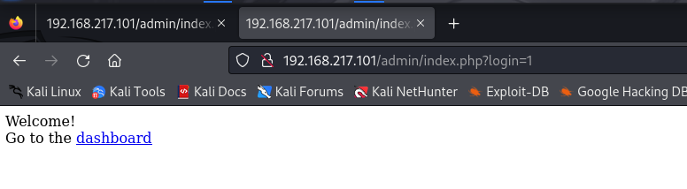

I went through all the different tabs. The Logs tab stood out to me.
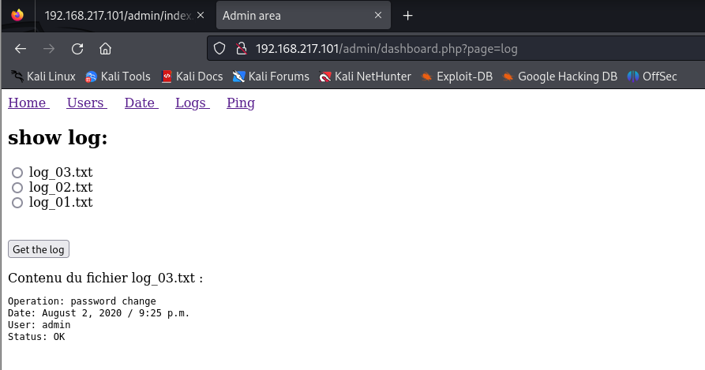
When a user selects any of the txt files and clicks on the get the log button the system fetches the contents of that file.

Further research into this pointed towards Local File Inclusion (LFI) vulnerabilities.
- LFI vulnerability is a type of vulnerability that occurs in web applications where an attacker can manipulate the file path or input mechanism to include files that are hosted on the server.
- Portswigger Web Academy has some nice notes on this vulnerability.

From portswigger I learnt to test for LFI by trying to fetch the contents of the `/etc/passwd` file.
For this, I decided to utilize Burp to test for LFI by using the `../` or `dot dot slash` method.
I continuously added `../` to the file section until I got some interesting output. This method could be tiresome in cases where a user has to continuously traverse through many directories to get to the desired file.

Luckily for me I did not have to go that far. 
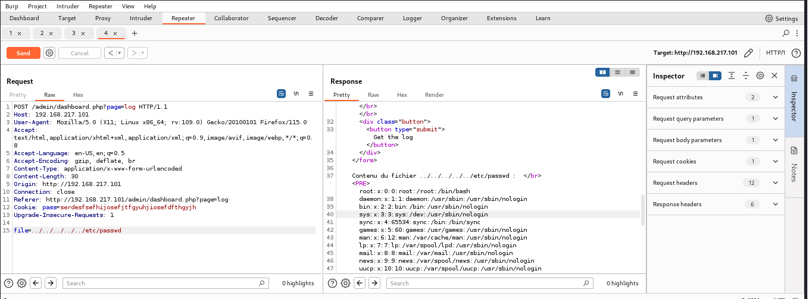
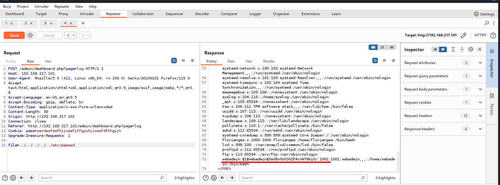

The last line of the output had some interesting information
`webadmin:$1$webadmin$3sXBxGUtDGIFAcnNTNhi6/`

The line contains some type of hashed password. I tried using tools such as hashidentifier on my terminal to identify the hash and https://crackstation.net/ to automatically decrypt the hash but none of these methods worked for me.

A bit of consultation from Chat GPT hinted towards the hash being an md5-crypt hash due to the `$1$` salt used. 

I had a really troublesome time trying to crack the hash using hashcat but in the end I was able to crack it.

`hashcat -m 500 -a 0 -o crack hash /usr/share/wordlists/rockyou.txt `
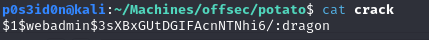
`password: dragon`

Now that I have the password, I was able to ssh to the target as the user `webadmin` and with that successfully got the user flag!!
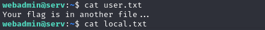

## PRIVILEGE ESCALATION
For this, I started by running the `sudo -l` command to find out which sudo commands the current user can run.
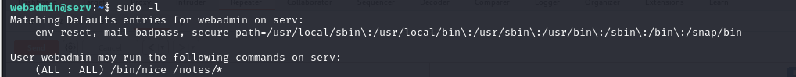

The output simply means the user `webadmin` is permitted to run the command `/bin/nice` with any arguments (if any) on any file or directory under `/notes/`.

Some information about nice in Linux and what it means: https://en.wikipedia.org/wiki/Nice_(Unix)

A search on GTFOBins on how nice can be used to escalate provileges: https://gtfobins.github.io/gtfobins/nice/

To create an interactive shell, create a root.sh file in the webadmin home directory using `echo '/bin/sh' >root.sh`

Run the shell using `nice /bin/sh`
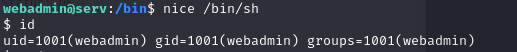

It works!!
Now to use try running it using sudo
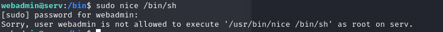
I got an error. But then I remembered in order to run sudo commands I have to first move to the notes directory 
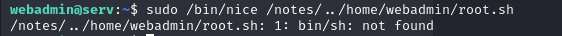

Constantly encountered this error, but I fixed it by creating a new shell with /bin/bash and repeating the entire process successfully got root!!
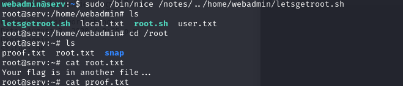