## Executive Summary

SecureBank is a web application security challenge designed to demonstrate how seemingly independent vulnerabilities can be chained together to achieve complete application compromise. It is also the first CTF challenge I created.

The attack begins with reconnaissance and endpoint enumeration before progressing to SQL Injection against the authentication API. Successfully exploiting the login endpoint allows an attacker to obtain a valid administrator JWT, which grants access to privileged functionality. From there, an insecure EJS-powered reporting feature is abused through Server-Side Template Injection (SSTI), allowing arbitrary server-side JavaScript execution and access to sensitive files.

Rather than focusing on a single vulnerability, this challenge emphasizes the importance of understanding **attack chains** and demonstrates how weaknesses in authentication, authorization, and template rendering interact to produce a full compromise.

---

# Challenge Overview

**Difficulty:** Easy

**Category:** Web Security

**Technology Stack**

- Node.js
- Express
- EJS Templates
- JWT Authentication
- SQL Database

---

# Skills Demonstrated

- Web reconnaissance
- robots.txt enumeration
- API discovery
- Burp Suite
- SQL Injection
- Authentication bypass
- JWT analysis
- HTTP header manipulation
- Server-Side Template Injection (SSTI)
- EJS template exploitation
- Node.js internals
- Secure coding analysis
- Defensive remediation

---

# Attack Chain

```text
Reconnaissance
        │
        ▼
robots.txt Enumeration
        │
        ▼
API Discovery
        │
        ▼
SQL Injection
        │
        ▼
Administrator JWT
        │
        ▼
Dashboard Access
        │
        ▼
Admin Panel
        │
        ▼
EJS Report Generator
        │
        ▼
Server-Side Template Injection
        │
        ▼
Filesystem Access
        │
        ▼
Read flag.txt
```

---

# Walkthrough

## Step 1 — Initial Reconnaissance

Upon loading the application, the landing page presents a standard login portal.

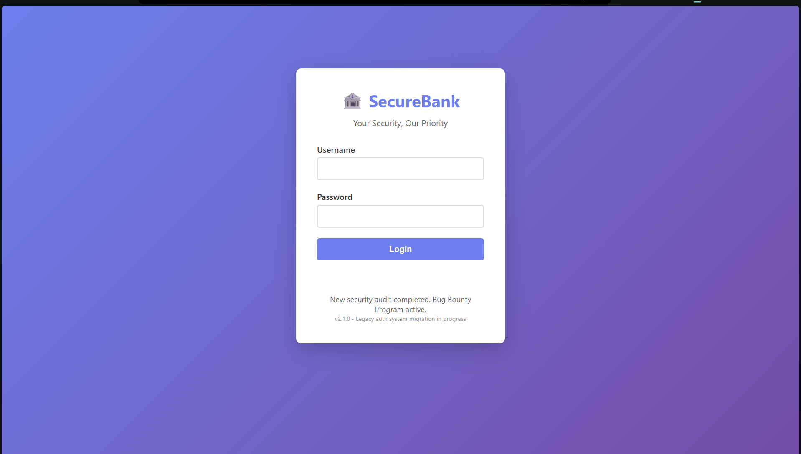

As with any authentication challenge, the first step is to test for weak or default credentials.
Common combinations such as:

```sh
admin:admin
admin:password
root:root
```

all return:

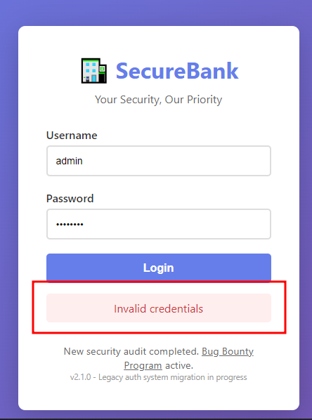

While unsuccessful, this confirms that authentication is functioning normally and encourages further enumeration.

---

## Step 2 — Discovering Hidden Endpoints
Rather than attacking the login immediately, the application is enumerated for additional attack surface.

Inspection of `Page Source` and `robots.txt` reveals two interesting endpoints:

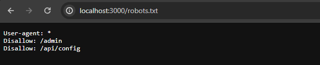

This immediately tells us two things:
- Administrative functionality exists.
- The application exposes an API that may be directly accessible.

---

## Step 3 — Investigating the Admin Panel
Navigating directly to `/admin`
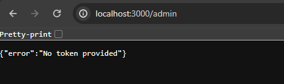

returns an authorization error rather than a **404 Not Found**.

This is an important distinction. A 404 would imply the endpoint does not exist.

Instead, the response confirms that:
- the endpoint exists
- authentication is required
- obtaining valid credentials or tokens may unlock additional functionality.

---

## Step 4 — Investigating the API

Accessing `/api/config` returns another authorization error indicating elevated privileges are required.

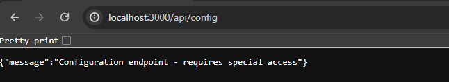

At this stage we know:
- an authenticated API exists
- authentication is likely token-based
- administrative functionality is protected but reachable

---

## Step 5 — Testing the Login API

Burp Suite is used to intercept requests to `/api/login`
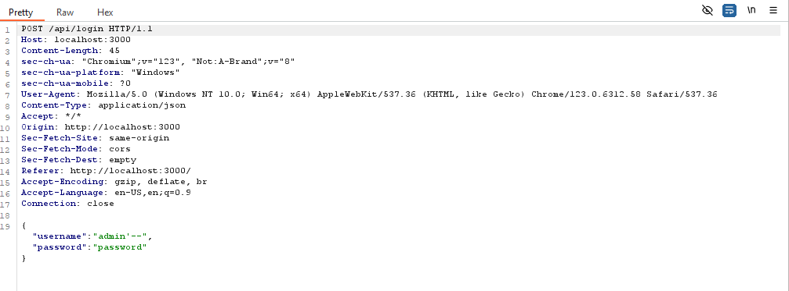

The username field is tested using a simple SQL Injection payload:

```sql
admin'--
```

The password can contain any value.

Once you capture the request, Right-click --> Do Intercept --> Response to this request in Burp so the server response can be inspected.

---

## Step 6 — Authentication Bypass

Instead of rejecting the request, the response returns `Login successful` along with a JWT.

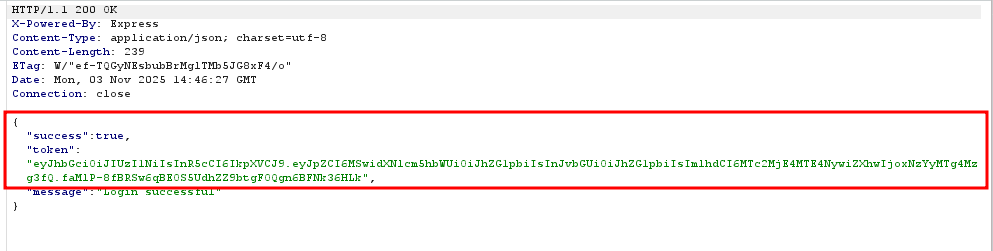

This confirms that SQL Injection successfully altered the login query and bypassed authentication.

---

## Step 7 — Inspecting the JWT

The returned JWT is decoded using **jwt.io** or **xjwt.io**.

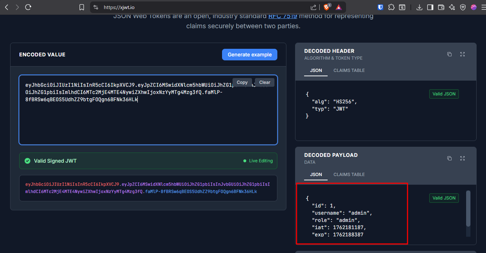

The decoded payload identifies the authenticated user as `admin`.

This confirms that authentication was bypassed successfully and the application issued a legitimate administrator token.

---

## Step 8 — Accessing the Dashboard

Based on the application behaviour, authenticated users are redirected to the `/dashboard`.
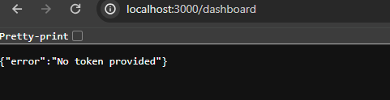


Attempting to access the endpoint without the JWT shows a `No token provided` error which indicates authentication relies on a Bearer token.

Include the following header in the authentication request:
```
Authorization: Bearer <JWT>
```
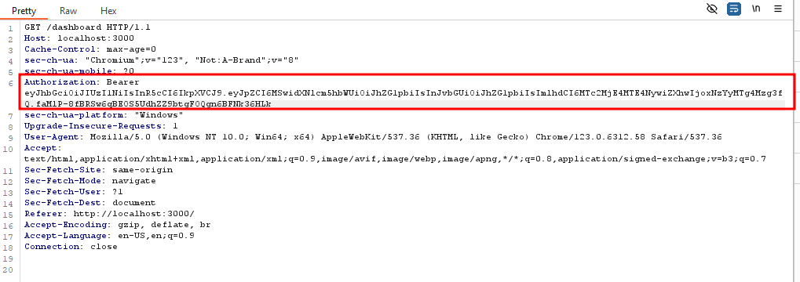

Reloading the request now grants access to the administrator dashboard.
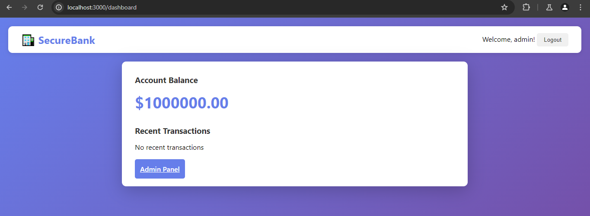

---

## Step 9 — Accessing the Admin Panel

Selecting **Admin Panel** while including the JWT successfully loads the privileged interface.

The Generate Report feature immediately stands out.


The page also displays an example template which strongly suggests the application renders user-controlled EJS templates.
```ejs
User Report for <%= user.username %>
```
---

## Step 10 — Testing for SSTI

To determine whether template expressions are evaluated server-side, submit:

```ejs
<%= 7*7 %>
```

The generated report returns `49` instead of displaying the expression confirming the application is vulnerable to **Server-Side Template Injection (SSTI).**
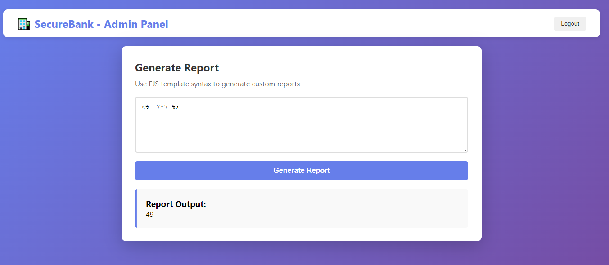

---

## Step 11 — Environment Enumeration

The first objective is understanding the execution environment.

Retrieve the application's current working directory:

```ejs
<%= process.cwd() %>
```

Output confirms where application files are stored.

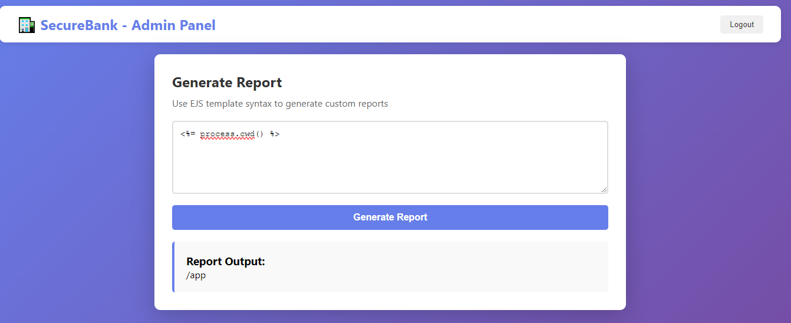

---

## Step 12 — Directory Enumeration

List files within the application directory:

```ejs
<%= global.process.mainModule.require('fs').readdirSync('/app').join('\n') %>
```

The output reveals `flag.txt`
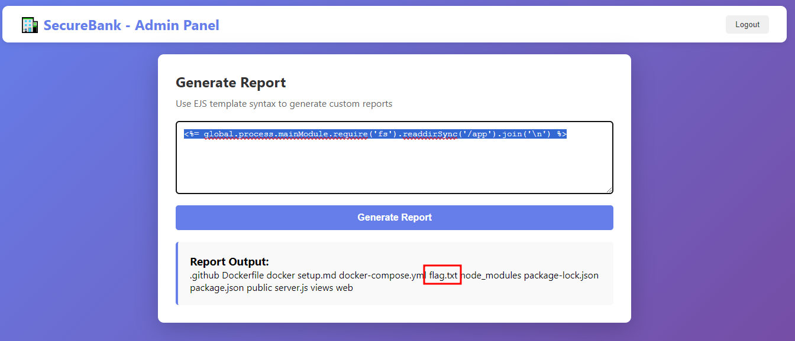

---

## Step 13 — Reading the Flag

With filesystem access established, retrieve the contents of the flag.

```ejs
<%= global.process.mainModule.require('fs').readFileSync('/app/flag.txt','utf8') %>
```

The application returns the contents of the file, completing the challenge.
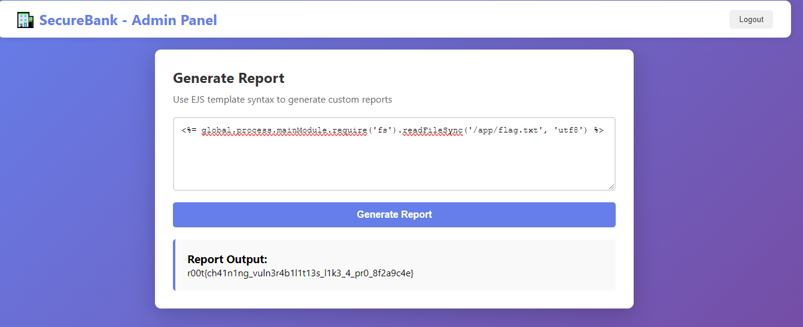
---

# Technical Analysis

## What is EJS (Embedded JavaScript)?

EJS is a templating language for Node.js that injects JavaScript expressions into HTML templates. Common tokens:

```sh
<%= expression %> — Evaluate expression and output the result (HTML-escaped).
<%- expression %> — Evaluate and output unescaped.
<% code %> — Run JavaScript code without direct output.
```

EJS templates are rendered server-side, so expressions are executed on the application server. This makes EJS powerful — and potentially dangerous if user input is rendered without restrictions.

---

## What is SSTI (Server-Side Template Injection)?

SSTI happens when unsanitized user input is inserted into templates that execute code. If the template engine allows arbitrary code execution, an attacker can inject expressions that run on the server, enabling information disclosure, file reads, or remote command execution depending on environment restrictions.

Typical SSTI flow:
- Discover that the template engine evaluates expressions.
- Execute incremental, low-impact payloads to learn about the environment (cwd, env vars, file list).
- Craft a payload to read sensitive files or run commands (only if permitted in the CTF context).

---

## Why some payloads worked and others didn’t

he EJS rendering context is executed as a function with a limited local scope. In that scope, require may not be directly available. However, some global objects (like process) are still accessible. The Node.js runtime exposes an internal reference to the module loader via process.mainModule.require, which allows loading core modules (such as fs and child_process) even when require is not present in the template scope.

Examples:

```sh
process.cwd() → works because process is global.
require('fs') → fails: require is not defined in template locals.
global.process.mainModule.require('fs') → works: this uses the main module’s require function reachable through the global process object, bypassing the local scope limitation.
```

This difference is why the mainModule.require chain is the reliable approach in this challenge.

---

# Root Cause Analysis

| Vulnerability | Root Cause |
|---------------|------------|
| SQL Injection | User input was concatenated directly into SQL queries without parameterized statements. |
| Authentication Bypass | The application assumed authentication could not be bypassed before issuing administrator JWTs. |
| JWT Abuse | The JWT itself was valid; the weakness originated in the authentication process that generated it. |
| Server-Side Template Injection | User-controlled template input was rendered directly by EJS without sanitization or sandboxing. |
| Information Disclosure | The application process had unrestricted access to sensitive files within the application directory. |

---

# MITIGATIONS/FIXES

## Prevent SQL Injection
- Use parameterized queries (prepared statements).
- Avoid dynamic SQL string concatenation.
- Validate and sanitize user input.

---
## Secure Authentication
- Validate authentication logic before issuing privileged JWTs.
- Implement rate limiting.
- Monitor for suspicious authentication behaviour.

---
## Prevent SSTI
- Never render raw user input as templates.
- Use predefined template selections.
- Consider logic-less template engines such as Mustache where appropriate.
- Execute templates within restricted sandboxes.

---
## Minimize Information Disclosure
- Disable verbose error messages.
- Avoid exposing application paths.
- Restrict environment variable exposure.

---
## Apply Least Privilege
- The application should not have filesystem permissions beyond what is strictly necessary.
- Sensitive files should never reside in locations directly accessible by the application runtime.

---

# Lessons Learned
The most important lesson from this challenge is that attackers rarely depend on a single vulnerability.

Individually, SQL Injection, authentication weaknesses, and Server-Side Template Injection represent distinct security issues. Combined, however, they create a complete attack chain capable of compromising the application.

Designing this challenge reinforced an important principle of offensive security: understanding **how vulnerabilities interact** is often more valuable than understanding each vulnerability in isolation.

For defenders, this highlights the importance of layered security. Eliminating a single vulnerability may interrupt an attack chain, but designing systems with defense-in-depth ensures that one failure does not immediately result in complete compromise.

---

# References

- OWASP – SQL Injection  
  https://owasp.org/www-community/attacks/SQL_Injection

- OWASP Web Security Testing Guide – Server-Side Template Injection  
  https://owasp.org/www-project-web-security-testing-guide/latest/4-Web_Application_Security_Testing/07-Input_Validation_Testing/18-Testing_for_Server-side_Template_Injection

- PortSwigger Academy – SQL Injection  
  https://portswigger.net/web-security/sql-injection

- PortSwigger Academy – Server-Side Template Injection  
  https://portswigger.net/web-security/server-side-template-injection

- PayloadsAllTheThings  
  https://github.com/swisskyrepo/PayloadsAllTheThings

- JWT.io  
  https://jwt.io/

- xjwt.io  
  https://xjwt.io/